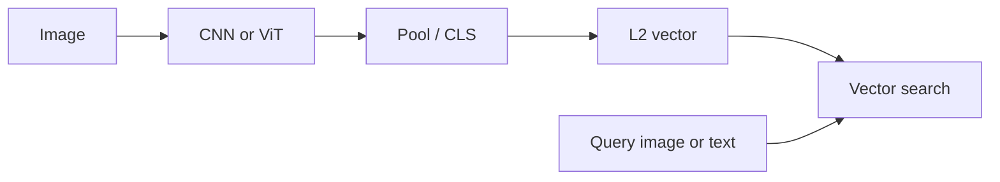

import { ConceptTemplate } from '@/features/kb/components/templates/ConceptTemplate'
import { Callout } from '@/features/kb/components/mdx/Callout'
import { ComparisonTable } from '@/features/kb/components/mdx/ComparisonTable'

export default function Layout({ children }) {
  return (
    <ConceptTemplate title="Image Embeddings">
      {children}
    </ConceptTemplate>
  )
}

An **image embedding** is a vector `z = f(image)` — often 512–2048-D — such that **nearby z means similar picture** (or similar *text*, for CLIP). You get `f` by chopping the classifier head off a CNN/ViT, by metric learning (ArcFace, triplet), or by a multimodal contrastive model. Then you store `z` in a vector index, same as RAG.

## 1. Deep Dive and Mechanics

**Pooled backbone.** ResNet + global average pool + optional linear projection. Cheap. Similarity is "same ImageNet-ish category," not "same instance" unless you fine-tune.

**Metric learning.** Train so `sim(z_a, z_p) > sim(z_a, z_n)` (triplets, NT-Xent, ArcFace angular margins). Faces, products, and re-id need this. Softmax on 10k SKUs is often worse than a well-mined triplet setup.

**Multimodal.** CLIP/SigLIP embed images and text in one space. Query can be a sentence. See the CLIP page.

**Invariance.** You choose what "similar" means: category (dog vs cat), instance (this shoe SKU), or near-duplicate (this meme). Augmentation and loss define that. A generic ImageNet vector will not match the same person in two cameras.

<Callout icon="warning" title="Same model, same preprocess">
A vector from `f` and a vector from `f'` are not comparable. Store `model_id`, crop policy, and whether you L2-normalised. Re-embed the catalog when you upgrade.
</Callout>

## 2. Mathematical / Theoretical Foundation

Contrastive loss (InfoNCE) maximises the log-softmax of the positive pair among in-batch negatives. Cosine on L2-normalised `z` is the usual `s`. Hubness and anisotropy show up in high-d — same as text. PCA / Matryoshka can shrink `d` for cheaper ANN.

<ComparisonTable
  headers={['Source of f', 'Aligns to', 'Typical job']}
  rows={[
    ['ImageNet GAP', 'Object class', 'Quick similar-image'],
    ['ArcFace / triplet', 'Identity', 'Face, product re-id'],
    ['CLIP / SigLIP', 'Language', 'Search by caption'],
    ['SSL (DINO, MAE)', 'Generic visual', 'Strong unlabeled pretrain'],
  ]}
/>

## 3. Real-World Implementation

```python
import torch
from PIL import Image

model.eval()
x = preprocess(Image.open('sku.jpg')).unsqueeze(0)
with torch.no_grad():
    z = model(x)
    z = torch.nn.functional.normalize(z, dim=-1)
# upsert z.cpu().numpy() into your ANN index
```

## 4. Visualizations



## 5. Interview Prep

**Q: Embedding vs classification head?**
**A:** Softmax locks you to a closed set. Embeddings plus ANN are open-set: new SKUs are new vectors, not a retrained last layer (though you may still fine-tune `f`).

**Q: Why is my "similar products" search colour-blind?**
**A:** The pretrain discarded colour as nuisance, or your resize wrecked aspect. Fine-tune with colour-sensitive pairs or add a colour histogram feature.

**Q: Cross-encoder for images?**
**A:** Late fusion (concat two images into one transformer) is the analog of a text reranker — too slow for the catalog, good for top-50.

## 6. Production Use Cases

- **Visual search** and dedup.
- **RAG over figures** (embed paper images).
- **Moderation** nearest-neighbor to known bad examples.

<Callout icon="tip" title="Eval with recall@k on a labeled pair set">
Do not trust t-SNE pretty pictures. Hold out query/gallery splits like face verification (ROC) or instance retrieval (mAP).
</Callout>
