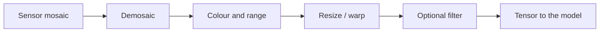

import { ConceptTemplate } from '@/features/kb/components/templates/ConceptTemplate'
import { Callout } from '@/features/kb/components/mdx/Callout'
import { ComparisonTable } from '@/features/kb/components/mdx/ComparisonTable'

export default function Layout({ children }) {
  return (
    <ConceptTemplate title="Image Processing Fundamentals">
      {children}
    </ConceptTemplate>
  )
}

A digital image is a **grid of samples**. RGB uint8 is three 0–255 channels. Before CNNs, "computer vision" was this: denoise, find edges, warp, threshold. Those ops are still how you **debug** a dataset (look at the pixels) and how you **preprocess** (resize, crop, colour convert) so a network sees a sane tensor.

## 1. Deep Dive and Mechanics

**Sampling and aliasing.** Downsize without a low-pass filter and you get moiré. `INTER_AREA` / Gaussian pyramid exist for a reason. Super-res and CNNs do not remove the Nyquist fact.

**Colour.** RGB is convenient for displays. HSV/HSL separate hue from lighting (useful for naive colour keys). YCbCr is what JPEG compresses. LAB is closer to perceptual distance. Convert *before* thresholding on "redness."

**Linear filters.** Convolution with a kernel: box blur, Gaussian, Sobel/Scharr edges, Laplacian. Separable Gaussians are O(k) not O(k²). Unsharp mask = image + amount × (image − blur).

**Morphology.** Dilate / erode / open / close on binary (or grayscale) masks. The cheapest way to clean OCR boxes and segmentation crumbs.

**Geometry.** Homography maps planes (document scan). Affine covers rotate/scale/shear. Remap with interpolation (bilinear, bicubic). Wrong interpolation on masks = fuzzy labels.

<Callout icon="info" title="uint8 vs float">
Filter math in uint8 saturates and rounds. Convert to float32 in 0–1 (or z-score) for anything you will differentiate through. Then decide how you re-quantize for codecs.
</Callout>

## 2. Mathematical / Theoretical Foundation

An image is `I: Z² → R^c` (or a torus if you wrap). Convolution is linear and diagonal in the Fourier basis — that is why we talk about low-pass vs high-pass. Gradients approximate derivatives; Canny adds non-max suppression and hysteresis, a thin classic pipeline that still beats a sloppy learned edge on some industrial parts.

<ComparisonTable
  headers={['Op', 'Does', 'Typical use']}
  rows={[
    ['Gaussian blur', 'Low-pass', 'Denoise, pyramid'],
    ['Sobel', 'Gradient', 'Edges, focus measure'],
    ['Histogram eq', 'Spread intensities', 'Contrast (careful on colour)'],
    ['Warp / remap', 'Resample grid', 'Align, augment'],
  ]}
/>

## 3. Real-World Implementation

```python
import cv2
import numpy as np

bgr = cv2.imread('part.png')
gray = cv2.cvtColor(bgr, cv2.COLOR_BGR2GRAY)
blur = cv2.GaussianBlur(gray, (5, 5), 1.0)
edges = cv2.Canny(blur, 80, 160)
```

For a training loader, do the same *ideas* in torchvision / albumentations so GPU augment matches.

## 4. Visualizations



## 5. Interview Prep

**Q: Why is OpenCV BGR?**
**A:** Historical camera/DirectShow defaults. Mixing RGB and BGR silently swaps channels — a rite of passage. Be explicit in every API.

**Q: Is histogram equalisation a good default?**
**A:** For a single grayscale medical slice, maybe. On colour photos it wrecks hues unless you equalise luminance only. CLAHE is the usual upgrade.

**Q: Convolution here vs CNN conv?**
**A:** Same sliding dot product. Classical kernels are *chosen*. CNN kernels are *learned* and stacked with nonlinearities.

## 6. Production Use Cases

- **Preprocess** every CV dataset (EXIF orientation!).
- **Classical QC** when you have 50 images and no GPU.
- **Debug** "the model is bad" — often the JPEG is 4:2:0 mush or the crop missed the object.

<Callout icon="tip" title="Look at the batch">
Visualise 16 training tensors *after* augment, as the net sees them. That picture finds swapped channels and double-normalise faster than any metric.
</Callout>
