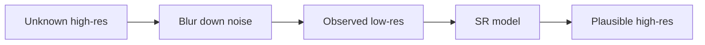

import { ConceptTemplate } from '@/features/kb/components/templates/ConceptTemplate'
import { Callout } from '@/features/kb/components/mdx/Callout'
import { ComparisonTable } from '@/features/kb/components/mdx/ComparisonTable'

export default function Layout({ children }) {
  return (
    <ConceptTemplate title="Image Super-Resolution">
      {children}
    </ConceptTemplate>
  )
}

**Super-resolution (SR)** invents pixels. A 4× upsample from 64² to 256² is **ill-posed**: many sharp images blur to the same low-res. Classical (bicubic, sparse coding) smears. **SRCNN**, **ESRGAN**, **SwinIR**, **Real-ESRGAN**, and **diffusion SR** (StableSR, SeeSR) learn a posterior that looks sharp — and can **hallucinate** text and faces.

## 1. Deep Dive and Mechanics

**Degradation.** Research often trains on bicubic downsample. Real photos have JPEG, noise, and shaky blur. **Real-ESRGAN**-style pipelines synthesise that chain or the net fails in the wild.

**L1 / PSNR nets.** They regress the mean of possible highs — blurry but faithful. Good for medical / satellite if you must not invent edges.

**GAN / perceptual.** Adversarial + VGG/LPIPS losses look crisp. They invent tiles and eyelashes. Fine for marketing; dangerous for evidence.

**Diffusion.** Iterative refinement, often the current quality king, slow unless distilled. Condition on the low-res (and sometimes a text prompt).

**Video SR.** Temporal consistency is the extra loss. Flicker is why image SR ≠ video SR.

<Callout icon="warning" title="Do not SR a license plate for court">
A hallucinated character is a false identity. Use SR as enhancement for *viewing*, not as forensic proof. Same for medical micro-calcifications.
</Callout>

## 2. Mathematical / Theoretical Foundation

Observation: `y = (x * k) ↓_s + n` (blur, subsample, noise). MAP: `argmax_x p(y|x) p(x)`. PSNR/SSIM measure distance to *one* GT. LPIPS / NIQE / human studies measure "looks natural." They disagree — that is the field.

<ComparisonTable
  headers={['Family', 'Looks', 'Faithful']}
  rows={[
    ['Bicubic', 'Soft', 'Yes'],
    ['L1 CNN', 'Softer than GAN', 'Closer to GT'],
    ['GAN', 'Sharp', 'Hallucinates'],
    ['Diffusion', 'Sharpest now', 'Still invents'],
  ]}
/>

## 3. Real-World Implementation

```python
# Conceptual
lr = load('small.png')
hr = sr_model(lr)   # 4x
# For production, tile large images with overlap to fit VRAM
```

Real-ESRGAN and SwinIR have widely used weights; read the expected colour space (RGB vs Y).

## 4. Visualizations



## 5. Interview Prep

**Q: Why is PSNR a bad demo metric?**
**A:** Blurry means are high PSNR. GANs win user studies and lose PSNR. Quote both plus a perceptual score.

**Q: Blind vs non-blind SR?**
**A:** Non-blind knows k. Blind must estimate degradation. Real photos are blind.

**Q: Relation to deblurring / JPEG restore?**
**A:** Same inverse-problem family. Joint models (Restormer, etc.) treat a stack of degradations.

## 6. Production Use Cases

- **Thumbnails → display** (with a "enhanced" label).
- **Old media** restore (video-specific).
- **Satellite** (prefer PSNR-oriented).

<Callout icon="tip" title="Tile with overlap">
A 4K frame will OOM a naive forward. Slide 512 tiles with 32 px overlap and Hamming-blend the seams or you will see a grid.
</Callout>
