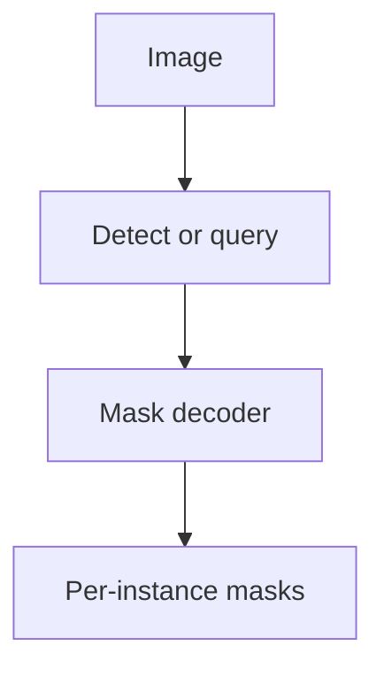

import { ConceptTemplate } from '@/features/kb/components/templates/ConceptTemplate'
import { Callout } from '@/features/kb/components/mdx/Callout'
import { ComparisonTable } from '@/features/kb/components/mdx/ComparisonTable'

export default function Layout({ children }) {
  return (
    <ConceptTemplate title="Instance Segmentation">
      {children}
    </ConceptTemplate>
  )
}

**Semantic** segmentation will fuse two red cars into one "car" puddle. **Instance segmentation** outputs a **set of masks**, one per object. Mask R-CNN is the textbook two-stage path. YOLO-seg, SOLO, CondInst, Mask2Former, and SAM-style promptable masks are the rest of the menu.

## 1. Deep Dive and Mechanics

**Detect-then-segment.** Box first, mask inside the box (Mask R-CNN). Simple association: the mask belongs to that detection. Fails when the box is loose or two instances share a box.

**Segment-then-detect / box-free.** Predict per-pixel embeddings and cluster (YOLACT proto + coeffs, SOLO grid, CondInst dynamic filters). Or query-based masks (Mask2Former) like DETR.

**Promptable.** SAM / SAM 2: a heavy image encoder plus a decoder that takes points, boxes, or masks. Not a closed-set detector unless you pair it with a detector or CLIP.

**Occlusion.** True instance labels require amodal or layered reasoning; most datasets are modal (visible pixels only). Say which you evaluate.

<Callout icon="info" title="Panoptic = instance things + semantic stuff">
PQ metric. Sky and road do not get instance ids. Person and car do. If the slide says "we segment everything," ask which.
</Callout>

## 2. Mathematical / Theoretical Foundation

COCO **mask AP** is box AP's sibling with mask IoU. Overlap between instances is allowed in the GT (occlusion). Predictions are matched one-to-one like detection. Pixel-level mIoU is the *wrong* headline metric here.

<ComparisonTable
  headers={['Approach', 'How instances appear']}
  rows={[
    ['Mask R-CNN', 'RoI mask head'],
    ['YOLACT / YOLO-seg', 'Protos plus coefficients'],
    ['SOLO / CondInst', 'Position or dynamic kernels'],
    ['Mask2Former', 'Mask queries'],
  ]}
/>

## 3. Real-World Implementation

```python
# After a Mask R-CNN forward
keep = pred['scores'] > 0.6
masks = pred['masks'][keep] > 0.5
```

For SAM: pass a detector box as the prompt, do not click production frames by hand.

## 4. Visualizations



## 5. Interview Prep

**Q: Instance vs semantic on crowds?**
**A:** Instance is the one that counts people. Semantic will give you a "person" blob.

**Q: Why is mask AP lower than box AP?**
**A:** Masks are stricter. A decent box with a sloppy silhouette loses mask IoU. Also annotation noise on boundaries.

**Q: Realtime instance?**
**A:** YOLOv8/11-seg, SparseInst, or a tiny Mask R-CNN. Measure mask AP at your operating resolution.

## 6. Production Use Cases

- **Bin picking** and depalletise.
- **Retail** on-shelf availability (this SKU facing).
- **Video** SAM 2 tracking of a clicked object.

<Callout icon="tip" title="Don't eval with box AP only">
If the product is a mask, put mask AP (and a boundary F-score) on the dashboard or you will ship boxes with potato outlines.
</Callout>
