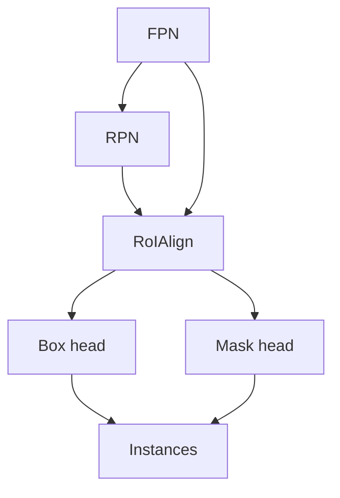

import { ConceptTemplate } from '@/features/kb/components/templates/ConceptTemplate'
import { Callout } from '@/features/kb/components/mdx/Callout'
import { ComparisonTable } from '@/features/kb/components/mdx/ComparisonTable'

export default function Layout({ children }) {
  return (
    <ConceptTemplate title="Mask R-CNN">
      {children}
    </ConceptTemplate>
  )
}

**Mask R-CNN** (He et al., 2017) keeps Faster R-CNN's box path and adds a small **FCN** on each RoI that predicts a class-specific binary **mask**. **RoIAlign** replaces RoIPool so the mask is not shifted by quantisation. That is the difference between a jagged blob and a crisp person outline.

## 1. Deep Dive and Mechanics

**Heads.** Shared backbone + FPN. RPN proposals. Box head: class + box. Mask head: e.g. 28×28 per class, trained only on positive RoIs. Inference: pick the mask channel of the winning class, threshold, warp back to the box.

**RoIAlign.** Bilinear sample at four (or more) points per bin instead of rounding the RoI to the feature-grid. A ~1 pixel error on the feature map is many pixels on the image — fatal for masks, also helps box AP.

**Multi-task.** L = L_cls + L_box + L_mask. Mask loss is per-pixel BCE (or dice in later forks). Detectron2 / mmdet add cascade and HTC for extra points.

**Keypoints.** The same paper's keypoint head is a one-hot mask per joint — pose as "instance segmentation of points."

<Callout icon="info" title="Not semantic segmentation">
Semantic seg labels *pixels* with a class (all stuff). Instance seg gives a *mask per object*. Two cars = two masks. See those pages.
</Callout>

## 2. Mathematical / Theoretical Foundation

Mask AP uses mask IoU, same COCO averaging as box AP. The mask is predicted in a canonical RoI frame, then affine-mapped to the image. Misaligned RoI → systematic IoU leak, which is why Align exists.

<ComparisonTable
  headers={['Model', 'Output']}
  rows={[
    ['Faster R-CNN', 'Boxes'],
    ['Mask R-CNN', 'Boxes plus instance masks'],
    ['U-Net / DeepLab', 'Per-pixel class (no instances)'],
    ['SOLO / CondInst', 'Instance masks, often box-free'],
  ]}
/>

## 3. Real-World Implementation

```python
from torchvision.models.detection import maskrcnn_resnet50_fpn
model = maskrcnn_resnet50_fpn(weights='DEFAULT')
model.eval()
pred = model([img])[0]
# pred['masks'] is N x 1 x H x W after resize to the image
```

Fine-tune `num_classes` on both box predictor and mask predictor.

## 4. Visualizations



## 5. Interview Prep

**Q: Why a mask head per class, not one mask?**
**A:** The paper's default is class-specific so the head can specialise. Class-agnostic masks exist and pair with the box class. Both ship.

**Q: RoIPool vs Align in one sentence?**
**A:** Pool snaps to the grid; Align interpolates. Masks need Align.

**Q: Realtime?**
**A:** Heavy. Use YOLOv8-seg / RT-DETR-seg / lightweight SOLOv2 if you need 30 FPS.

## 6. Production Use Cases

- **Robot pick:** mask → grasp.
- **Medical instances** (cells, lesions) when boxes are not enough.
- **VFX / background replace** per person.

<Callout icon="tip" title="Train longer on the mask">
A checkpoint with great boxes and mediocre masks is common. Watch mask AP, not only bbox AP, and keep high-res RoIs if instances are thin (poles, cables).
</Callout>
