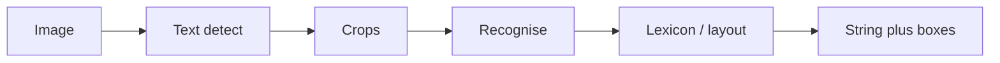

import { ConceptTemplate } from '@/features/kb/components/templates/ConceptTemplate'
import { Callout } from '@/features/kb/components/mdx/Callout'
import { ComparisonTable } from '@/features/kb/components/mdx/ComparisonTable'

export default function Layout({ children }) {
  return (
    <ConceptTemplate title="OCR">
      {children}
    </ConceptTemplate>
  )
}

**OCR** is two problems glued together. **Detection** finds text regions (boxes or polygons). **Recognition** reads a crop into a string (CTC, attention, transformer). **End-to-end** nets (some DBNet+CRNN stacks, TrOCR, commercial APIs) hide the seam. Document AI adds **layout** (titles, tables) on top.

## 1. Deep Dive and Mechanics

**Detect.** EAST, DBNet, TextSnake (curves). Scene text is rotated and tiny; document text is dense and axis-aligned. One model rarely wins both.

**Recognise.** CRNN: CNN + biLSTM + CTC. Attention seq2seq for irregular text. TrOCR: ViT encoder + text decoder. Language models (lexicon, n-gram, LLM post) fix "rn" vs "m" when the domain is known.

**Layout.** Detectron / LayoutLMv3 / Donut: not OCR alone — they classify *blocks*. Tables need structure (cells), not a bag of words.

**Quality.** Deskew, denoise, binarise still help Tesseract. Deep nets want a sane crop and enough px per character (a 8-px letter will hallucinate).

<Callout icon="info" title="Tesseract vs a cloud API">
Tesseract is free and good on clean scans with the right PSM. Photos of neon shop signs want a scene-text model or a paid API. Benchmark *your* docs.
</Callout>

## 2. Mathematical / Theoretical Foundation

CTC: align a longer softmax timeline to a shorter label by summing over alignments (blank token). CER / WER are Levenshtein rates. Detection uses the usual box/polygon AP, plus "don't cut characters in half."

<ComparisonTable
  headers={['Stage', 'Output']}
  rows={[
    ['Detect', 'Polygons'],
    ['Recognise', 'String plus optional conf'],
    ['Layout', 'Reading order, block types'],
    ['Parse', 'JSON fields (invoice)'],
  ]}
/>

## 3. Real-World Implementation

```python
import pytesseract
from PIL import Image
text = pytesseract.image_to_string(Image.open('form.png'), lang='eng')
```

For scene text, PaddleOCR / EasyOCR / a vendor SDK. Always keep the box attached to the string for citations.

## 4. Visualizations



## 5. Interview Prep

**Q: Why does OCR fail on your PDF?**
**A:** It is already text — you used a rasteriser. Extract with a PDF library first. OCR the pages that are scans only.

**Q: CTC vs attention?**
**A:** CTC is fast and stable for nearly horizontal lines. Attention/transformers handle warps and longer context, cost more.

**Q: How do you eval?**
**A:** CER on a held-out labeled set, plus field-level F1 for forms. Demo-on-one-invoice is not a metric.

## 6. Production Use Cases

- **Invoices** and KYC docs.
- **Shelf labels** and plates (specialised nets).
- **Accessibility** alt-text assist (not a replacement for real alt).

<Callout icon="tip" title="Keep the crop DPI">
If you downsample a scan to 256² for a detector, the recogniser sees mush. Detect at high res, crop, then recognise at a height of ~32–64 px per line.
</Callout>
