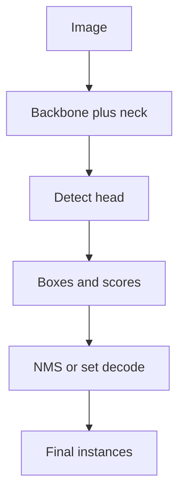

import { ConceptTemplate } from '@/features/kb/components/templates/ConceptTemplate'
import { Callout } from '@/features/kb/components/mdx/Callout'
import { ComparisonTable } from '@/features/kb/components/mdx/ComparisonTable'

export default function Layout({ children }) {
  return (
    <ConceptTemplate title="Object Detection">
      {children}
    </ConceptTemplate>
  )
}

**Classification** names the photo. **Detection** answers *what* and *where*: a list of **boxes** (xyxy or cxcywh) and **class scores**. Overlaps are resolved with **NMS** or, in DETR, with set matching so you never emit 40 boxes on one dog.

Family pages: R-CNN → Faster R-CNN → Mask R-CNN; YOLO; SSD; DETR.

## 1. Deep Dive and Mechanics

**Candidates.** Two-stage: propose regions (Selective Search, then **RPN**), then classify/regress. One-stage: dense anchors or anchor-free points on a feature map (YOLO, SSD, FCOS). Query-based: a fixed set of object queries (DETR).

**Assignment.** During training, each GT box is matched to anchors/queries by IoU or Hungarian matching. Unmatched predictions are background.

**NMS.** At test time, greedy suppress boxes with IoU above a threshold of a higher-scoring box. Soft-NMS and NMS-free heads exist because NMS is a brittle hyperparameter.

**Multi-scale.** FPN / YOLO necks fuse high-res and semantic maps so a 20-pixel traffic light is not only a rumor on the last stride-32 map.

<Callout icon="warning" title="Box format chaos">
COCO is xywh. YOLO is normalised cxcywh. OpenCV sometimes xyxy. Convert explicitly. Off-by-one and unnormalised coords are the main "the mAP is 2" bugs.
</Callout>

## 2. Mathematical / Theoretical Foundation

**IoU** = intersection area / union area. A detection is a TP at a threshold (0.5, or COCO's average 0.5:0.95). **mAP** averages precision-recall area over classes (and IoU thresholds). That is why a model can look great in a demo and lose 15 points on small objects.

L1 / GIoU / DIoU / CIoU box losses shape the regressor. Focal loss (RetinaNet) down-weights easy background.

<ComparisonTable
  headers={['Family', 'Idea', 'Trait']}
  rows={[
    ['Two-stage', 'Propose then classify', 'Accuracy, slower'],
    ['One-stage', 'Dense predict', 'Realtime'],
    ['DETR-like', 'Set of queries', 'No NMS, heavier train'],
  ]}
/>

## 3. Real-World Implementation

```python
# torchvision sketch
from torchvision.models.detection import fasterrcnn_resnet50_fpn
model = fasterrcnn_resnet50_fpn(weights='DEFAULT')
model.eval()
out = model([image_tensor])  # boxes, labels, scores
```

Always filter `scores > t` then NMS if the API did not.

## 4. Visualizations



## 5. Interview Prep

**Q: mAP@0.5 vs COCO mAP?**
**A:** 0.5 is loose (PASCAL). COCO averages 10 IoU thresholds — punishes sloppy boxes. Report both if stakeholders think in "did we find it?"

**Q: Why do tiny objects vanish?**
**A:** Stride and assignment. Use FPN, higher input res, copy-paste aug, or a dedicated small-object head.

**Q: Detection vs instance segmentation?**
**A:** Seg adds a mask per instance (Mask R-CNN). Same eval family (mask AP).

## 6. Production Use Cases

- **Retail** shelf and empty-hook.
- **ADAS** vehicles, pedestrians (latency + calibration).
- **Doc AI** as a first step before OCR.

<Callout icon="tip" title="Calibrate the threshold on your prior">
0.5 score on COCO is not 0.5 on your camera. Plot precision-recall on a held-out plant-floor set and pick the operating point.
</Callout>
