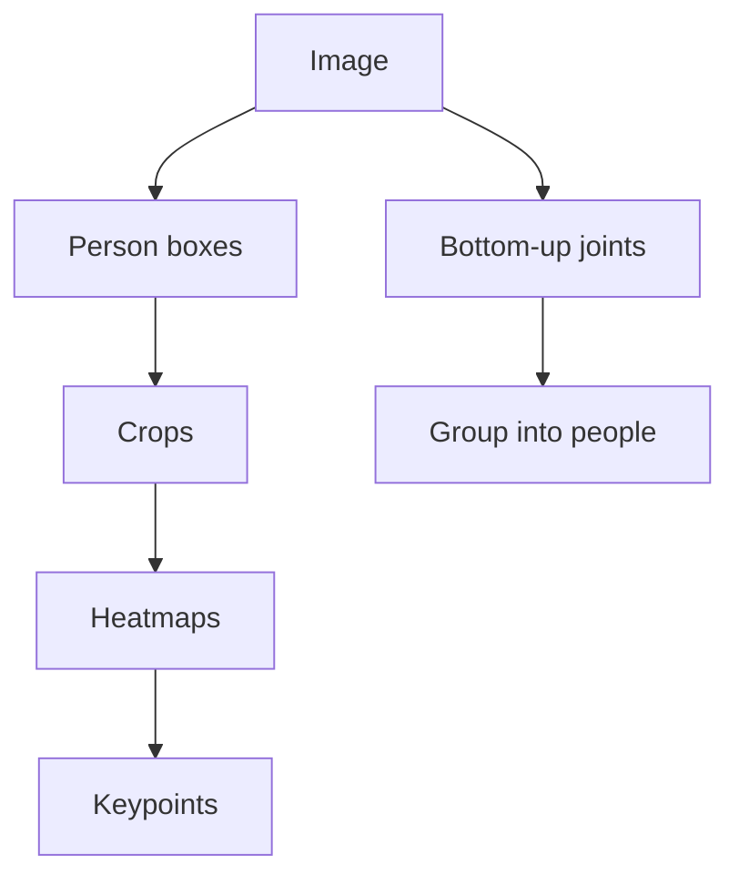

import { ConceptTemplate } from '@/features/kb/components/templates/ConceptTemplate'
import { Callout } from '@/features/kb/components/mdx/Callout'
import { ComparisonTable } from '@/features/kb/components/mdx/ComparisonTable'

export default function Layout({ children }) {
  return (
    <ConceptTemplate title="Pose Estimation">
      {children}
    </ConceptTemplate>
  )
}

**Pose** here means **keypoints** (human skeleton, hand, face mesh) or **6-DoF object pose** (R, t in the camera). Human pose: OpenPose, HRNet, ViTPose, RTMPose, MediaPipe. Object pose: PVNet, CosyPose, FoundationPose. Do not confuse with "camera pose" (that is SLAM / PnP).

## 1. Deep Dive and Mechanics

**Top-down.** Detect persons, crop, run a single-person pose net. Accurate, cost grows with crowd size. The usual COCO winner path (HRNet, ViTPose).

**Bottom-up.** Predict all joints and group them into people (OpenPose PAFs, HigherHRNet). Better when people overlap and boxes fail.

**Heatmaps vs regression.** Heatmaps: a Gaussian target per joint, take argmax (plus DARK / UDP sub-pixel). Regression: direct (x,y) — faster, often less precise unless carefully designed (SimCC).

**3D pose.** From 2D lifting (Videopose3d) or volumetric heatmaps. Absolute 3D needs camera or a bone-length prior. Object 6-DoF uses correspondences + PnP or a pose-CNN.

<Callout icon="info" title="COCO 17 is not a body">
No palms, no spine chain, no feet toes. Whole-body (133) and SMPL meshes are different products. Match the skeleton to the application.
</Callout>

## 2. Mathematical / Theoretical Foundation

OKS (object keypoint similarity) is COCO's analog of IoU, with per-keypoint sigmas. mAP on OKS is the headline. For 6-DoF, ADD / ADD-S and projection error. PnP solves `min_R,t Σ ||π(RX+t) - x||` given 2D–3D matches.

<ComparisonTable
  headers={['Style', 'First step', 'Crowd behaviour']}
  rows={[
    ['Top-down', 'Person detector', 'N times pose net'],
    ['Bottom-up', 'All joints', 'Grouping is the hard part'],
    ['One-stage (YOLO-pose)', 'Joint detect', 'Realtime compromise'],
  ]}
/>

## 3. Real-World Implementation

```python
# Conceptual heatmap decode
heat = model(crop)           # J x H x W
ys, xs = argmax2d(heat)
# refine with 1/4-pixel shift from neighbour cells
```

MediaPipe / MMPose are the practical stacks, not a from-scratch heatmap.

## 4. Visualizations



## 5. Interview Prep

**Q: Why heatmaps not raw xy?**
**A:** Spatial softmax is well-behaved; xy regression from a global pool loses resolution. SimCC and some transformers close the gap.

**Q: Occluded joints?**
**A:** Predict a visibility bit. Do not force a heatmap peak on a hidden elbow; eval protocols specify "visible only" vs "occluded annotated."

**Q: Multi-person ID over time?**
**A:** That is tracking (ByteTrack + pose, or pose-based ReID). Single-frame pose has no identity.

## 6. Production Use Cases

- **Fitness / retail analytics** (privacy!).
- **AR avatars** and filters.
- **Bin picking** 6-DoF.
- **Sports** broadcast overlays.

<Callout icon="warning" title="Biometrics adjacent">
Body pose in a store is still personal data in many jurisdictions. Face+pose is worse. Design retention like you mean it.
</Callout>
