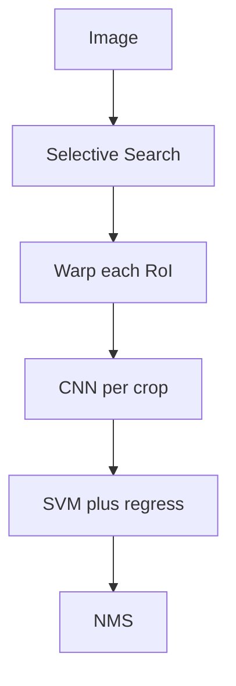

import { ConceptTemplate } from '@/features/kb/components/templates/ConceptTemplate'
import { Callout } from '@/features/kb/components/mdx/Callout'
import { ComparisonTable } from '@/features/kb/components/mdx/ComparisonTable'

export default function Layout({ children }) {
  return (
    <ConceptTemplate title="R-CNN">
      {children}
    </ConceptTemplate>
  )
}

**R-CNN** (Girshick et al., 2014) is the ancestor, not the thing you ship. **Selective Search** (or EdgeBoxes) proposes ~2000 region boxes. Each crop is warped to a fixed size, run through a CNN (AlexNet/VGG), and classified with class SVMs. A linear **bounding-box regressor** refines the box. It crushed HOG+DPM on PASCAL — and took **tens of seconds** per image because the CNN ran 2000 times.

## 1. Deep Dive and Mechanics

**Warp.** Proposals have wild aspect ratios. R-CNN squashes them to 227², which distorts objects. Later RoIPool / RoIAlign keep the feature map and sample, instead of re-cropping pixels.

**Training.** Supervised pretrain on ImageNet, fine-tune on warped regions, then train SVMs on frozen features (positive = high IoU with GT). Multi-stage and fussy.

**Fast R-CNN (2015).** One CNN on the whole image; RoIPool extracts features per box. Same proposals, ~10× faster, end-to-end softmax. **Faster R-CNN** then learns proposals (RPN). Read that page for the production two-stage story.

<Callout icon="info" title="Why we still teach it">
Every modern detector still "propose or query, then classify and regress." R-CNN is the sentence in slow motion.
</Callout>

## 2. Mathematical / Theoretical Foundation

Detection as **classification of candidate windows**. The CNN provides a representation φ(crop). SVM learns w_c · φ. Box regression is a class-specific linear map on φ toward GT offsets (t_x, t_y, t_w, t_h) as in the paper's parameterisation.

Compute: O(P) forward passes for P proposals. Fast/Faster make this O(1) image pass + cheap RoI heads.

<ComparisonTable
  headers={['System', 'CNN forwards', 'Proposals']}
  rows={[
    ['R-CNN', 'Per crop, ~2k', 'Selective Search'],
    ['Fast R-CNN', 'One image', 'Selective Search'],
    ['Faster R-CNN', 'One image', 'RPN (learned)'],
  ]}
/>

## 3. Real-World Implementation

Nobody trains original R-CNN in 2026. If you must recreate the idea for a class:

```python
# Conceptual only
for box in selective_search(image):
    crop = warp(image, box, 224)
    feat = cnn(crop)
    scores = [svm[c].decision(feat) for c in classes]
    box = box + regressor[c_hat](feat)
```

Use torchvision Faster R-CNN for real work.

## 4. Visualizations



## 5. Interview Prep

**Q: Bottleneck?**
**A:** Repeated CNN eval and disk-caching features. Also non-differentiable proposals.

**Q: Why SVMs not softmax in the first paper?**
**A:** They found SVMs on frozen features a bit better then; Fast R-CNN dropped that.

**Q: Relation to overfeat?**
**A:** Overfeat did conv sliding-window. R-CNN used external object-like proposals. Both are 2013–14 history; FPN+RPN or YOLO won.

## 6. Production Use Cases

- **None**, except explaining a design review.
- **Legacy** academic code reproductions.

<Callout icon="tip" title="Say Fast/Faster in interviews unless asked">
If the prompt is "how does two-stage detection work?", start at RPN, mention R-CNN as the ancestor, and do not linger on Selective Search.
</Callout>
