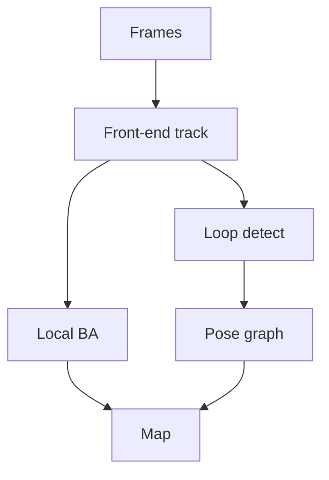

import { ConceptTemplate } from '@/features/kb/components/templates/ConceptTemplate'
import { Callout } from '@/features/kb/components/mdx/Callout'
import { ComparisonTable } from '@/features/kb/components/mdx/ComparisonTable'

export default function Layout({ children }) {
  return (
    <ConceptTemplate title="SLAM (Vision-Based)">
      {children}
    </ConceptTemplate>
  )
}

**SLAM** estimates the sensor **pose** and a **map** at once. Vision-based SLAM uses monocular, stereo, or RGB-D cameras (often plus IMU: VIO). ORB-SLAM, VINS-Mono, Kimera, RTAB-Map, and commercial ARKit/ARCore are this problem engineered. Without **loop closure**, you walk a square and the map is a spiral.

## 1. Deep Dive and Mechanics

**Front-end.** Detect and match features (ORB, SuperPoint) or track photometric residuals (DSO, SVO). Output is a relative pose guess and inliers.

**Back-end.** Optimise a pose graph or a full BA window (g2o, GTSAM, Ceres). Keyframes, not every frame.

**Loop closure.** Place recognition (DBoW2, NetVLAD) proposes "I have been here." Add a constraint, the graph snaps. False loops wreck the map — ratio tests and geometric verify.

**Monocular.** Scale is free to drift (or is fused from IMU / stereo). Pure mono SLAM is up to scale.

**Dynamic scenes.** People walking through the map are moving outliers. Detect and mask, or use robust kernels.

<Callout icon="warning" title="White walls">
Feature SLAM needs texture. A hospital corridor can kill tracking. Have a recovery (relocalise) and a sensor backup (wheel, IMU, depth).
</Callout>

## 2. Mathematical / Theoretical Foundation

State: camera poses T_k ∈ SE(3), map points X_j. Measurements: reprojection `π(T^{-1} X)`. Factor graphs encode odometry, IMU preintegration, and loop factors. Gauge: first pose (and scale if mono) pinned.

<ComparisonTable
  headers={['Flavour', 'Map', 'Scale']}
  rows={[
    ['Mono feature', 'Sparse points', 'Unknown / drifted'],
    ['Stereo / RGB-D', 'Sparse or TSDF', 'Metric'],
    ['VIO', 'Sparse plus IMU', 'Metric if IMU biased well'],
    ['NeRF-SLAM', 'Radiance / Gaussians', 'Research + some products'],
  ]}
/>

## 3. Real-World Implementation

```text
Typical ORB-SLAM3 flow:
track features → local BA on a window → insert keyframe
→ bag-of-words loop query → pose-graph optimise → (optional) full BA
```

ROS + a recorded bag is how you debug, not a live demo first.

## 4. Visualizations



## 5. Interview Prep

**Q: SLAM vs odometry?**
**A:** Odometry is dead-reckoning (drift OK). SLAM builds a reusable map and closes loops.

**Q: Why IMU?**
**A:** Fast motion, textureless frames, and metric scale for mono. IMU bias estimation is the tax.

**Q: Relocalisation vs tracking?**
**A:** Tracking is frame-to-frame. Relocalise is global place recognition after you got lost.

## 6. Production Use Cases

- **Warehouse AMRs** (usually lidar-first, vision as helper).
- **AR** persistent content.
- **Drones** indoor.

<Callout icon="tip" title="Log the covariance">
A pose without uncertainty is a lie. Downstream planners need to know when tracking is "confident" vs "we are guessing."
</Callout>
