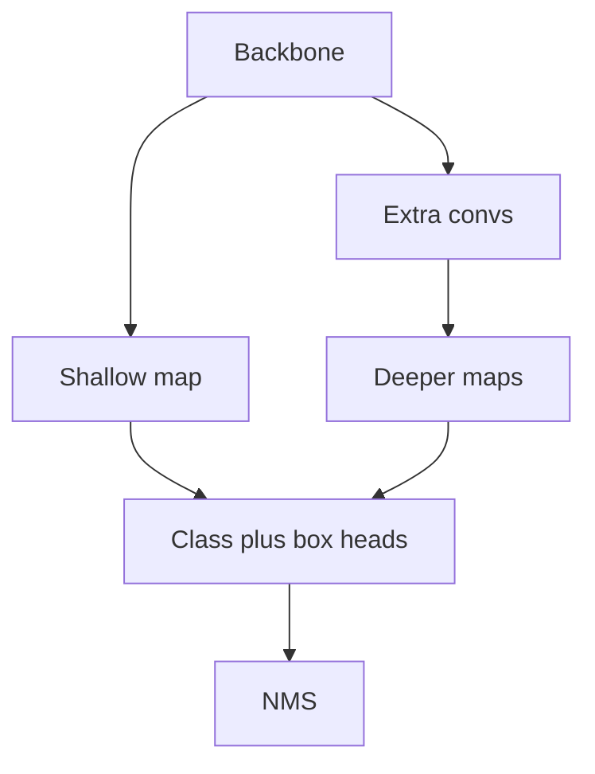

import { ConceptTemplate } from '@/features/kb/components/templates/ConceptTemplate'
import { Callout } from '@/features/kb/components/mdx/Callout'
import { ComparisonTable } from '@/features/kb/components/mdx/ComparisonTable'

export default function Layout({ children }) {
  return (
    <ConceptTemplate title="SSD">
      {children}
    </ConceptTemplate>
  )
}

**SSD** (Liu et al., 2016) predicts classes and box offsets **directly** on a pyramid of conv maps (conv4_3, extra layers, …) with **default boxes** (anchors) at each cell. No RPN, no second RoI pass. On 2016 hardware that meant 50+ FPS at 300² with competitive VOC mAP — the "YOLO but multi-scale" story of its year.

## 1. Deep Dive and Mechanics

**Multi-scale maps.** Shallow maps (higher res) handle small objects; deep maps handle large ones. Each cell owns default boxes of several aspects. That is FPN's ancestor, without the later lateral fusion.

**Matching.** GT assigned to defaults by IoU (best + above 0.5). Hard-negative mining keeps the foreground/background ratio sane (e.g. 1:3) — otherwise softmax drowns in easy negatives. RetinaNet later replaced this with focal loss.

**Input size.** SSD300 vs SSD512 is a real accuracy/latency knob. Tiny objects still lose; people stacked deconvolution or used DSSD.

**Today.** Ultralytics YOLO and FCOS-likes dominate one-stage. SSD is what you inherit in old mobile apps and what interviewers use to probe anchors + pyramids.

<Callout icon="info" title="Default boxes are anchors">
Same math as Faster R-CNN's anchors, tiled on several maps instead of (classically) one RPN map. Naming is historical.
</Callout>

## 2. Mathematical / Theoretical Foundation

Per default box: softmax over classes+background and 4 offsets. Smooth-L1 on positives. NMS at the end. The "single shot" claim is: one forward, dense decode — vs two-stage RoI heads.

<ComparisonTable
  headers={['2016-era model', 'Proposals', 'Scales']}
  rows={[
    ['Faster R-CNN', 'RPN', 'Mostly one map then FPN later'],
    ['YOLO v1', 'None (grid)', 'One map'],
    ['SSD', 'None (defaults)', 'Several maps'],
  ]}
/>

## 3. Real-World Implementation

```python
# torchvision has ssd300_vgg16
from torchvision.models.detection import ssd300_vgg16
model = ssd300_vgg16(weights='DEFAULT')
```

For new projects prefer a maintained YOLO or RT-DETR unless you must match an SSD export.

## 4. Visualizations



## 5. Interview Prep

**Q: SSD vs YOLO v1?**
**A:** YOLO v1 one grid, more localisation error. SSD multi-scale defaults, better small-object VOC numbers at the time. YOLO later absorbed multi-scale (v3+).

**Q: Why hard-negative mining?**
**A:** 10k defaults, ~10 objects. Unmined loss is almost all background. Focal loss is the smoother 2017 answer.

**Q: Is SSD dead?**
**A:** As a *paper*, yes. As a *pattern* (dense anchors on a pyramid), no — it is half of every one-stage net.

## 6. Production Use Cases

- **Embedded** firmware still shipping SSD-MobileNet (TFLite zoo).
- **Teaching** one-stage assignment.

<Callout icon="tip" title="If you inherit SSD-MobileNet">
Re-evaluate on *your* camera. 2016 COCO numbers plus a wide-angle lobby cam is not a spec. Consider a modern nano YOLO before you write a new C++ kernel.
</Callout>
