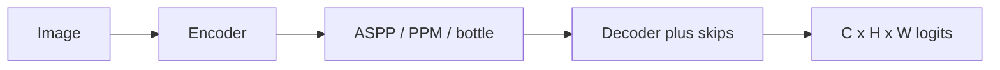

import { ConceptTemplate } from '@/features/kb/components/templates/ConceptTemplate'
import { Callout } from '@/features/kb/components/mdx/Callout'
import { ComparisonTable } from '@/features/kb/components/mdx/ComparisonTable'

export default function Layout({ children }) {
  return (
    <ConceptTemplate title="Semantic Segmentation">
      {children}
    </ConceptTemplate>
  )
}

**Semantic segmentation** paints the image with a **class map**: road, sky, person, car. All pixels of "car" share one id. Two cars merge into one blob. **Instance** and **panoptic** segmentation fix that (see those pages / Mask R-CNN).

FCN (2015), DeepLab (ASPP / atrous), PSPNet, HRNet, SegFormer, Mask2Former (also instance) are the lineage. **U-Net** is the biomedical default.

## 1. Deep Dive and Mechanics

**Encoder–decoder.** Downsample for context, upsample (deconv, bilinear + conv) for resolution. Skip connections (U-Net) copy fine edges back.

**Atrous / ASPP.** Dilated convs enlarge the field without pooling away resolution — DeepLab's trick for "I need context and sharp boundaries."

**Loss.** Per-pixel CE is the baseline. Class imbalance (road vs traffic light) wants weighted CE, dice, or focal. Boundary losses help thin structures.

**Output stride.** Predict at 1/4 or 1/8 then upsample. Full 1/1 from the start is VRAM suicide on 2K frames.

<Callout icon="warning" title="Metrics lie on rare classes">
Mean IoU averages classes. 0.95 mIoU with 0.1 IoU on "stroller" is a crashed robot. Report per-class IoU and a safety-critical subset.
</Callout>

## 2. Mathematical / Theoretical Foundation

IoU_c = TP / (TP+FP+FN) on pixels of class c. mIoU = mean_c IoU_c. Pixel accuracy is dominated by the majority class — do not quote it alone.

FCN showed that a classification net + 1×1 + upsample is a dense predictor. Everything since is better context and better upsampling.

<ComparisonTable
  headers={['Task', 'ID per pixel']}
  rows={[
    ['Semantic', 'Class only'],
    ['Instance', 'Class plus instance id (things)'],
    ['Panoptic', 'Things instanced, stuff semantic'],
  ]}
/>

## 3. Real-World Implementation

```python
from torchvision.models.segmentation import deeplabv3_resnet50
model = deeplabv3_resnet50(weights='DEFAULT')
out = model(img)['out']  # B x C x H x W logits
mask = out.argmax(1)
```

## 4. Visualizations



## 5. Interview Prep

**Q: Why not classify every crop?**
**A:** Sliding-window classify is detection-era slow and inconsistent at boundaries. Dense heads share features.

**Q: CRF at the end?**
**A:** 2015 DeepLab used DenseCRF. Learned decoders mostly ate that lunch. Still appears in some medical papers.

**Q: Realtime seg?**
**A:** BiSeNet, PIDNet, Lite-HRNet, or a small SegFormer. Watch boundary IoU, not only FPS.

## 6. Production Use Cases

- **ADAS** free space / lane stuff.
- **Satellite** land cover.
- **Medical** organs (often U-Net).

<Callout icon="tip" title="Align the label palette">
Train 19 Cityscapes classes and then eval with a 35-class map and you will invent a new random baseline. Version the colour table with the checkpoint.
</Callout>
