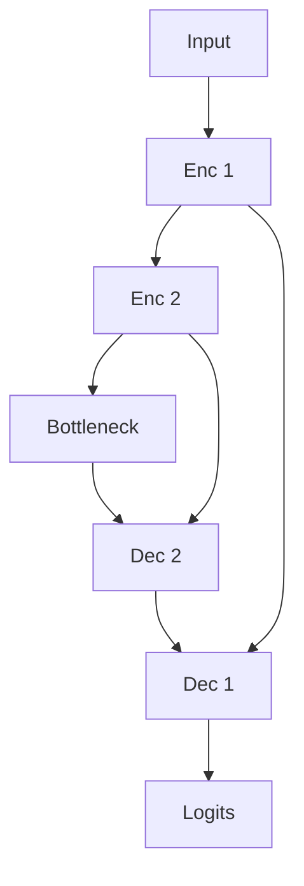

import { ConceptTemplate } from '@/features/kb/components/templates/ConceptTemplate'
import { Callout } from '@/features/kb/components/mdx/Callout'
import { ComparisonTable } from '@/features/kb/components/mdx/ComparisonTable'

export default function Layout({ children }) {
  return (
    <ConceptTemplate title="U-Net">
      {children}
    </ConceptTemplate>
  )
}

**U-Net** (Ronneberger et al., 2015) is a U-shaped FCN: a contracting path (conv + pool) and an expanding path (upsample + conv) with **skip concatenations** that splice encoder feature maps onto the decoder at the same scale. Designed for cell tracking with few annotated slides, it became the starting point for almost every medical segmentation repo and a lot of satellite / industrial work.

## 1. Deep Dive and Mechanics

**Skips.** The encoder knows *where* (high-res edges). The bottleneck knows *what*. Concat (not just add, in the original) lets the decoder see both. ResNet-style *add* skips appear in residual U-Nets.

**Valid conv vs padding.** The 2015 paper used unpadded convs and a clever overlap-tile strategy for large images. Everyone else uses `same` padding now. Do not mix paper output sizes with a padded impl.

**3D / variants.** V-Net, nnU-Net (the auto-configured winner of many medical challenges), Attention U-Net, U-Net++, TransUNet (ViT bottleneck). **nnU-Net** is what you should actually run on a new CT dataset before inventing a block.

**Loss.** Dice + CE is the medical cliché because organs are small. Deep supervision on decoder stages helps.

<Callout icon="info" title="U-Net is a topology">
The "U" is skips + symmetric scales. The stem can be ResNet, ConvNeXt, or a tiny MobileNet. Debating 3×3 vs 5×5 without nnU-Net fingerprinting is usually procrastination.
</Callout>

## 2. Mathematical / Theoretical Foundation

Each decoder level: upsample by 2, concat encoder map, two convs. Receptive field at the bottom is large; skip tensors restore the high-frequency residual the pool destroyed. Dice = 2|P∩G| / (|P|+|G|) is the differentiable IoU cousin used as a loss.

<ComparisonTable
  headers={['Net', 'Skips', 'Typical data']}
  rows={[
    ['U-Net', 'Concat U'],
    ['FCN-8s', 'Add / fuse scores'],
    ['DeepLab', 'ASPP, lighter decoder'],
    ['nnU-Net', 'U-Net family, auto config'],
  ]}
/>

## 3. Real-World Implementation

```python
# segmentation-models-pytorch
import segmentation_models_pytorch as smp
model = smp.Unet(encoder_name='resnet34', encoder_weights='imagenet', classes=2)
```

For clinical CT, prefer the official nnU-Net pipeline (resample, intensity, 5-fold).

## 4. Visualizations



## 5. Interview Prep

**Q: Concat vs sum skips?**
**A:** Concat keeps channels and lets 1×1 mix; sum needs matching channels (residual). Original U-Net concats.

**Q: Why does U-Net win on 30 labeled slices?**
**A:** Strong locality bias, few params vs a ViT, and skips that preserve edges. Also medical patches are stereotyped.

**Q: 2D vs 3D U-Net?**
**A:** Anisotropic CT (thick slices) often uses 2.5D. Isotropic MRI likes 3D if VRAM allows.

## 6. Production Use Cases

- **Radiology** organs, tumours (with a human in the loop).
- **Microscopy** cells.
- **Document / satellite** when you have a handful of masks.

<Callout icon="warning" title="Dice on empty slices">
All-background patches make Dice explode or NaN. Smooth the denominator and sample foreground-aware patches (nnU-Net does).
</Callout>
