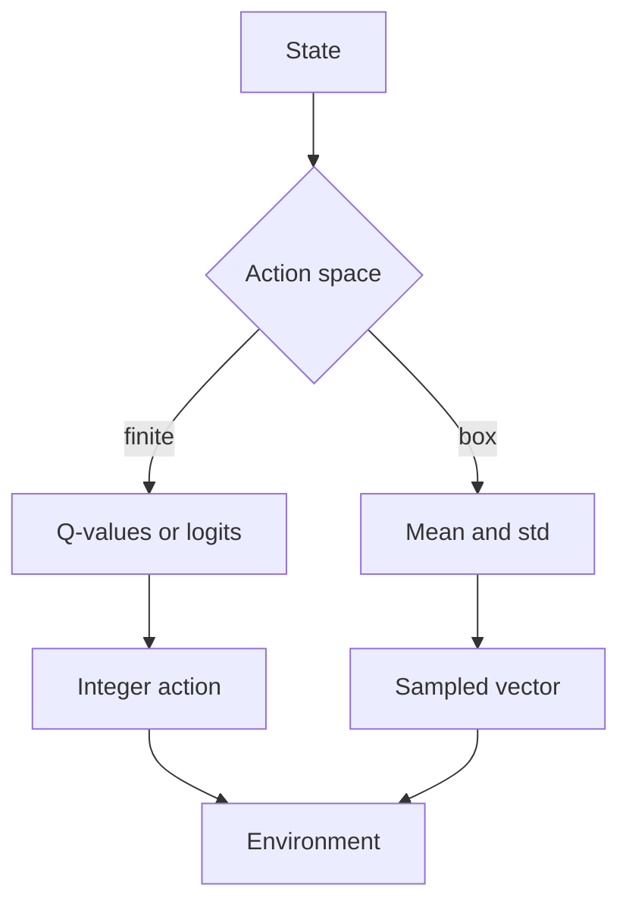

import { ConceptTemplate } from '@/features/kb/components/templates/ConceptTemplate'
import { Callout } from '@/features/kb/components/mdx/Callout'
import { ComparisonTable } from '@/features/kb/components/mdx/ComparisonTable'

export default function Layout({ children }) {
  return (
    <ConceptTemplate title="Actions (Reinforcement Learning)">
      {children}
    </ConceptTemplate>
  )
}

Supervised models emit a label and stop. An RL **action** is applied to an environment and *changes what happens next*. The set of legal actions — the **action space** — decides whether you can tabulate Q-values, whether you need a Gaussian policy, and how dangerous a bad sample is.

## 1. Deep Dive and Mechanics

**Discrete.** Finite set: left / right / jump, or “which SKU to show.” Q-learning and DQN output one value per action. Illegal actions must be masked (set logits to -inf) or the agent will press buttons the API rejects.

**Continuous.** A vector in a box, a simplex, or a manifold (unit quaternion). You cannot max over infinitely many Q-values without a trick (DDPG/TD3 critic + actor, or CEM). PPO/SAC output a distribution, usually diagonal Gaussian, then squash with tanh to a box.

**Hybrid and structured.** “Which tool” plus “how hard to press.” Parameterised actions, autoregressive tokens, or a planner that turns a high-level action into motor commands.

**Multi-step and options.** An “action” can be a temporally extended **option** (Sutton): a policy plus a termination condition. Hierarchies reduce effective horizon.

<Callout icon="info" title="Action repeat">
Atari agents often repeat the same button for 4 frames. That is part of the action definition. Changing repeat without retraining is a new MDP.
</Callout>

## 2. Mathematical / Theoretical Foundation

A is the action set of the MDP. A policy is pi(a | s). For discrete A, pi is a softmax over |A| logits. For continuous A, pi is typically N(mu_theta(s), sigma) with a Jacobian correction if you tanh-squash (SAC).

The Q-function is defined for each pair (s, a). Argmax_a Q(s, a) is cheap only when A is small. In continuous control the actor approximates that argmax.

<ComparisonTable
  headers={['Space', 'Typical algo', 'Failure mode']}
  rows={[
    ['Small discrete', 'DQN, PPO categorical', 'Unmasked illegal actions'],
    ['Huge discrete', 'Policy gradient, action embeddings', 'Slow argmax, sparse credit'],
    ['Box continuous', 'SAC, PPO, TD3', 'Exploding torque, bad squashing'],
    ['Hybrid', 'Parameterised / hierarchical', 'Two time-scales, credit split'],
  ]}
/>

## 3. Real-World Implementation

```python
import torch
import torch.nn.functional as F

def masked_categorical(logits: torch.Tensor, legal: torch.Tensor) -> torch.Tensor:
    # legal is 1 where the API will accept the action
    masked = logits.masked_fill(legal == 0, float('-inf'))
    return F.softmax(masked, dim=-1)
```

Never sample from an unmasked softmax and “hope” the env no-ops illegal moves — that silently changes the policy.

## 4. Visualizations



## 5. Interview Prep

**Q: Why not DQN on steering angle?**
**A:** Infinite actions; max_a Q is not a lookup. Use an actor (DDPG/TD3/SAC) or discretise the wheel and accept quantisation error.

**Q: What is action masking?**
**A:** Zeroing probability (or Q) of moves the rules forbid so gradients and exploration stay on the legal set.

**Q: Why tanh-squash a Gaussian in SAC?**
**A:** Environments expect a bounded control. Squash maps R to (-1, 1); you must add the log-det Jacobian so the entropy term stays correct.

## 6. Production Use Cases

- **Games and UI:** discrete clicks; mask disabled widgets.
- **Robotics and HVAC:** continuous setpoints with safety clips *after* the policy, plus a watchdog.
- **Bidding:** discrete price tiers or a continuous bid; both need budget constraints in the action, not only in the reward.

<Callout icon="tip" title="Log the action the env received">
If you clip, quantise, or latency-delay the command, the learner must see that same action in the transition tuple or off-policy methods become inconsistent.
</Callout>
