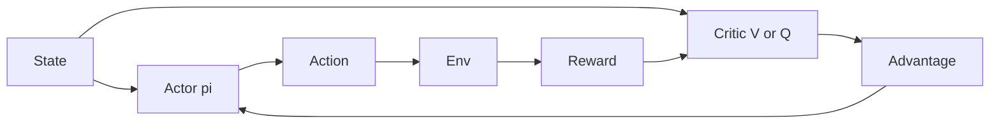

import { ConceptTemplate } from '@/features/kb/components/templates/ConceptTemplate'
import { Callout } from '@/features/kb/components/mdx/Callout'
import { ComparisonTable } from '@/features/kb/components/mdx/ComparisonTable'

export default function Layout({ children }) {
  return (
    <ConceptTemplate title="Actor-Critic Methods">
      {children}
    </ConceptTemplate>
  )
}

Pure REINFORCE waits until the episode ends and still shakes. **Actor-critic** trains two models: the **actor** pi_theta(a|s) and the **critic** V_w(s) or Q_w(s,a). The critic supplies a bootstrapped advantage so the actor can update every few steps, not every death.

## 1. Deep Dive and Mechanics

**A2C / A3C.** Advantage actor-critic. Many env workers (async in A3C, batched in A2C). Critic learns TD; actor maximises A_t log pi. Shared conv trunk is common; fight interference with grad clip.

**GAE.** Smooth the advantage with lambda. This is the default critic signal in PPO, which is actor-critic plus a clipped surrogate.

**Off-policy actors.** DDPG/TD3/SAC: the actor maximises the critic (deterministic or entropy-regularised). Replay is allowed because the critic is Q, not an on-policy V of the current pi only — with the usual off-policy caveats.

**Two-time-scale.** If the actor runs ahead of a stale critic, advantages are nonsense. Target nets, delayed actor updates (TD3), and not over-fitting V on one batch are the usual brakes.

<Callout icon="info" title="Who is the product?">
You deploy the actor. The critic is training scaffolding — unless you use Q at serve time (rare, latency).
</Callout>

## 2. Mathematical / Theoretical Foundation

Actor step: theta ← theta + alpha ∇_theta log pi_theta(a|s) A_w(s,a). Critic step: regress V_w toward r + gamma V_w(s') (or a Q Bellman error).

Asymptotic analyses treat critic as a faster timescale (Borkar two-time-scale SA). In deep RL both are the same Adam — theory is a vibe.

<ComparisonTable
  headers={['Family', 'Actor', 'Critic']}
  rows={[
    ['A2C', 'Stochastic on-policy', 'V, GAE'],
    ['PPO', 'Stochastic, clipped', 'V, GAE'],
    ['DDPG/TD3', 'Deterministic', 'Q, replay'],
    ['SAC', 'Stochastic entropy', 'Twin Q, replay'],
  ]}
/>

## 3. Real-World Implementation

```python
def a2c_losses(log_pi, values, returns, entropy):
    adv = returns - values.detach()
    policy_loss = -(log_pi * adv).mean()
    value_loss = (returns - values).pow(2).mean()
    return policy_loss + 0.5 * value_loss - 0.01 * entropy.mean()
```

`returns` here are n-step or GAE targets, not raw Monte Carlo unless the episode is tiny.

## 4. Visualizations



## 5. Interview Prep

**Q: Why not just REINFORCE?**
**A:** Variance. A learned baseline / TD advantage lets you use shorter rollouts and more parallel workers.

**Q: Shared trunk — good idea?**
**A:** Saves compute and can help the actor see critic features. It can also wreck one head when the other has a huge loss. Watch both losses.

**Q: Is Q-learning actor-critic?**
**A:** The greedy policy is an implicit actor. People reserve the name for an explicit parameterised pi trained with a critic.

## 6. Production Use Cases

- **Default deep RL** for games and robots: PPO or SAC, both actor-critic.
- **Recommendation** with a policy over slates and a critic on delayed reward.
- **Simulators** with vectorised A2C as a cheap smoke test before PPO.

<Callout icon="tip" title="Normalise advantages">
Per-batch mean 0 std 1 on A_t is boring and extremely effective. Do it after GAE, before the actor loss.
</Callout>
