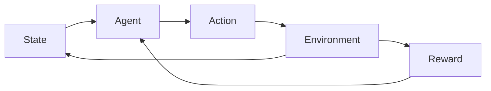

import { ConceptTemplate } from '@/features/kb/components/templates/ConceptTemplate'
import { Callout } from '@/features/kb/components/mdx/Callout'
import { ComparisonTable } from '@/features/kb/components/mdx/ComparisonTable'

export default function Layout({ children }) {
  return (
    <ConceptTemplate title="Agents (Reinforcement Learning)">
      {children}
    </ConceptTemplate>
  )
}

An **agent** is the piece that *chooses* and *learns*. The environment is the rest of the world. That split is the RL API: the agent does not internally simulate physics unless it is model-based; it sends an action and receives (observation, reward, done).

## 1. Deep Dive and Mechanics

**Loop.** Observe → select action (explore or exploit) → env steps → store transition → every N steps, update parameters. Evaluation runs the same loop with exploration off.

**What lives inside.** A **policy** (and maybe a **value** / **Q** head), an **optimizer**, optional **replay**, optional **world model**, and a **scheduler** for epsilon, entropy, or learning rate.

**On-policy vs off-policy.** On-policy agents (vanilla PG, PPO, SARSA) must learn from data the current policy collected. Off-policy agents (Q-learning, DQN, SAC) can reuse a replay buffer or another actor’s logs.

**Multiple bodies.** One policy can control many env copies (vectorised rollouts). That is still one agent logically; **multi-agent RL** is several learners with coupled rewards.

<Callout icon="info" title="Agent is not the env wrapper">
Gym/Gymnasium `Env` is the world. `nn.Module` plus `act()` plus `learn()` is the agent. Mixing them (calling `env.step` inside `forward`) makes testing and export miserable.
</Callout>

## 2. Mathematical / Theoretical Foundation

The agent implements a policy pi_theta and a learning rule that (in expectation) increases J(theta) = E_pi[return]. Value-based agents store Q or V and derive pi by greedy or softmax. Actor-critic agents store both.

Convergence theorems assume infinite visits, decaying stepsizes, and a Markov state. Deep agents inherit none of that automatically — they inherit inductive bias and a lot of hyperparameters.

<ComparisonTable
  headers={['Agent style', 'Stores', 'Data']}
  rows={[
    ['Tabular Q', 'Table Q(s,a)', 'Off-policy transitions'],
    ['DQN', 'Q-net plus replay plus target', 'Off-policy'],
    ['PPO', 'pi and V, rollout buffer', 'On-policy'],
    ['Model-based', 'pi plus T-hat and R-hat', 'Real plus imagined'],
  ]}
/>

## 3. Real-World Implementation

```python
class Agent:
    def __init__(self, policy, explorer):
        self.policy = policy
        self.explorer = explorer

    def act(self, state, eval_mode: bool = False):
        logits = self.policy(state)
        if eval_mode:
            return int(logits.argmax())
        return self.explorer.sample(logits)

    def learn(self, batch) -> dict:
        return self.policy.update(batch)
```

Keep `act` free of gradient side effects so you can export it without the trainer.

## 4. Visualizations



## 5. Interview Prep

**Q: Agent vs environment?**
**A:** Agent picks actions and updates. Environment defines P and R and the observation. The boundary is wherever you can no longer issue a control.

**Q: Can one agent have two networks?**
**A:** Yes — actor and critic, or online and target Q. They are still one agent if they share a training loop and a control interface.

**Q: Is an LLM tool-user an RL agent?**
**A:** Only if it is trained (or bandit-updated) on a reward from the environment. A scripted ReAct loop is an agent in the systems sense, not necessarily an RL agent.

## 6. Production Use Cases

- **Game AI and robotics** — the textbook loop, often with a safety filter around `act`.
- **Bid / allocate** — agent is a service; env is the market over a day.
- **Sim-to-real** — train the agent in sim, freeze `act`, keep the same observation contract on the robot.

<Callout icon="tip" title="Version the act() contract">
Schema of the observation and legal actions is an API. Bump it like a model card when you add a sensor.
</Callout>
