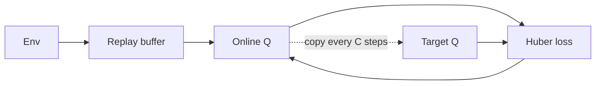

import { ConceptTemplate } from '@/features/kb/components/templates/ConceptTemplate'
import { Callout } from '@/features/kb/components/mdx/Callout'
import { ComparisonTable } from '@/features/kb/components/mdx/ComparisonTable'

export default function Layout({ children }) {
  return (
    <ConceptTemplate title="Deep Q-Networks (DQN)">
      {children}
    </ConceptTemplate>
  )
}

Tabular Q-learning dies when the state is pixels. **DQN** lets a conv net stand in for the table: input stack of frames, output one Q per joystick action. Three engineering pieces made it stable enough to publish: **experience replay**, a **target network**, and **reward clipping**.

## 1. Deep Dive and Mechanics

**Replay.** Transitions go into a ring buffer. Updates sample a minibatch, breaking the correlation of consecutive frames and letting rare events reappear.

**Target net.** Every C steps, copy theta → theta-minus. The TD target is r + gamma max_a Q(s', a; theta-minus). Without the freeze, both sides of the regression move and the net can blow up.

**Preprocess.** Atari: 84×84 greyscale, 4-frame stack, action repeat 4, clip r to [-1, 1], terminate on loss of life (training only, original Nature setup).

**Rainbow and friends.** Double Q, dueling heads (V + advantage), prioritized replay, n-step, distributional RL (C51/QR-DQN), noisy nets. Production stacks pick a subset.

<Callout icon="warning" title="Maximisation bias">
The online net picking max_a Q(s', a) overestimates. Double DQN: select with online, evaluate with target. Cheap and usually worth it.
</Callout>

## 2. Mathematical / Theoretical Foundation

Minimise E[(y - Q_theta(s,a))^2] with y = r + gamma max_a' Q_theta-(s', a') (or  r if terminal). This is *not* a contraction once Q is a deep net. Replay + target is an empirical fix for the deadly triad.

Distributional DQN learns Z(s,a), a return distribution; the mean is Q. Often stronger because the loss sees the shape, not one scalar.

<ComparisonTable
  headers={['Ingredient', 'Role', 'Skip?']}
  rows={[
    ['Replay', 'Decorrelate, reuse', 'On-policy then no'],
    ['Target net', 'Stable y', 'Almost never'],
    ['Double Q', 'Less overestimate', 'Rarely skip'],
    ['Prioritized replay', 'TD-error sampling', 'Optional, extra bias'],
  ]}
/>

## 3. Real-World Implementation

```python
import torch
import torch.nn.functional as F

def dqn_loss(online, target, batch, gamma=0.99):
    q = online(batch.s).gather(1, batch.a.unsqueeze(1)).squeeze(1)
    with torch.no_grad():
        next_a = online(batch.s2).argmax(1, keepdim=True)
        next_q = target(batch.s2).gather(1, next_a).squeeze(1)
        y = batch.r + gamma * next_q * (1.0 - batch.done)
    return F.smooth_l1_loss(q, y)
```

That is Double DQN. Swap `next_a` for `target(batch.s2).argmax` to get vanilla DQN.

## 4. Visualizations



## 5. Interview Prep

**Q: Why not just SGD on consecutive frames?**
**A:** Strong temporal correlation; one bad streak dominates the gradient. Replay mixes the past.

**Q: Why clip Atari rewards?**
**A:** Different games have different score scales. Clipping keeps TD errors comparable so one hyperparameter set can play many titles. You lose magnitude information.

**Q: DQN for continuous control?**
**A:** Not without discretising or switching to an actor (DDPG/TD3/SAC). The max over a is the blocker.

## 6. Production Use Cases

- **Discrete product actions:** which template, which bid tier, which server pool.
- **Game QA bots** and simple NPC policies.
- **Baselines** before you pay for PPO on a new simulator.

<Callout icon="tip" title="Eval without epsilon">
Train with decaying epsilon. Snapshot greedy scores every N env steps. Replay size and target period belong in the report; they change the algorithm.
</Callout>
