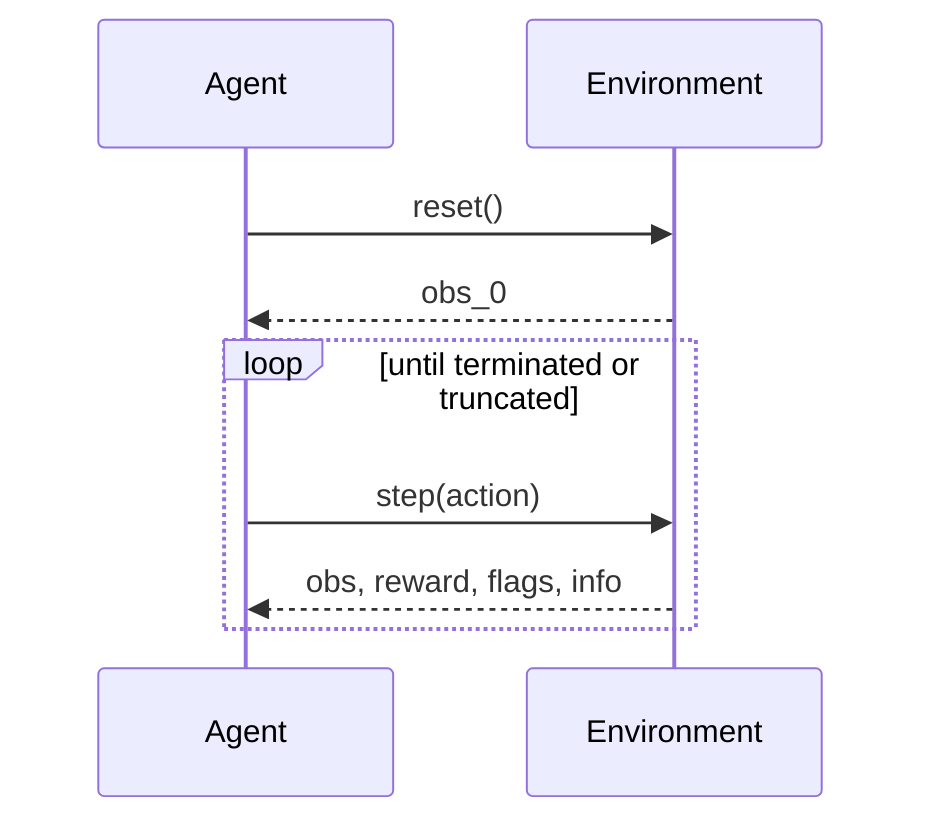

import { ConceptTemplate } from '@/features/kb/components/templates/ConceptTemplate'
import { Callout } from '@/features/kb/components/mdx/Callout'
import { ComparisonTable } from '@/features/kb/components/mdx/ComparisonTable'

export default function Layout({ children }) {
  return (
    <ConceptTemplate title="Environments (Reinforcement Learning)">
      {children}
    </ConceptTemplate>
  )
}

The **environment** is everything the agent does not control: physics, users, markets, a game ROM. In code it is an object with `reset` and `step`. If those two methods lie about the real world, you have trained a demo, not a controller.

## 1. Deep Dive and Mechanics

**Gymnasium contract.** `reset()` → initial obs. `step(action)` → obs, reward, terminated, truncated, info. **Terminated** means a true terminal state (goal, death). **Truncated** means you cut the episode (time limit). Bootstrapping must treat them differently.

**Vectorisation.** `SyncVectorEnv` / `AsyncVectorEnv` run N copies for throughput. Seeds, auto-reset, and info dicts become easy places to desync.

**Wrappers.** Frame skip, greyscale, reward clip, action repeat — each wrapper is a new MDP. Log the wrapper stack next to the checkpoint.

**Sim vs real.** Sim is cheap and biased. Domain randomisation and system ID narrow the gap; they do not delete it. Real envs have latency: the action you send now lands later.

<Callout icon="warning" title="Time-limit truncation">
If you set `done=True` on a timeout and bootstrap with zeros, you teach the agent the horizon is absorbing. Use `truncated` and bootstrap with V(s_T).
</Callout>

## 2. Mathematical / Theoretical Foundation

The env realises P(s' | s, a) and R. Episodes are trajectories from an initial distribution mu(s_0). Continuing tasks have no `reset`; they need average-reward or a discount that is a genuine preference, not a hack for finite rollouts.

Partial observability: the env may emit o_t, not s_t. Then the “environment” the algorithm sees is the induced POMDP on histories.

<ComparisonTable
  headers={['Env class', 'Examples', 'Pain']}
  rows={[
    ['Classic control', 'CartPole, Pendulum', 'Too small to prove scale'],
    ['Pixel games', 'Atari, Procgen', 'Wrapper stack, sticky actions'],
    ['Physics sim', 'MuJoCo, Isaac', 'Contact, dt, solver artifacts'],
    ['Real / logged', 'Ads, HVAC, robots', 'Delay, safety, non-stationarity'],
  ]}
/>

## 3. Real-World Implementation

```python
class TimeoutWrapper:
    def __init__(self, env, max_steps: int):
        self.env = env
        self.max_steps = max_steps
        self.t = 0

    def reset(self, **kwargs):
        self.t = 0
        return self.env.reset(**kwargs)

    def step(self, action):
        obs, reward, terminated, truncated, info = self.env.step(action)
        self.t += 1
        if self.t >= self.max_steps:
            truncated = True
        return obs, reward, terminated, truncated, info
```

Do not fold `truncated` into `terminated` before the learner sees the flags.

## 4. Visualizations



## 5. Interview Prep

**Q: terminated vs truncated?**
**A:** Terminated is a real absorbing outcome. Truncated is an external cutoff. Value backups should bootstrap on truncate, not on terminate.

**Q: Why vector envs?**
**A:** PPO/A2C want many independent steps per update for a low-variance gradient. One env is a sequential bottleneck.

**Q: Is a replay of production logs an environment?**
**A:** It is a **dataset** (offline RL). Stepping a logged action does not let you try a new action unless you have a model or you only evaluate the behaviour policy.

## 6. Production Use Cases

- **Gym / Isaac / Unity** for research and robot pretraining.
- **Recsys simulators** that replay user models — dangerous if the user model is the old policy.
- **Canary real traffic** as the env, with a hard action allow-list.

<Callout icon="tip" title="Seed and version the env">
`env_id`, wrapper list, and seed belong in the run config. “It worked last week” is usually a silent wrapper change.
</Callout>
