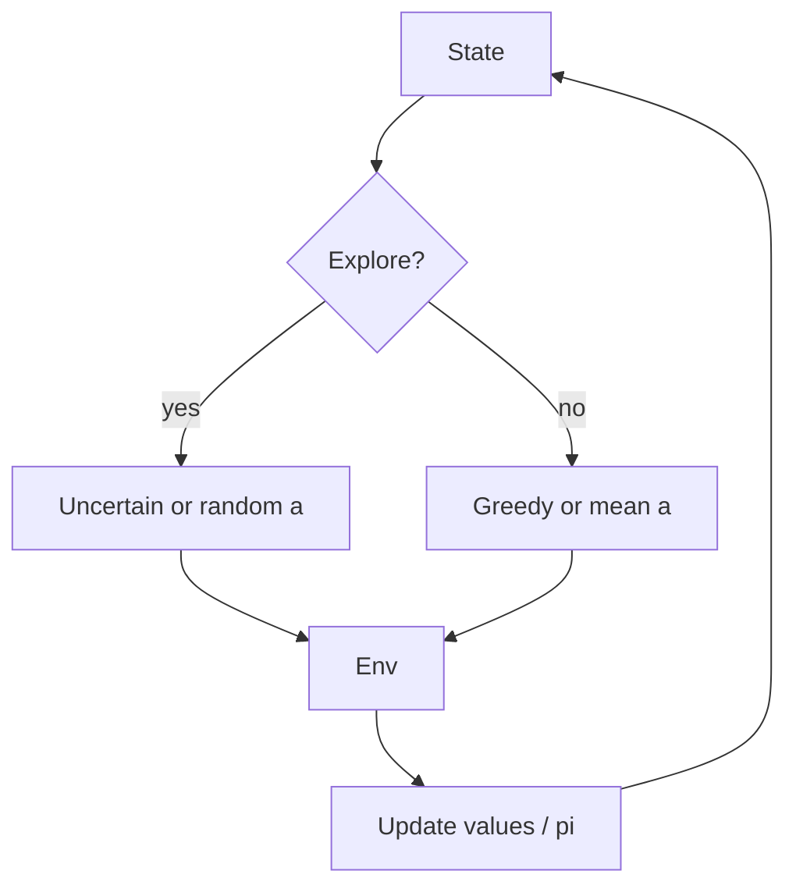

import { ConceptTemplate } from '@/features/kb/components/templates/ConceptTemplate'
import { Callout } from '@/features/kb/components/mdx/Callout'
import { ComparisonTable } from '@/features/kb/components/mdx/ComparisonTable'

export default function Layout({ children }) {
  return (
    <ConceptTemplate title="Exploration vs Exploitation">
      {children}
    </ConceptTemplate>
  )
}

If you only **exploit**, you never discover a better door. If you only **explore**, you never cash in. Every RL algorithm encodes a stance on this trade-off. Get it wrong and you either plateau on a local policy or wander until the budget dies.

## 1. Deep Dive and Mechanics

**Undirected.** Epsilon-greedy, softmax temperature, Gaussian noise, entropy bonuses. Cheap, ignore the *value of information*. Still the production default.

**Directed / uncertainty.** UCB, Thompson sampling, bootstrapped DQN, ensemble disagreement. Prefer states where models disagree or counts are low.

**Intrinsic rewards.** Curiosity (ICM, RND, Never Give Up): a bonus for prediction error or novelty. Helps sparse extrinsic r. Can be addicted to TV static (noisy TV problem).

**Scheduled vs learned.** Decay epsilon. Or learn a skill (DIAYN) and explore in skill space. Or reset to diverse starts (Go-Explore).

<Callout icon="warning" title="Noisy TV">
If the bonus is “I cannot predict this pixel,” a white-noise monitor is infinite candy. Use episodic novelty, random features (RND), or hash counts that saturate.
</Callout>

## 2. Mathematical / Theoretical Foundation

Bandits make the trade-off crisp: regret bounds for UCB and Thompson. In MDPs, **PAC-MDP** and **optimism in the face of uncertainty** (R-MAX, UCRL) add bonuses to rarely visited (s,a). Deep RL almost never has those guarantees; it borrows the *shape* of the bonus.

Optimism: treat unknown as good so the agent goes there. Pessimism (offline RL) is the opposite stance.

<ComparisonTable
  headers={['Style', 'Signal', 'Typical use']}
  rows={[
    ['Epsilon-greedy', 'Random action', 'DQN, tabular'],
    ['Entropy / noise', 'Stochastic pi', 'PPO, SAC'],
    ['UCB / counts', '1/sqrt(n)', 'Bandits, small MDPs'],
    ['Curiosity / RND', 'Prediction error', 'Hard-explore games'],
  ]}
/>

## 3. Real-World Implementation

```python
import random

def epsilon_greedy(q_row, epsilon: float) -> int:
    if random.random() < epsilon:
        return random.randrange(len(q_row))
    return int(max(range(len(q_row)), key=lambda i: q_row[i]))
```

Decay epsilon against **env steps**, not SGD steps, and keep a floor (0.01–0.05) if the MDP can change.

## 4. Visualizations



## 5. Interview Prep

**Q: Why not explore forever?**
**A:** Asymptotic optimality wants decaying exploration, but a non-stationary world (ads, users) needs a floor. State the assumption.

**Q: Entropy bonus vs epsilon?**
**A:** Entropy keeps the whole softmax alive and works in continuous action. Epsilon is a hard random override, simple with Q-values.

**Q: Is curiosity still RL?**
**A:** Yes — you changed the reward to r_ext + r_int. Optimal for the new MDP, not necessarily for r_ext alone. Turn r_int down for eval.

## 6. Production Use Cases

- **Cold start** in recsys: explore new items with a budgeted epsilon or Thompson.
- **Robotics:** entropy / SAC in sim; on the real robot, a tiny noise ball plus a safety layer.
- **Games:** RND-style bonuses for sparse-achievement titles; disable for leaderboard eval.

<Callout icon="tip" title="Evaluate greedy">
Report the exploitation policy. If your dashboard only shows training epsilon behaviour, you are measuring a different agent.
</Callout>
