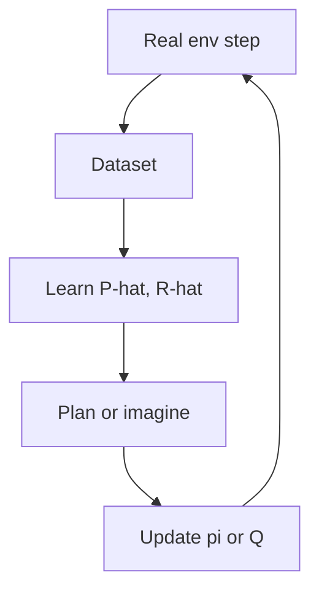

import { ConceptTemplate } from '@/features/kb/components/templates/ConceptTemplate'
import { Callout } from '@/features/kb/components/mdx/Callout'
import { ComparisonTable } from '@/features/kb/components/mdx/ComparisonTable'

export default function Layout({ children }) {
  return (
    <ConceptTemplate title="Model-Based Reinforcement Learning">
      {children}
    </ConceptTemplate>
  )
}

**Model-free** methods update pi or Q from real transitions only. **Model-based** methods estimate (or are given) P and R, then **plan** (MPC, value iteration) or **dream** extra data for a model-free learner (Dyna, Dreamer). The bet is that a model generalises faster than a policy.

## 1. Deep Dive and Mechanics

**Given model.** Chess engines, some robot kinematics. Planning (MCTS, MPPI) at decision time. No learning of P, maybe learning of a value prior.

**Learned dynamics.** Neural s' = f_theta(s, a) (+ uncertainty). Train on real (s,a,s'). Use short imagined horizons — error compounds.

**Dyna.** Real step → update model → many simulated backups → update Q/pi. The 1990s idea behind a lot of 2020s “world models.”

**Latent models.** Dreamer, PlaNet: encode pixels to z, predict in z. Planning in latent space is cheaper than pixel-space.

<Callout icon="warning" title="Model exploitation">
The planner will find a fake high-reward region the model invented. Ensembles, short horizons, and mixing real data are the usual seatbelts.
</Callout>

## 2. Mathematical / Theoretical Foundation

If P-hat = P, planning computes the true Q*. With error, you get bounds in terms of total-variation or Wasserstein model error times horizon (simulation lemma). That is why long rollouts in a bad model are theoretically doomed.

Bayesian model-based RL (PILCO historically, PETS ensembles) plans with respect to model uncertainty, not a single mean network.

<ComparisonTable
  headers={['Style', 'Model', 'Control']}
  rows={[
    ['MPC / MPPI', 'Known or learned f', 'Replan each step'],
    ['Dyna-Q', 'Tabular or net P', 'Q backups in sim'],
    ['Dreamer-like', 'Latent RSSM', 'Actor-critic in dreams'],
    ['AlphaZero', 'Known rules', 'MCTS plus policy prior'],
  ]}
/>

## 3. Real-World Implementation

```python
def dyna_q_update(Q, model, s, a, r, s2, n_plan=10, alpha=0.1, gamma=0.99):
    # real
    Q[s, a] += alpha * (r + gamma * Q[s2].max() - Q[s, a])
    model.fit(s, a, r, s2)
    for _ in range(n_plan):
        sm, am = model.sample_seen_pair()
        rm, s2m = model.predict(sm, am)
        Q[sm, am] += alpha * (rm + gamma * Q[s2m].max() - Q[sm, am])
```

Never plan from states the model has never seen unless you trust its extrapolation (you should not).

## 4. Visualizations



## 5. Interview Prep

**Q: When is model-based worth it?**
**A:** Expensive real steps (robots, humans), smooth dynamics, or a *known* rule set (Go). Pixel chaos with stochastic enemies is still mostly model-free.

**Q: Model-based vs model-free sample efficiency?**
**A:** Model-based often wins on MuJoCo-like tasks. The wall clock can still lose if the model trainer is huge (Dreamer-scale).

**Q: Is MCTS model-based?**
**A:** Yes if it queries a dynamics model (the game). The policy/value nets around it can be model-free learners.

## 6. Production Use Cases

- **Robotics MPC** with an identified or learned residual model.
- **Games with perfect rules** (AlphaZero family).
- **Inventory / queueing** where a discrete-event model is already trusted.

<Callout icon="tip" title="Hold out transitions">
Validate one-step and n-step prediction error on a held-out set. If n-step error explodes at n=3, do not dream n=50.
</Callout>
