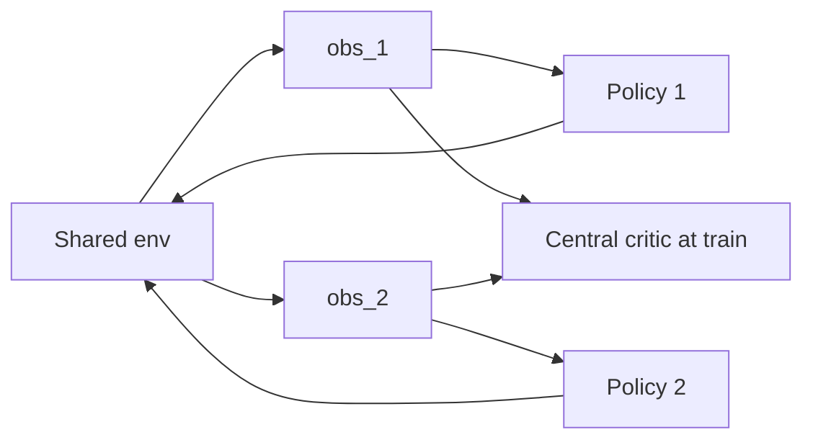

import { ConceptTemplate } from '@/features/kb/components/templates/ConceptTemplate'
import { Callout } from '@/features/kb/components/mdx/Callout'
import { ComparisonTable } from '@/features/kb/components/mdx/ComparisonTable'

export default function Layout({ children }) {
  return (
    <ConceptTemplate title="Multi-Agent Reinforcement Learning">
      {children}
    </ConceptTemplate>
  )
}

**Multi-agent RL (MARL)** is not “run PPO twice.” Each agent’s environment *includes the other policies*, which are also learning. From one agent’s seat the MDP is **non-stationary**. That breaks replay, breaks convergence, and creates games (literally) of credit assignment and communication.

## 1. Deep Dive and Mechanics

**Taxonomy.** Cooperative (shared or team reward), competitive (zero-sum), mixed (self-driving, markets). Independent learners (IPPO) ignore the issue and sometimes work.

**CTDE.** Centralised training, decentralised execution: critics see all agents’ obs/actions in training (MADDPG, QMIX, MAPPO); at serve time each actor sees only its local obs.

**Value factorisation.** QMIX, VDN: team Q is a monotonic mix of per-agent utilities so argmax decentralises.

**Self-play.** One policy plays copies of itself (or a league). Non-stationarity is the training signal (AlphaStar, OpenAI Five). Need a population or you cycle.

<Callout icon="warning" title="Lazy agents">
In a shared reward, one agent can learn a useful skill and the other can stand still. Individual shaping, role rewards, or counterfactual credit (COMA) exist because of this.
</Callout>

## 2. Mathematical / Theoretical Foundation

A Markov game (stochastic game) is (S, A_1..A_n, P, R_1..R_n). Nash / correlated equilibria replace “optimal policy.” Independent Q-learning has no general guarantee. In two-player zero-sum, self-play plus a proper solver (fictitious play, PSRO) has a cleaner story.

Partial observability: Dec-POMDP is undecidable in the worst case. Practitioners approximate with RNNs and CTDE.

<ComparisonTable
  headers={['Approach', 'Train', 'Execute']}
  rows={[
    ['Independent PPO', 'Local only', 'Local'],
    ['MADDPG', 'Central critic', 'Local actors'],
    ['QMIX', 'Mix team Q', 'Local argmax'],
    ['Self-play league', 'Population', 'Single or team policy'],
  ]}
/>

## 3. Real-World Implementation

```python
def maddpg_actor_loss(actor_i, critic, obs_all, actions_all, i):
    a_i = actor_i(obs_all[i])
    actions = list(actions_all)
    actions[i] = a_i
    q = critic(obs_all, actions)
    return -q.mean()
```

The critic’s input is the **joint** action. Only actor i’s parameters get this gradient.

## 4. Visualizations



## 5. Interview Prep

**Q: Why is independent DQN unstable in MARL?**
**A:** Replay stores (s, a_me, r, s') while the *other* agent’s policy has since changed, so P(s'|s, a_me) is not the same.

**Q: What does CTDE buy you?**
**A:** A less non-stationary, more informed critic during training, without requiring a god-view at deploy.

**Q: Cooperative vs competitive metrics?**
**A:** Team return vs exploitability / Elo. Do not report only your score in a zero-sum game without a held-out opponent set.

## 6. Production Use Cases

- **Warehouse robots, traffic lights, packet scheduling** — cooperative with a shared simulator.
- **Markets and bidding** — mixed; other “agents” may be humans.
- **Games** — self-play leagues, then freeze a snapshot for shipping.

<Callout icon="tip" title="Freeze opponents in the buffer">
Some stacks store the opponent action or a policy id in the transition so the critic is not lying about who was there.
</Callout>
