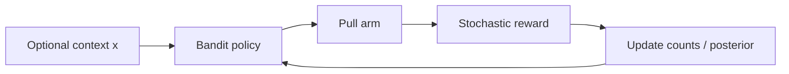

import { ConceptTemplate } from '@/features/kb/components/templates/ConceptTemplate'
import { Callout } from '@/features/kb/components/mdx/Callout'
import { ComparisonTable } from '@/features/kb/components/mdx/ComparisonTable'

export default function Layout({ children }) {
  return (
    <ConceptTemplate title="Multi-Armed Bandits">
      {children}
    </ConceptTemplate>
  )
}

A **multi-armed bandit** has no state transition worth modelling: you pick an arm, see a reward, and the world looks the same. That is RL with |S| = 1. It is also how a lot of **production experimentation** is actually solved — contextual bandits sit between this and a full MDP.

## 1. Deep Dive and Mechanics

**i.i.d. arms.** Each arm k has unknown mean mu_k. Algorithms estimate mu and decide what to pull.

**Epsilon-greedy.** Explore uniformly; exploit the current best mean. Simple, suboptimal regret.

**UCB.** Pull argmax (hat_mu + c sqrt(log t / n_k)). Optimism: less-pulled arms get a bonus.

**Thompson sampling.** Put a prior on mu_k (Beta for Bernoulli). Sample a mean, pull the winner. Often excellent in practice.

**Contextual.** Reward depends on a feature x (user, query). Learn a linear or neural map; still no long-horizon credit assignment unless you add state.

<Callout icon="info" title="Regret is the metric">
Cumulative regret is the gap vs always pulling the best arm. Accuracy of hat_mu is not the product metric — leftover explore budget is.
</Callout>

## 2. Mathematical / Theoretical Foundation

For K arms and horizon T, UCB1 has regret O(K log T) under bounded rewards (Lai–Robbins lower bound is logarithmic in T for well-separated arms). Thompson has Bayesian and frequentist analyses; it is not just a heuristic.

Contextual linear bandits (LinUCB, OFUL) add confidence ellipsoids in feature space. That is still not sequential RL: pulling an arm does not change tomorrow’s x except through the real world.

<ComparisonTable
  headers={['Algo', 'Idea', 'When']}
  rows={[
    ['Epsilon-greedy', 'Random vs best', 'Debugging, tiny K'],
    ['UCB1', 'Mean plus bonus', 'Need a bound, simple rewards'],
    ['Thompson', 'Sample from posterior', 'Default production pick'],
    ['LinUCB', 'Linear context plus UCB', 'Features, still myopic'],
  ]}
/>

## 3. Real-World Implementation

```python
import math

def ucb1(counts, means, t, c=2.0) -> int:
    bonuses = []
    for n, m in zip(counts, means):
        if n == 0:
            return len(bonuses)  # pull unseen
        bonuses.append(m + c * math.sqrt(math.log(t + 1) / n))
    return max(range(len(bonuses)), key=lambda i: bonuses[i])
```

Increment `t` once per pull. Initialise unseen arms first.

## 4. Visualizations



## 5. Interview Prep

**Q: Bandit vs full RL?**
**A:** Bandits have no (or myopic) state dynamics. If today’s action changes tomorrow’s state or the user model, you need an MDP / RL.

**Q: Why Thompson over A/B?**
**A:** A/B dumps a fixed fraction on a loser for the whole test. Thompson spends fewer pulls on arms that already look bad, with a posterior you can dump to a dashboard.

**Q: Delayed rewards?**
**A:** Classic analyses assume immediate r. In ads, clicks arrive late — use delay-aware updates or you over-explore new arms that have not reported yet.

## 6. Production Use Cases

- **Headline / creative** selection, layout slots, pricing tiers.
- **Clinical dose-finding** (with ethics constraints UCB does not know about).
- **As a submodule** inside RL (explore over skills or goals).

<Callout icon="tip" title="Non-stationarity">
User tastes drift. Discount old pulls (discounted UCB, sliding window) or you will exploit a dead arm forever.
</Callout>
