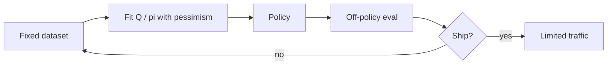

import { ConceptTemplate } from '@/features/kb/components/templates/ConceptTemplate'
import { Callout } from '@/features/kb/components/mdx/Callout'
import { ComparisonTable } from '@/features/kb/components/mdx/ComparisonTable'

export default function Layout({ children }) {
  return (
    <ConceptTemplate title="Offline Reinforcement Learning">
      {children}
    </ConceptTemplate>
  )
}

**Offline RL** (batch RL) forbids interaction. You get a dataset D of (s, a, r, s') from a behaviour policy — humans, an old controller, random. That is the industrial case: you cannot let a half-trained net bid real money to explore. The trap is **distributional shift**: Q will invent a high value for an action D never tried.

## 1. Deep Dive and Mechanics

**Why naive DQN fails.** The max_a Q(s, a) walks off the data support. Targets become fantasy. Training loss can look great.

**Pessimism.** Prefer actions close to behaviour. BCQ / TD3+BC constrain the actor toward D. CQL (conservative Q-learning) **penalises** Q on out-of-support actions. IQL treats values with expectile regression and does not explicitly query OOD actions.

**Hybrid.** Offline pretrain, then a little online fine-tune (safe if you have a shield). Often the winning industrial recipe.

**Eval.** You cannot trust D’s reward for a new pi. Use a held-out log + OPE (importance sampling, DR, fitted Q-eval) *and* a cheap sim if you have one. OPE is fragile; say so.

<Callout icon="warning" title="Behaviour coverage">
If D never turns left, no algorithm honestly learns a good left turn. Offline RL is not alchemy. Plot action histograms before you pick CQL vs BC.
</Callout>

## 2. Mathematical / Theoretical Foundation

Error bounds for offline RL scale with how far pi is from the behaviour policy (concentrability) and with pessimism bonuses. If concentrability is infinite (no overlap), you cannot identify Q^pi.

CQL lower-bounds Q by adding a term that minimises Q on a wide action set and maximises it on D’s actions. IQL’s expectile tau &gt; 0.5 is a soft upper expectile of the return, avoiding explicit OOD max.

<ComparisonTable
  headers={['Method', 'Idea', 'Vibe']}
  rows={[
    ['Behaviour cloning', 'Supervise a from s', 'Safe, no improvement'],
    ['CQL', 'Push down OOD Q', 'Strong, extra alpha'],
    ['IQL', 'Expectile V plus A', 'Simple, good on robotics logs'],
    ['TD3+BC', 'Actor plus BC term', 'Continuous, few knobs'],
  ]}
/>

## 3. Real-World Implementation

```python
def cql_regulariser(q_net, states, actions_data, n_random=10):
    q_data = q_net(states, actions_data)
    a_rand = sample_uniform_actions(len(states), n_random)
    q_rand = q_net(states.repeat_interleave(n_random, 0), a_rand)
    return q_rand.mean() - q_data.mean()
```

Add `alpha * cql_regulariser` to the Bellman loss so OOD Q cannot drift up.

## 4. Visualizations



## 5. Interview Prep

**Q: Offline RL vs imitation?**
**A:** Imitation copies a. Offline RL uses r to *improve* on the behaviour if D covers better actions. No coverage, no improvement.

**Q: Why is OPE hard?**
**A:** Importance weights explode when pi disagrees with behaviour. Doubly robust still needs a decent Q model. Report several OPE estimators, not one.

**Q: Can I mix 1% online?**
**A:** Yes, and it often beats pure offline. Treat it as a different algorithm (safe explorer, conservative buffer).

## 6. Production Use Cases

- **Recommendations and ads** from years of logged policies.
- **Robotics** from human teleop plus failed autonomous runs.
- **Healthcare / dosing** where exploration is unethical — often stay at BC plus clinicians.

<Callout icon="tip" title="Start with BC">
If BC already matches the behaviour return, your data may not contain a better policy. Try CQL only after that sanity check.
</Callout>
