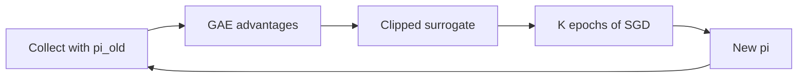

import { ConceptTemplate } from '@/features/kb/components/templates/ConceptTemplate'
import { Callout } from '@/features/kb/components/mdx/Callout'
import { ComparisonTable } from '@/features/kb/components/mdx/ComparisonTable'

export default function Layout({ children }) {
  return (
    <ConceptTemplate title="Proximal Policy Optimization (PPO)">
      {children}
    </ConceptTemplate>
  )
}

Vanilla policy gradients waste a rollout after one SGD step. **PPO** (Schulman et al., 2017) keeps the update **proximal**: the new policy must not stray far from the policy that collected the data. The popular **clip** trick does that with first-order SGD — no conjugate gradient, no KL hard constraint like TRPO.

## 1. Deep Dive and Mechanics

**Ratio.** r_t(theta) = pi_theta(a_t|s_t) / pi_old(a_t|s_t). The surrogate is r_t A_t. If r_t is huge and A_t &gt; 0, one step can destroy the policy.

**Clip.** L_clip = min( r A, clip(r, 1-eps, 1+eps) A ) with eps ≈ 0.2. When the ratio walks outside the band, the gradient on that sample flattens.

**Value and entropy.** A learned V with clipped value loss; GAE advantages, often normalised; entropy bonus. Several epochs over the same rollout, then throw the data away (on-policy).

**Implementation lottery.** Hidden states, advantage norm, mini-batch order, and “value clip” change scores more than people admit. Stick to a known codebase (CleanRL, Stable-Baselines3) until you can match a published curve.

<Callout icon="warning" title="Not off-policy magic">
A few epochs ≠ replay of last month’s logs. Once pi has moved, the clip band is about *this* batch’s pi_old, not an arbitrary behaviour policy.
</Callout>

## 2. Mathematical / Theoretical Foundation

TRPO maximises a surrogate subject to a KL trust region, justified by a performance-difference lemma (Kakade / Schulman). PPO is a heuristic that *usually* keeps KL small. There is also a PPO-penalty variant (adaptive KL coefficient) that is closer to TRPO and less used.

<ComparisonTable
  headers={['Piece', 'Typical default', 'If you change it']}
  rows={[
    ['clip eps', '0.1-0.2', 'Larger = bigger steps, more collapse'],
    ['GAE lambda', '0.95', 'Lower = more TD bias'],
    ['epochs / rollout', '3-10', 'Too many = stale ratios'],
    ['entropy coef', '0-0.01', 'Zero can collapse softmax'],
  ]}
/>

## 3. Real-World Implementation

```python
import torch

def ppo_policy_loss(ratio: torch.Tensor, adv: torch.Tensor, clip=0.2) -> torch.Tensor:
    unclipped = ratio * adv
    clipped = torch.clamp(ratio, 1.0 - clip, 1.0 + clip) * adv
    return -torch.min(unclipped, clipped).mean()
```

`ratio = exp(new_logp - old_logp)`. Store `old_logp` at collection time, not by running the old net later unless weights are frozen.

## 4. Visualizations



## 5. Interview Prep

**Q: Why clip instead of a hard KL constraint?**
**A:** Simpler, GPU-friendly, one optimizer. You lose the TRPO guarantee; you watch KL in logs and abort if it spikes.

**Q: What does a ratio of 2.0 mean?**
**A:** The new policy is twice as likely to take that action. If advantage is positive, vanilla PG would slam it; PPO caps the credit.

**Q: PPO vs SAC?**
**A:** PPO is on-policy, great for wide parallel sims and discrete or continuous. SAC is off-policy, sample-efficient on continuous control, replay-based.

## 6. Production Use Cases

- **OpenAI / game / robot** default when you can simulate cheaply (many parallel envs).
- **RLHF / language** (PPO-ptx and cousins) with a KL penalty to the SFT policy — same ratio idea, different extra terms.
- **Industrial process** control in sim before a conservative real rollout.

<Callout icon="tip" title="Log explained variance of V">
If the critic cannot predict return, advantages are noise and clip will not save you. Fix obs and reward scale first.
</Callout>
