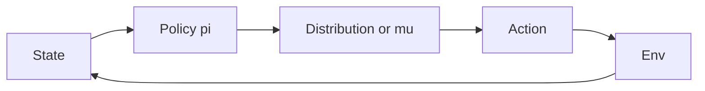

import { ConceptTemplate } from '@/features/kb/components/templates/ConceptTemplate'
import { Callout } from '@/features/kb/components/mdx/Callout'
import { ComparisonTable } from '@/features/kb/components/mdx/ComparisonTable'

export default function Layout({ children }) {
  return (
    <ConceptTemplate title="Policies (Reinforcement Learning)">
      {children}
    </ConceptTemplate>
  )
}

A **policy** pi is the agent’s behaviour. Training may use critics, advantages, and trust regions. Serving usually needs only pi(s) — greedy or a low-temperature sample. If you cannot export the policy without the trainer, the project is not done.

## 1. Deep Dive and Mechanics

**Deterministic.** a = mu_theta(s). DDPG/TD3. Exploration is added *outside* (Gaussian noise, OU). Eval is the mean action.

**Stochastic.** a ~ pi_theta(· | s). Discrete: categorical. Continuous: Gaussian, Beta, or mixture. Entropy keeps exploration alive; you anneal it or let SAC target a fixed entropy.

**Parametric vs implicit.** Softmax(Q / tau) is a policy derived from values (Boltzmann). A standalone actor is trained by policy gradient or by maximising Q (deterministic policy gradient).

**Stationary vs history.** A Markov policy uses s_t only. A general policy uses the whole history (or an RNN hidden state that *is* the policy’s memory).

<Callout icon="info" title="Eval policy is a different object">
Train with entropy and action noise. Report scores with a frozen, greedy (or mean) policy. Mixing them in a graph is how people “lose 20% overnight.”
</Callout>

## 2. Mathematical / Theoretical Foundation

pi: S → Dist(A). The occupancy measure rho_pi(s) is the discounted visitation. Performance J(pi) = E_s~rho, a~pi [r]. Policy gradient theorems express ∇J in terms of Q^pi or A^pi without differentiating through the env.

Deterministic policy gradient (Silver et al.): nabla_theta J is about E[ nabla_a Q(s, a) at a = mu times nabla_theta mu_theta(s) ]. Needs a critic.

<ComparisonTable
  headers={['Policy', 'Sample at train', 'Sample at serve']}
  rows={[
    ['Epsilon-greedy on Q', 'Random or argmax', 'Argmax'],
    ['Categorical PPO', 'Softmax sample', 'Argmax or low T'],
    ['Gaussian PPO/SAC', 'N(mu, sig)', 'mu (and clip)'],
    ['DDPG actor', 'mu plus noise', 'mu'],
  ]}
/>

## 3. Real-World Implementation

```python
import torch

class GaussianPolicy(torch.nn.Module):
    def __init__(self, net, log_std_min=-5.0, log_std_max=2.0):
        super().__init__()
        self.net = net
        self.log_std_min = log_std_min
        self.log_std_max = log_std_max

    def forward(self, state, deterministic: bool = False):
        mu, log_std = self.net(state).chunk(2, dim=-1)
        log_std = log_std.clamp(self.log_std_min, self.log_std_max)
        if deterministic:
            return mu
        return mu + log_std.exp() * torch.randn_like(mu)
```

Clamp log-std. Unbounded std either dies (0) or explodes.

## 4. Visualizations



## 5. Interview Prep

**Q: Why stochastic policies?**
**A:** Exploration; multi-modal optima; the math of entropy-regularised RL; and some games (rock-paper-scissors) have no good deterministic policy.

**Q: On-policy means what for pi?**
**A:** Updates must use data generated by the *current* (or very recent) pi. Importance sampling can relax that a little; PPO clips that ratio.

**Q: Can I distill Q into a policy?**
**A:** Yes — supervised clone of argmax Q, or act greedily on Q and throw Q away at deploy if latency requires one net.

## 6. Production Use Cases

- **The exported artefact** in robotics and games is almost always the policy net plus preprocess.
- **Safety:** a shield that overrides pi(s) when a constraint fires — document that the served policy is shield(pi).
- **A/B:** two policies, same env contract, different checkpoints.

<Callout icon="tip" title="Save the eval graph">
Checkpoint `act(s, deterministic=True)` with the exact preprocess. Train-time dropout or batch-norm in eval mode is a common silent regression.
</Callout>
