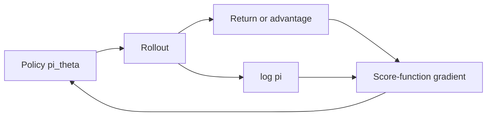

import { ConceptTemplate } from '@/features/kb/components/templates/ConceptTemplate'
import { Callout } from '@/features/kb/components/mdx/Callout'
import { ComparisonTable } from '@/features/kb/components/mdx/ComparisonTable'

export default function Layout({ children }) {
  return (
    <ConceptTemplate title="Policy Gradients">
      {children}
    </ConceptTemplate>
  )
}

Value methods pick actions by argmax Q. **Policy gradients** treat the policy as the primary object: sample actions, see return, push up the log-probability of lucky actions and down the unlucky ones. That works for discrete *and* continuous actions, and for policies that are not greedy on a Q-table.

## 1. Deep Dive and Mechanics

**REINFORCE.** For a full episode, ∇J ≈ sum_t ∇ log pi(a_t|s_t) G_t. High variance: one late reward credits every button mash.

**Baseline.** Subtract b(s_t) that does not depend on a_t. Variance drops, expectation of the gradient is unchanged. The usual b is V(s) — that is already actor-critic.

**Advantage and GAE.** Use A_t ≈ GAE(lambda) instead of G_t. PPO/A2C are policy gradient + a learned V + extra stabilisers (normalise advantages, clip, entropy bonus).

**On-policy.** The math uses the current pi to sample. Old trajectories need importance ratios pi_new / pi_old. Unclipped ratios explode; that is why PPO clips.

<Callout icon="warning" title="Score-function vs pathwise">
REINFORCE is the score-function (likelihood-ratio) estimator. If the env were differentiable you could backprop through it (pathwise / world models). Most games are not.
</Callout>

## 2. Mathematical / Theoretical Foundation

Policy gradient theorem (Sutton et al.): ∇_theta J(theta) = E_s~rho_pi, a~pi [ ∇_theta log pi_theta(a|s) Q^pi(s,a) ]. You never differentiate P or R.

With a baseline: replace Q with Q - b(s). Optimal baseline in a simple model is V^pi. Deterministic policy gradient is the continuous-greedy cousin (critic ∇_a Q, not log pi).

<ComparisonTable
  headers={['Estimator', 'Needs', 'Variance']}
  rows={[
    ['REINFORCE', 'Full return G', 'High'],
    ['REINFORCE plus V', 'Critic baseline', 'Medium'],
    ['A2C / GAE', 'TD residuals, lambda', 'Tunable'],
    ['PPO clip', 'Ratio plus clip', 'Stable, biased'],
  ]}
/>

## 3. Real-World Implementation

```python
import torch

def reinforce_loss(log_probs: torch.Tensor, returns: torch.Tensor) -> torch.Tensor:
    # log_probs, returns: (T,) for one episode; returns already discounted
    adv = returns - returns.mean()
    return -(log_probs * adv.detach()).sum()
```

Normalising advantages across a rollout batch is the one-line trick that makes vanilla PG less miserable.

## 4. Visualizations



## 5. Interview Prep

**Q: Why log pi times return?**
**A:** Chain rule on E_a~pi[f(a)] gives E[f(a) ∇ log pi(a)]. Here f is the return (or Q, or A).

**Q: Does a baseline bias the gradient?**
**A:** Not if it does not depend on the sampled action (or you use a correctly weighted critic). A bad critic still adds bias in actor-critic TD.

**Q: PG vs Q-learning for a huge discrete action space?**
**A:** PG never argmaxes over all actions; it only needs the sampled action’s log-prob. Embeddings or autoregressive policies scale further.

## 6. Production Use Cases

- **Continuous control** when you already live in PPO/SAC land.
- **RLHF** — the policy is an LLM; the gradient is (approximately) this theorem plus a KL tether.
- **Bandit-like** ranking with a stochastic policy and a delayed reward.

<Callout icon="tip" title="Entropy bonus is not optional at the start">
Add -H(pi) or an explicit entropy term so the softmax does not collapse to one action in hour one.
</Callout>
