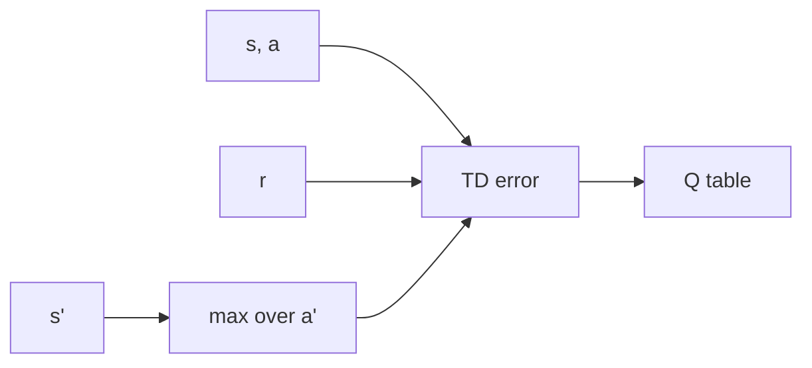

import { ConceptTemplate } from '@/features/kb/components/templates/ConceptTemplate'
import { Callout } from '@/features/kb/components/mdx/Callout'
import { ComparisonTable } from '@/features/kb/components/mdx/ComparisonTable'

export default function Layout({ children }) {
  return (
    <ConceptTemplate title="Q-Learning">
      {children}
    </ConceptTemplate>
  )
}

**Q-learning** stores a number Q(s, a) meaning “best return I can get after doing a in s.” It updates using the *best* next action, not the action it actually took next. That is why it is **off-policy**: behaviour can be sloppy (epsilon-greedy) while the table still aims at Q*.

## 1. Deep Dive and Mechanics

**Update.** After (s, a, r, s'): Q(s,a) ← Q(s,a) + alpha [ r + gamma max_a' Q(s', a') - Q(s,a) ]. Terminal s' uses max = 0.

**Exploration.** The table does not explore. The **behaviour policy** does (epsilon-greedy, UCB, Boltzmann). Too little epsilon: unseen pairs stay at 0. Too much: slow.

**Off-policy.** The target uses max, not Q(s', a_taken). You can even learn from a human demo, as long as coverage is decent.

**Limits.** |S| × |A| must fit in RAM. Continuous a kills the max. Function approximation plus this backup is the deadly triad — that is the DQN research programme.

<Callout icon="info" title="Watkins Q-learning">
The original proof needs every pair visited infinitely often and a decaying alpha. In practice you use a constant alpha and hope the MDP is small.
</Callout>

## 2. Mathematical / Theoretical Foundation

The optimality operator T*Q(s,a) = E[ r + gamma max_a' Q(s', a') ] is a gamma-contraction. Q-learning is a stochastic approximation to the unique fixed point Q*. SARSA uses T^pi instead (on-policy).

Double Q-learning stores two tables and uses one to select, one to evaluate, cutting maximisation bias.

<ComparisonTable
  headers={['Algorithm', 'Backup', 'Policy']}
  rows={[
    ['Q-learning', 'max next Q', 'Off-policy'],
    ['SARSA', 'Q of next action taken', 'On-policy'],
    ['Expected SARSA', 'E_pi next Q', 'Usually on-policy'],
    ['Double Q', 'cross-table max', 'Off-policy, less bias'],
  ]}
/>

## 3. Real-World Implementation

```python
import numpy as np

def q_learning_step(Q, s, a, r, s_next, done, alpha=0.1, gamma=0.99):
    target = r if done else r + gamma * np.max(Q[s_next])
    Q[s, a] += alpha * (target - Q[s, a])
```

`Q` is a 2D array shaped (n_states, n_actions). Initialise optimistically (small positive) if you want implicit exploration.

## 4. Visualizations



## 5. Interview Prep

**Q: Why is Q-learning off-policy?**
**A:** The target assumes greedy continuation, not the behaviour policy that collected a'.

**Q: Q-learning vs SARSA in a cliff walk?**
**A:** Q-learning learns the optimal path along the cliff; epsilon-greedy *execution* still falls. SARSA learns a safer path that matches how it actually behaves.

**Q: Can Q-learning use a replay buffer?**
**A:** Yes — that is DQN’s tabular ancestor. Uniform replay is just off-policy data reuse.

## 6. Production Use Cases

- **Tiny discrete ops:** cache admission, simple HVAC modes, tutorial game AI.
- **Teaching and unit tests** before you stand up a GPU trainer.
- **Warm-start** a discrete simulator while you debug reward and wrappers.

<Callout icon="tip" title="Log visit counts">
If half the table was never touched, your “optimal” policy is fiction. Plot N(s,a), not only mean return.
</Callout>
