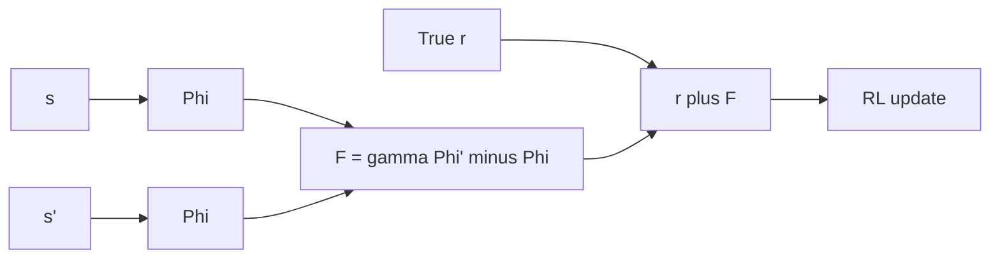

import { ConceptTemplate } from '@/features/kb/components/templates/ConceptTemplate'
import { Callout } from '@/features/kb/components/mdx/Callout'
import { ComparisonTable } from '@/features/kb/components/mdx/ComparisonTable'

export default function Layout({ children }) {
  return (
    <ConceptTemplate title="Reward Shaping">
      {children}
    </ConceptTemplate>
  )
}

**Reward shaping** is any extra term you add to the environment’s true reward to make credit assignment easier. It is the most common way teams “help” RL — and the most common way they accidentally specify a different game.

## 1. Deep Dive and Mechanics

**Heuristic bonuses.** +distance closed, +progress along a spline, -collision. Fast to write. The optimal policy of the *new* MDP may idle, circle, or farm the bonus.

**Potential-based shaping (PBRS).** Ng, Harada, Russell: F(s, s') = gamma Phi(s') - Phi(s). Adding F does **not** change the optimal policy of the original MDP. Phi is any function of state (and, in later work, of time or state-action with care).

**Learned Phi.** You can train a potential (or use a value function from a previous task). Still PBRS if you only add that telescoping difference.

**Curriculum and hints.** Changing the *task* over time is not shaping; it is a sequence of MDPs. Do not mix the two in one graph.

<Callout icon="warning" title="Living wages">
A constant -0.01 per step is shaping that *does* change optima (prefer shorter episodes). That can be what you want. It is not PBRS.
</Callout>

## 2. Mathematical / Theoretical Foundation

Telescoping: the extra return along a trajectory is gamma^T Phi(s_T) - Phi(s_0) (plus discount bookkeeping). For infinite horizon the boundary terms vanish in the right function class, so Q* only shifts by Phi in a way that **argmax_a is unchanged**.

Arbitrary F can create new cycles with positive loop reward (the boat-race cheat). Always ask: is there an infinite-horizon exploit?

<ComparisonTable
  headers={['Form', 'Optimal pi unchanged?', 'Use']}
  rows={[
    ['PBRS gamma Phi(s\')-Phi(s)', 'Yes', 'Distance potentials, old V'],
    ['Per-step constant', 'No', 'Encourage speed'],
    ['Raw distance to goal', 'Usually no', 'Quick prototype only'],
    ['Curiosity bonus', 'No', 'Exploration, then anneal'],
  ]}
/>

## 3. Real-World Implementation

```python
def potential_shaping(phi_s, phi_s2, gamma: float) -> float:
    return gamma * phi_s2 - phi_s

def shaped_reward(r_true, s, s2, phi, gamma: float) -> float:
    return r_true + potential_shaping(phi(s), phi(s2), gamma)
```

`phi` might be `-dist_to_goal`. Then moving closer is rewarded, moving away is punished, and looping at fixed distance nets ~0 (plus gamma effects).

## 4. Visualizations



## 5. Interview Prep

**Q: When is shaping “safe”?**
**A:** Potential-based (and some extensions). Otherwise you must empirically show the exploit is not better than the goal.

**Q: Is clipping reward shaping?**
**A:** It changes the MDP. Atari clipping is a different game than raw score. Fine for a benchmark, dangerous if the business uses unclipped dollars.

**Q: Can I shape with a learned critic?**
**A:** Using V as Phi is a known trick (and relates to advantage). Keep it in the PBRS form or you double-count.

## 6. Production Use Cases

- **Robotics:** workspace potentials toward a grasp frame; keep the sparse success bit as the true task.
- **Games:** progress along a designer spline, annealed to zero before ship.
- **Ops:** SLA penalties are *true* rewards if they are the contract, not shaping.

<Callout icon="tip" title="A/B the unshaped return">
Always log true r and shaped r. Promote checkpoints on true return. Shaped curves lying upward is not success.
</Callout>
