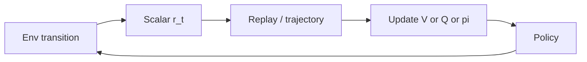

import { ConceptTemplate } from '@/features/kb/components/templates/ConceptTemplate'
import { Callout } from '@/features/kb/components/mdx/Callout'
import { ComparisonTable } from '@/features/kb/components/mdx/ComparisonTable'

export default function Layout({ children }) {
  return (
    <ConceptTemplate title="Rewards (Reinforcement Learning)">
      {children}
    </ConceptTemplate>
  )
}

The reward is not “encouragement.” It is the **specification** of success. Change the scalar and you change the MDP. Agents do not pursue your English intent; they maximise discounted return. If a simulator glitch pays +1 forever, that is the optimal policy.

## 1. Deep Dive and Mechanics

**Immediate vs return.** The env emits r_t at each step. The agent maximises G_t = r_t + gamma r_t+1 + … . A large gamma makes distant r matter; gamma = 0 is greedy one-step.

**Sparse vs dense.** A +1 at the goal only is honest and hard. Dense rewards (distance to goal) speed learning and invite **reward hacking**: sit near the goal, oscillate, farm the potential.

**Terminal bonuses.** +100 on success, -100 on crash. Scale relative to per-step costs or the critic saturates.

**Reward as observation.** Putting the last reward into the state can help POMDPs. Putting the *undiscounted score* on screen can leak remaining horizon.

<Callout icon="warning" title="Specification gaming">
CoastRunners learned to loop a catch-target instead of racing. Your agent will too if looping is higher return than finishing. Watch rollouts, not only mean episode reward.
</Callout>

## 2. Mathematical / Theoretical Foundation

Expected return under policy pi: J(pi) = E[sum_t gamma^t r_t]. For a bounded reward |r| ≤ Rmax, |Q| ≤ Rmax / (1 - gamma). That bound tells you if your critic is exploding.

Potential-based shaping (Ng, Harada, Russell): F(s, s') = gamma Phi(s') - Phi(s) does **not** change the optimal policy. Arbitrary shaping can.

<ComparisonTable
  headers={['Style', 'Pros', 'Cons']}
  rows={[
    ['Sparse success', 'Matches the real goal', 'Slow credit assignment'],
    ['Dense distance', 'Learns sooner', 'Local optima, hacking'],
    ['Learned reward IRL', 'From demos', 'Identifiability, shift'],
    ['Human preference', 'Aligns with taste', 'Label noise, cost'],
  ]}
/>

## 3. Real-World Implementation

```python
def step_reward(dist: float, crashed: bool, success: bool, dt: float) -> float:
    if crashed:
        return -10.0
    if success:
        return 5.0
    # small living cost so stalling is bad; not a substitute for a real goal
    return -0.01 * dt - 0.1 * dist
```

Keep the success term larger than any integral of the living cost over a max episode, or the agent will prefer dying early.

## 4. Visualizations



## 5. Interview Prep

**Q: Sparse vs dense — which is “correct”?**
**A:** The correct reward is the one whose maximiser is the behaviour you want. Dense rewards are optimisers for a *proxy*. Use them only if the proxy’s optimum is still the real task (or use potential-based shaping).

**Q: Why normalise rewards?**
**A:** PopArt / reward scaling keeps TD errors in a trainable range when r jumps from 1 to 1000 across games (DQN Atari clipping to [-1, 1] is the blunt version).

**Q: Is a negative living reward the same as a shorter episode?**
**A:** It biases toward finishing faster (or dying, if death ends the living cost). Check both.

## 6. Production Use Cases

- **Recommender / ads:** click is a proxy; watch time and long-term retention are closer to the business, and easier to hack.
- **Robotics:** energy and constraint penalties plus a sparse task bonus.
- **RLHF:** the “reward” is a preference model — still a proxy, still hackable.

<Callout icon="tip" title="Unit-test the reward">
Write three hand-built trajectories: success, obvious cheat, crash. Print G. If the cheat wins, do not start GPU jobs.
</Callout>
