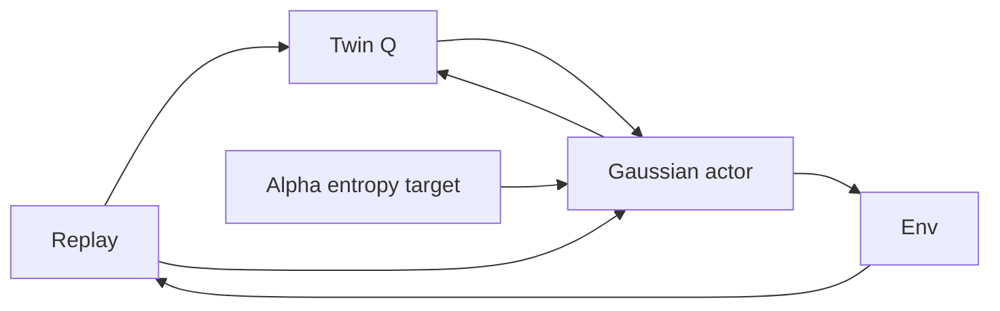

import { ConceptTemplate } from '@/features/kb/components/templates/ConceptTemplate'
import { Callout } from '@/features/kb/components/mdx/Callout'
import { ComparisonTable } from '@/features/kb/components/mdx/ComparisonTable'

export default function Layout({ children }) {
  return (
    <ConceptTemplate title="Soft Actor-Critic (SAC)">
      {children}
    </ConceptTemplate>
  )
}

**SAC** (Haarnoja et al.) maximises return *plus* policy entropy. The agent is rewarded for staying stochastic, which explores and avoids collapsing to a brittle delta. Combined with replay and twin critics, it is the usual **sample-efficient** choice for MuJoCo-style torque control.

## 1. Deep Dive and Mechanics

**Soft Q.** The critic target is r + gamma ( min_i Q_i(s', a') - alpha log pi(a'|s') ) with a' ~ pi. Entropy is part of the backup, not only the actor loss.

**Actor.** Reparameterise a = tanh(mu + std * eps), eps ~ N(0,1). Pathwise gradients through Q. Subtract alpha log pi (with tanh Jacobian).

**Twin Q.** Two critics, take min to fight overestimation (TD3 idea). Slow-moving target nets.

**Alpha.** Tune temperature so entropy matches a target (often -dim(A)). Too hot: random. Too cold: DDPG-like determinism.

**Discrete SAC** exists (Gumbel / exact softmax over Q) but the famous defaults are continuous.

<Callout icon="warning" title="Squash and log-prob">
If you forget the tanh log-abs-det, entropy is wrong and alpha tuning fights you. Every serious SAC code has a `TanhNormal` helper — use it.
</Callout>

## 2. Mathematical / Theoretical Foundation

Max-ent RL: J = E[ sum (r + alpha H(pi(·|s))) ]. Soft Bellman optimality has a closed-form softmax policy in the discrete finite case. In continuous spaces SAC parameterises a Gaussian and projects.

Off-policy: replay stores (s,a,r,s'). The actor is current; the critic uses the current pi in the target (soft). That is more off-policy than PPO, less theoretically clean than tabular Q.

<ComparisonTable
  headers={['Algo', 'Data', 'Exploration']}
  rows={[
    ['DDPG', 'Replay', 'External noise'],
    ['TD3', 'Replay, twin Q', 'Clipped noise'],
    ['SAC', 'Replay, twin Q', 'Entropy, learned temp'],
    ['PPO', 'On-policy rollouts', 'Stochastic pi'],
  ]}
/>

## 3. Real-World Implementation

```python
def sac_critic_target(reward, next_obs, done, actor, q1_t, q2_t, alpha, gamma):
    a2, logp = actor.sample(next_obs)
    q_next = torch.min(q1_t(next_obs, a2), q2_t(next_obs, a2))
    return reward + gamma * (1.0 - done) * (q_next - alpha * logp)
```

`actor.sample` must return the **squashed** action the env would see, and `logp` of that action.

## 4. Visualizations



## 5. Interview Prep

**Q: Why entropy in the Q target, not only the actor?**
**A:** Consistency: the soft Q should be the value of the *soft* policy. Otherwise actor and critic solve different problems.

**Q: SAC vs TD3?**
**A:** Both off-policy continuous. TD3 is deterministic + noise; SAC is stochastic + max-ent. SAC often explores better; both use twin Q.

**Q: Can I use SAC on Atari?**
**A:** Discrete SAC or just use Rainbow/PPO. Continuous SAC wants a box action.

## 6. Production Use Cases

- **Robot arms, locomotion, drones** in sim; then domain-randomise.
- **HVAC / process** setpoints where a replay of yesterday’s trajectories is available.
- **Any continuous MDP** where env steps are expensive and you cannot afford PPO’s throw-away rollouts.

<Callout icon="tip" title="Start from the SB3/CleanRL defaults">
Batch size, tau, and target entropy are a coupled mess. Match a known MuJoCo curve on Pendulum before you invent a temperature schedule.
</Callout>
