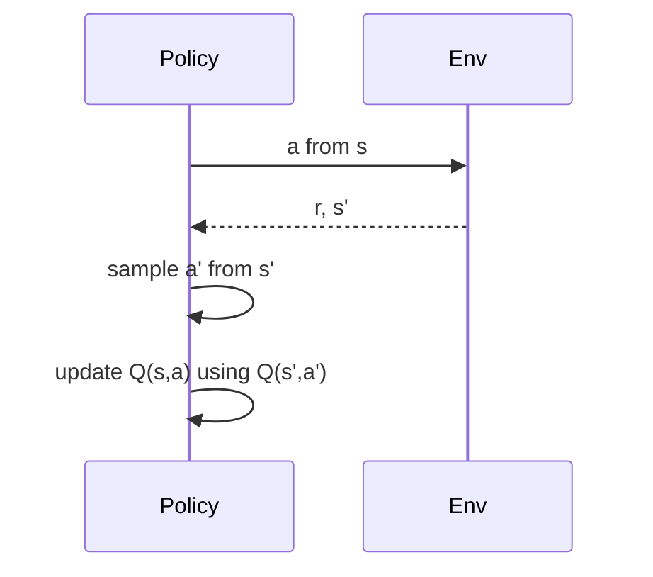

import { ConceptTemplate } from '@/features/kb/components/templates/ConceptTemplate'
import { Callout } from '@/features/kb/components/mdx/Callout'
import { ComparisonTable } from '@/features/kb/components/mdx/ComparisonTable'

export default function Layout({ children }) {
  return (
    <ConceptTemplate title="SARSA">
      {children}
    </ConceptTemplate>
  )
}

**SARSA** is named for the tuple (State, Action, Reward, State, Action). The update uses Q(s', a') where a' is the action the **current behaviour policy** sampled. You evaluate the policy you are actually running, including its epsilon-greedy stumbles.

## 1. Deep Dive and Mechanics

**Update.** Q(s,a) ← Q(s,a) + alpha [ r + gamma Q(s', a') - Q(s,a) ]. You must choose a' *before* the update (or store it). At termination, Q(s', a') = 0.

**On-policy.** Change epsilon and you change the thing being learned. A replay buffer of old (s,a,s',a') from a different epsilon is the wrong data — use it only with importance weights, which people rarely do for tabular SARSA.

**Cliff and risk.** Because a' might be a random step off the cliff, Q along the cliff edge stays pessimistic. The learned greedy path tends to walk farther from the edge than Q-learning’s optimum.

**Expected SARSA.** Replace Q(s', a') with sum_a pi(a|s') Q(s', a). Lower variance; still on-policy if pi is current behaviour.

<Callout icon="info" title="n-step SARSA">
You can backup n steps of real reward then Q. GAE-style lambda is the deep cousin. Same on-policy warning.
</Callout>

## 2. Mathematical / Theoretical Foundation

SARSA approximates Q^pi for the behaviour policy pi (often epsilon-greedy of Q itself — “GLIE” schemes prove control). The operator is T^pi, not T*. As epsilon → 0 slowly, Q^pi → Q* under the usual Robbins–Monro conditions.

<ComparisonTable
  headers={['Method', 'Next-action in target', 'Learns']}
  rows={[
    ['SARSA', 'Sampled a\'', 'Q of behaviour'],
    ['Expected SARSA', 'pi-average', 'Q of behaviour, less noise'],
    ['Q-learning', 'argmax Q', 'Q*'],
  ]}
/>

## 3. Real-World Implementation

```python
import numpy as np

def epsilon_greedy(Q_row, epsilon, rng):
    if rng.random() < epsilon:
        return int(rng.integers(len(Q_row)))
    return int(np.argmax(Q_row))

def sarsa_step(Q, s, a, r, s_next, a_next, done, alpha=0.1, gamma=0.99):
    target = r if done else r + gamma * Q[s_next, a_next]
    Q[s, a] += alpha * (target - Q[s, a])
```

Sample `a_next` with the **same** epsilon you will use on the following step.

## 4. Visualizations



## 5. Interview Prep

**Q: One-line difference from Q-learning?**
**A:** Target uses the next action you *took*, not the max.

**Q: When do you prefer SARSA?**
**A:** When execution will keep exploring, or when a catastrophic action is only a slip away and you want Q to reflect that.

**Q: Is Deep SARSA a thing?**
**A:** You can TD-train a Q-net on-policy (no replay, or very short). People usually switch to A2C/PPO instead.

## 6. Production Use Cases

- **Safety-sensitive discrete control** where the deployed policy will still dither.
- **Teaching MDPs** (cliff, windy gridworld) to show on- vs off-policy.
- **Online tuning** of a small finite controller with live epsilon.

<Callout icon="tip" title="Do not replay SARSA blindly">
A batch from last week’s epsilon is off-policy for today’s SARSA. That is Q-learning territory.
</Callout>
