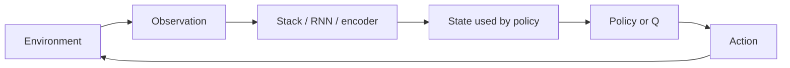

import { ConceptTemplate } from '@/features/kb/components/templates/ConceptTemplate'
import { Callout } from '@/features/kb/components/mdx/Callout'
import { ComparisonTable } from '@/features/kb/components/mdx/ComparisonTable'

export default function Layout({ children }) {
  return (
    <ConceptTemplate title="States (Reinforcement Learning)">
      {children}
    </ConceptTemplate>
  )
}

Supervised models consume a static input. An RL agent consumes a **state**: a snapshot of “what is true now” that is supposed to be enough to choose the next action. If that snapshot is incomplete, noisy, or leaking the future, every algorithm downstream will look mysteriously unstable.

## 1. Deep Dive and Mechanics

**Markov state.** In an MDP the next state and reward depend only on the current state and action, not the whole history. If you need the last three frames of Pong to see ball velocity, those frames *are* the state (or a recurrent net must remember them).

**Observation vs state.** The environment’s true configuration can be hidden. A camera image is an **observation**; the full simulator pose is the **state**. POMDPs force you to build a belief (RNN, stacking, explicit filter) so the policy is not Markov in raw pixels.

**Representation.** Tabular RL uses an integer id per state. Deep RL encodes images, proprioception, or language into a vector. The encoder is part of the state pipeline: resize, stack, normalise, mask invalid sensors.

**Absorbing and terminal.** Episode end is a special transition. Bootstrapping through a done flag as if the episode continued is a classic off-by-one that inflates Q-values.

<Callout icon="warning" title="State leakage">
If the observation includes the upcoming reward, the wall-clock, or an index that correlates with remaining horizon, the agent “cheats.” Unit-test that shuffling time-invariant noise does not collapse return.
</Callout>

## 2. Mathematical / Theoretical Foundation

An MDP is the tuple (S, A, P, R, gamma). Transition kernel P(s' | s, a) and reward R(s, a, s') are conditioned on **S**. The Bellman operators are contractions on functions of S (or S times A).

If the process is only partially observed, the sufficient statistic is the **belief** b(s) = P(true state | history). Acting on a non-sufficient statistic is the same as solving the wrong MDP.

<ComparisonTable
  headers={['Kind', 'Example', 'Watch-out']}
  rows={[
    ['Fully observed', 'Chess board, Gym CartPole', 'Still need features if S is huge'],
    ['Stacked frames', 'Atari 4-frame stack', 'Misses longer memory'],
    ['Belief / RNN', 'Poker, lidar + occlusions', 'Non-stationary hidden state'],
    ['Goal-conditioned', 's plus desired goal g', 'Must sample goals in training'],
  ]}
/>

## 3. Real-World Implementation

```python
from collections import deque
import numpy as np

class FrameStack:
    def __init__(self, k: int):
        self.k = k
        self.buf: deque[np.ndarray] = deque(maxlen=k)

    def reset(self, frame: np.ndarray) -> np.ndarray:
        self.buf.clear()
        for _ in range(self.k):
            self.buf.append(frame)
        return np.concatenate(self.buf, axis=-1)

    def step(self, frame: np.ndarray) -> np.ndarray:
        self.buf.append(frame)
        return np.concatenate(self.buf, axis=-1)
```

Treat `reset` and `step` as the only writers of “what the policy sees.”

## 4. Visualizations



## 5. Interview Prep

**Q: Why stack frames in Atari?**
**A:** A single frame has no velocity. Four greyscale frames make the process closer to Markov without a recurrent net.

**Q: What is a Markov state?**
**A:** One where P(future | history) = P(future | current state). Extra history is redundant; missing history is bias.

**Q: Observation includes the score ticker. Is that OK?**
**A:** Only if you want the agent to react to the HUD. Usually you crop it so the policy cannot read remaining lives as a cheat code.

## 6. Production Use Cases

- **Robotics:** joint angles plus a short history, or a learned encoder on RGB-D.
- **Ads / ranking:** user context vector as state; leaking click labels is a POMDP bug.
- **Games:** hidden information forces belief states, not raw public boards.

<Callout icon="tip" title="Log the raw observation">
When a trained policy dies in prod, replay the *encoded* state the net saw, not the pretty dashboard. Mismatched preprocess is the usual root cause.
</Callout>
