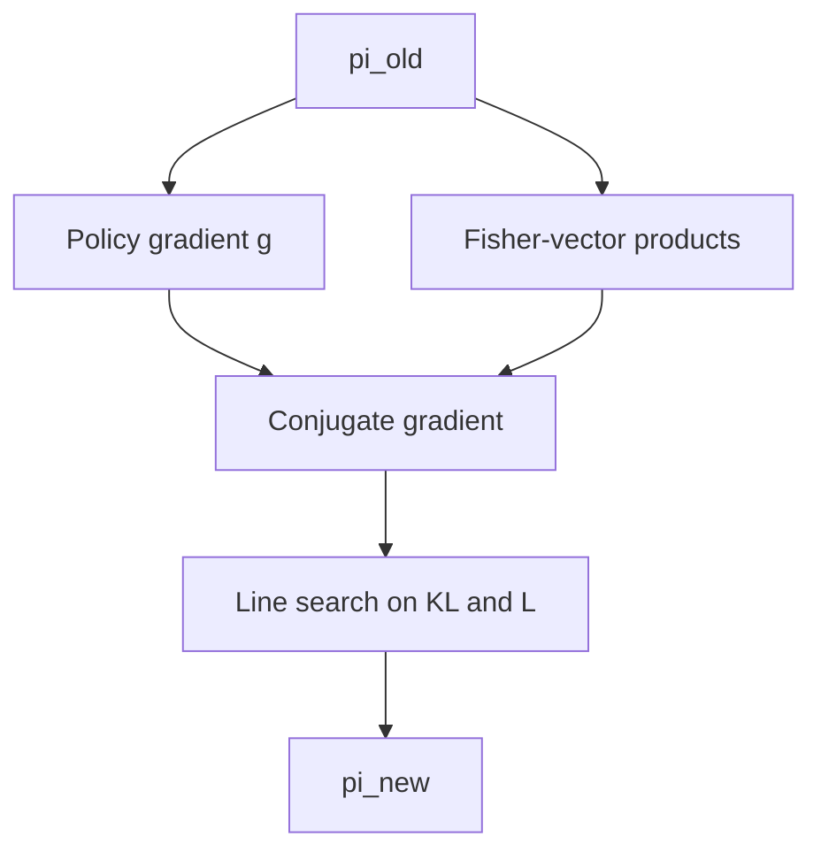

import { ConceptTemplate } from '@/features/kb/components/templates/ConceptTemplate'
import { Callout } from '@/features/kb/components/mdx/Callout'
import { ComparisonTable } from '@/features/kb/components/mdx/ComparisonTable'

export default function Layout({ children }) {
  return (
    <ConceptTemplate title="Trust Region Policy Optimization (TRPO)">
      {children}
    </ConceptTemplate>
  )
}

**TRPO** (Schulman et al., 2015) asks for the biggest policy improvement you can take **without leaving a KL ball** around the old policy. That constraint is why it was the first method many people trusted on high-dimensional continuous control — and why it is annoying to implement. PPO later faked the same intuition with a clip.

## 1. Deep Dive and Mechanics

**Surrogate.** Maximise E[ (pi / pi_old) A_old ] subject to E[ KL(pi_old || pi) ] ≤ delta (delta ~ 0.01).

**Natural gradient.** The KL quadratic is F, the Fisher information. You solve F x = g with conjugate gradient (Hessian-vector products, no explicit Fisher). Then a line search shrinks the step until the KL constraint and a real improvement hold.

**Critic.** Still actor-critic: GAE advantages, a value net trained separately (often plain SGD).

**Cost.** CG + line search + extra forward passes. Awkward with RNNs and discrete action masking unless you are careful about the KL estimate.

<Callout icon="info" title="Mean KL, not max">
The constraint is an *average* KL over the rollout states. A few states can still move a lot. That is not a per-state safety shield.
</Callout>

## 2. Mathematical / Theoretical Foundation

The performance difference lemma writes J(pi) - J(pi_old) in terms of advantages of pi_old plus a remainder that grows with how far occupancy measures drift. Bounding KL keeps that remainder small, so maximising the surrogate is a conservative proxy for true improvement.

Natural policy gradient (Kakade) is the unconstrained cousin: invert the Fisher. TRPO adds the explicit radius and line search.

<ComparisonTable
  headers={['Method', 'Trust', 'Optimizer']}
  rows={[
    ['NPG', 'Implicit via Fisher', 'Natural grad'],
    ['TRPO', 'Hard mean KL', 'CG plus line search'],
    ['PPO-clip', 'Heuristic band', 'Adam'],
    ['PPO-penalty', 'Adaptive KL coef', 'Adam'],
  ]}
/>

## 3. Real-World Implementation

```python
# Sketch: one conjugate-gradient solve for Hx = g, then backtracking
def trpo_step(policy, loss_fn, kl_fn, delta=0.01, max_kl_evals=10):
    g = torch_grad(loss_fn(), policy.parameters())
    step = conjugate_gradient(lambda v: fisher_vec(policy, v), g)
    step_size = torch.sqrt(2 * delta / (step @ fisher_vec(policy, step) + 1e-8))
    proposed = scale(step, step_size)
    for _ in range(max_kl_evals):
        if kl_fn(proposed) <= delta and loss_fn(proposed) < loss_fn():
            return apply(policy, proposed)
        proposed = scale(proposed, 0.5)
    return policy  # reject
```

Use a maintained implementation (Garage, original OpenAI baselines) unless you enjoy debugging CG damping.

## 4. Visualizations



## 5. Interview Prep

**Q: What problem does the trust region solve?**
**A:** A large policy step can collapse performance with no recovery. KL-bounding keeps occupancy close so the advantage of pi_old stays meaningful.

**Q: Why did PPO win the popularity contest?**
**A:** Similar empirical stability, one `loss.backward()`, easy to mix with other losses (aux, value clip). TRPO is fussier on GPUs and with discrete heads.

**Q: KL(pi_old || pi) or the reverse?**
**A:** TRPO uses KL(old || new) in the usual statement. Direction matters; do not swap casually.

## 6. Production Use Cases

- **Research baselines** when you need the paper-faithful trust-region story.
- **Low-dimensional control** where CG is cheap and you want conservative updates.
- **Most new systems** pick PPO or SAC instead and treat TRPO as ancestry.

<Callout icon="tip" title="Damping">
Add a small multiple of the identity to the Fisher-vector product (`cg_damping`). Without it CG is numerically rude.
</Callout>
