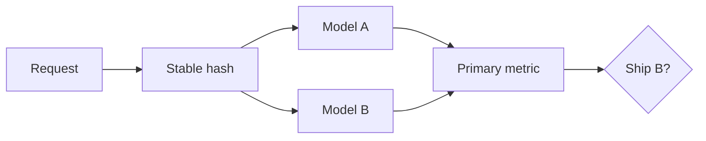

import { ConceptTemplate } from '@/features/kb/components/templates/ConceptTemplate'
import { Callout } from '@/features/kb/components/mdx/Callout'
import { ComparisonTable } from '@/features/kb/components/mdx/ComparisonTable'

export default function Layout({ children }) {
  return (
    <ConceptTemplate title="A/B Testing for Models">
      {children}
    </ConceptTemplate>
  )
}

Offline metrics lie. A model with a prettier AUC can tank conversion, latency, or safety. An **A/B test** (or a multi-arm bandit) is how you prove a new checkpoint is better on the metric you actually ship.

## 1. Deep Dive and Mechanics

**Unit of randomisation.** User, session, or request. Users are safer for learning effects; requests are easier and leak if the same person sees both models.

**Guardrails.** Primary metric (conversion) plus floors on latency, error rate, and a safety score. A “win” that burns p99 is a loss.

**Peeking.** Stopping when the chart looks good inflates false positives. Pre-register N, use sequential tests (SPRT, always-valid p-values), or a fixed horizon.

**SRM.** Sample-ratio mismatch: if you asked for 50/50 and got 47/53, the assignment path is broken. Do not read the lift.

<Callout icon="warning" title="Offline win, online loss">
If train and serve feature pipelines differ, A/B measures the pipeline bug, not the architecture. Log the exact feature vector each variant saw.
</Callout>

## 2. Mathematical / Theoretical Foundation

Two-proportion z-test or a Bayesian beta-binomial. Power: for a minimum detectable effect d, variance p(1-p), you need n on the order of p(1-p) / d^2 per arm. Multiple variants need a multiple-comparison correction (Bonferroni, Benjamini–Hochberg) or a hierarchical model.

CUPED / variance reduction uses a pre-period covariate to shrink variance so you need fewer users.

<ComparisonTable
  headers={['Design', 'Split', 'Stop rule']}
  rows={[
    ['Classic A/B', 'Fixed 50/50', 'Fixed horizon or sequential'],
    ['Canary', '1-5% then ramp', 'Guardrail SLO'],
    ['Bandit', 'Adaptive traffic', 'Regret / posterior'],
    ['Interleaving', 'Per-result mix', 'Pairwise preference'],
  ]}
/>

## 3. Real-World Implementation

```python
import hashlib

def assign_variant(user_id: str, experiment: str, salt: str = 'v1') -> str:
    key = f'{experiment}:{salt}:{user_id}'.encode()
    bucket = int(hashlib.sha256(key).hexdigest(), 16) % 100
    return 'treatment' if bucket < 50 else 'control'
```

Hash on a stable id. Changing the salt re-randomises everyone — that is a new experiment.

## 4. Visualizations



## 5. Interview Prep

**Q: Why not just deploy the better offline model?**
**A:** Offline labels are a proxy. Position bias, feedback loops, and serve skew do not show up in a parquet file.

**Q: User-split vs request-split?**
**A:** User-split avoids one person seeing both models and leaking. Request-split is simpler and underestimates variance if users correlate.

**Q: What is an SRM?**
**A:** The observed assignment ratio does not match the configured ratio. Fix assignment before you trust any lift.

## 6. Production Use Cases

- Ranking and ads models where click/revenue is the truth.
- LLM prompt or router changes with a human or proxy quality metric.
- Fraud models with a delayed label — use a leading guardrail (block rate) plus a delayed primary.

<Callout icon="tip" title="Hold out a long-term slice">
Keep 5% on the old model for weeks after a “win.” Novelty effects fade; regressions show up late.
</Callout>
