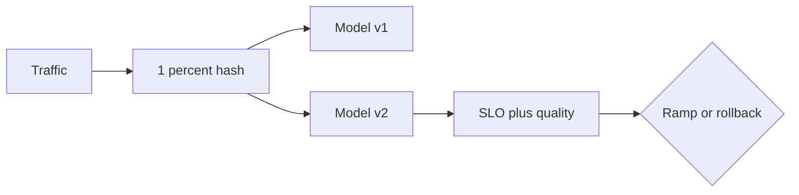

import { ConceptTemplate } from '@/features/kb/components/templates/ConceptTemplate'
import { Callout } from '@/features/kb/components/mdx/Callout'
import { ComparisonTable } from '@/features/kb/components/mdx/ComparisonTable'

export default function Layout({ children }) {
  return (
    <ConceptTemplate title="Canary Deployment (Models)">
      {children}
    </ConceptTemplate>
  )
}

A **canary** is a tiny live experiment with an abort button. Unlike a full A/B, you often start at 1% and only expand if error rate, latency, and a leading business metric stay inside a budget.

## 1. Deep Dive and Mechanics

**Routing.** Header, cookie, or hashed user id → canary cluster or canary model revision in the same server (Triton/TF-Serving versions).

**Metrics.** Platform: QPS, p99, GPU OOM, 5xx. Model: score distribution shift, empty-answer rate, toxicity. Business: CTR if you have it in minutes.

**Ramp.** 1% → 5% → 25% → 50% → 100% with automatic rollback on SLO burn. Hold each step long enough for p99 to be real.

**Stickiness.** Same user should stay on one revision during the ramp so support can reproduce.

<Callout icon="warning" title="Canary of one GPU">
If the canary pod is a different instance type than prod, you are testing hardware, not the model. Match SKUs.
</Callout>

## 2. Mathematical / Theoretical Foundation

At 1% traffic, you have 1% of the samples. Detecting a 0.1% quality drop needs a huge baseline QPS or a longer soak. Use sequential tests or a Bayesian threshold on a **leading** metric; do not pretend 1% has A/B power for a rare conversion.

Rollback is a control problem: compare canary vs control with a CUSUM or simple SLO error-budget burn rate.

<ComparisonTable
  headers={['Mode', 'User impact', 'When']}
  rows={[
    ['Shadow', 'None', 'Score-only compare'],
    ['Canary', 'Small slice', 'Default ship path'],
    ['A/B 50/50', 'Half', 'Need statistical power'],
    ['Blue-green', 'All at cutover', 'Infra swap, not model science'],
  ]}
/>

## 3. Real-World Implementation

```yaml
# Istio-style traffic split by revision
http:
  - route:
      - destination:
          host: ranker
          subset: v1
        weight: 99
      - destination:
          host: ranker
          subset: v2
        weight: 1
```

Prefer a control plane (Argo Rollouts, Flagger, your feature-flag service) over hand-edited weights.

## 4. Visualizations



## 5. Interview Prep

**Q: Canary vs A/B?**
**A:** Canary is a safety ramp. A/B is a powered experiment. You often canary first, then run A/B at a split that can actually detect the MDE.

**Q: What do you rollback on?**
**A:** Pre-agreed burn: p99, 5xx, and one model-specific canary (e.g. empty rate). Not a Slack vibe.

**Q: Why sticky assignment?**
**A:** Mixed revisions for one user make bugs unreproducible and bias learning if you log both.

## 6. Production Use Cases

- New ranking checkpoint after offline + shadow pass.
- LLM provider or prompt version with cost/latency floors.
- Tokenizer or preprocess change (those break as often as weights).

<Callout icon="tip" title="Canary the preprocess">
If only weights change but featurizers are new, canary the whole graph. Half-migrated features look like model regressions.
</Callout>
