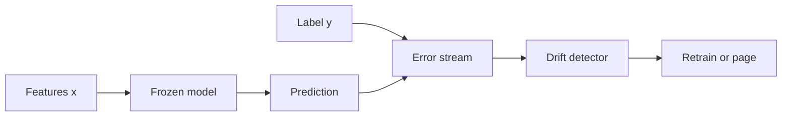

import { ConceptTemplate } from '@/features/kb/components/templates/ConceptTemplate'
import { Callout } from '@/features/kb/components/mdx/Callout'
import { ComparisonTable } from '@/features/kb/components/mdx/ComparisonTable'

export default function Layout({ children }) {
  return (
    <ConceptTemplate title="Concept Drift">
      {children}
    </ConceptTemplate>
  )
}

**Concept drift** is a change in the mapping from features to the thing you predict. Fraudsters change tactics. Users change slang. A credit policy change rewrites what “default” means. The feature histogram can look fine while accuracy dies.

## 1. Deep Dive and Mechanics

**Real vs virtual.** Real drift: P(y|x) moves. Virtual: P(x) moves but P(y|x) holds (that is closer to **data drift** / covariate shift). You still may need retraining because the model never saw the new x.

**Sudden vs gradual.** A regulation ships on Monday (sudden). A season creeps (gradual). Detectors and windows differ.

**Label delay.** You often cannot compute live accuracy. Use proxy errors, delayed labels, or human review samples.

**Response.** Retrain on a recent window, add features that capture the new concept, or route to a fallback policy.

<Callout icon="info" title="Not the same as data drift">
Data drift is “who showed up.” Concept drift is “what the label means given who showed up.” Monitor both; they need different stories in the postmortem.
</Callout>

## 2. Mathematical / Theoretical Foundation

You want to detect a change in P_t(y|x) vs P_0(y|x). With labels, compare error or a two-sample test on residuals. Without labels, you cannot identify concept drift from P(x) alone. Methods: ADWIN, DDM/EDDM on a stream of errors; PSI/JS on scores as a *proxy* (score shift can be either kind of drift).

<ComparisonTable
  headers={['Signal', 'Needs labels?', 'Tells you']}
  rows={[
    ['Online error / DDM', 'Yes or delayed', 'Concept or broken pipeline'],
    ['Score PSI', 'No', 'Something moved'],
    ['Feature PSI', 'No', 'Covariate shift'],
    ['Human audit sample', 'Yes, small n', 'True concept change'],
  ]}
/>

## 3. Real-World Implementation

```python
def rolling_error(y_true, y_pred, window=1000) -> float:
    err = (y_true[-window:] != y_pred[-window:]).mean()
    return float(err)
```

Alert if rolling error exceeds a baseline plus slack, then open a label-audit ticket — do not auto-retrain on a pipeline outage.

## 4. Visualizations



## 5. Interview Prep

**Q: Concept vs covariate shift?**
**A:** Covariate: P(x) changes. Concept: P(y|x) changes. Retraining recipes differ; identification without y is limited.

**Q: Why can accuracy drop with stable features?**
**A:** The world changed the rule, not the inputs. Or the label definition changed in the warehouse.

**Q: Do you always retrain?**
**A:** No. First rule out serve bugs and delayed labels. Then decide windowed retrain vs a new feature.

## 6. Production Use Cases

- Fraud, ads, and ranking where adversaries and tastes move.
- Clinical models after a guideline change.
- LLM judges when user tasks shift (new product line).

<Callout icon="tip" title="Version the label definition">
If “churn” is redefined, that is concept drift you caused. Put the definition hash next to the model card.
</Callout>
