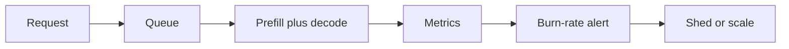

import { ConceptTemplate } from '@/features/kb/components/templates/ConceptTemplate'
import { Callout } from '@/features/kb/components/mdx/Callout'
import { ComparisonTable } from '@/features/kb/components/mdx/ComparisonTable'

export default function Layout({ children }) {
  return (
    <ConceptTemplate title="Cost-Latency Monitoring for Inference">
      {children}
    </ConceptTemplate>
  )
}

Accuracy is not the only production metric. **Inference cost and latency** decide whether a model is allowed to stay on the hot path. LLM tokens make this visceral: one verbose system prompt can 3× a monthly bill.

## 1. Deep Dive and Mechanics

**Latency breakdown.** Queue wait, tokenize, prefill, decode (per token), postprocess, network. p50 can look fine while p99 is a timeout.

**Cost drivers.** GPU-seconds, replica count, prompt+completion tokens, cache miss rate, tool-call fanout, retries.

**Budgets.** Per-request token cap, per-tenant QPS, max concurrent generations. Shed load (429, smaller model) before you melt the fleet.

**Attribution.** Tag traces with model id, prompt version, route, and tenant. Finance will ask “who spent this?”

<Callout icon="warning" title="Average tokens hide whales">
A 1% of requests that emit 8k tokens dominate cost. Histogram tokens and latency; do not stop at means.
</Callout>

## 2. Mathematical / Theoretical Foundation

Little’s law: L = lambda W. If arrivals lambda grow and each request holds a GPU for W, you need more replicas or you queue. For autoregressive models, W ≈ t_prefill + n_out * t_decode. Batching changes the constant but couples requests.

SLO: P(latency &gt; T) ≤ epsilon. Error budget is 1 - SLO over a window. Burn rate tells you when to page.

<ComparisonTable
  headers={['Signal', 'Unit', 'Action']}
  rows={[
    ['p99 latency', 'ms', 'Scale or shed'],
    ['Tokens in/out', 'count', 'Cap, cache, shorter prompts'],
    ['GPU util', 'percent', 'Batch or downsize'],
    ['Cost per 1k req', 'currency', 'Route to cheaper model'],
  ]}
/>

## 3. Real-World Implementation

```python
import time

def timed_generate(fn, prompt: str) -> dict:
    t0 = time.perf_counter()
    out = fn(prompt)
    ms = (time.perf_counter() - t0) * 1000
    return {
        'latency_ms': ms,
        'tokens_in': out.usage.prompt_tokens,
        'tokens_out': out.usage.completion_tokens,
        'model': out.model,
    }
```

Export those fields to Prometheus/OTel. Alert on p99 and on cost-per-minute, not only 5xx.

## 4. Visualizations



## 5. Interview Prep

**Q: Why is decode p99 so bad?**
**A:** Output length is heavy-tailed, batching stalls, and KV-cache memory fragments. Cap max tokens and isolate whales.

**Q: Cost vs latency trade?**
**A:** Bigger batches raise GPU util (cheaper) and often raise p99. Pick the constraint (SLA or budget) first.

**Q: How do you compare two LLM routes?**
**A:** Same traffic, report $/accepted-task and p99, not just win-rate on a quality rubric.

## 6. Production Use Cases

- LLM gateways with per-tenant budgets.
- Recsys / CV on GPU with HPA on queue depth.
- Multi-model routers that send easy queries to small models.

<Callout icon="tip" title="Price the fallback">
A cheap model that retries three times can cost more than one large-model call. Log **successful** task cost.
</Callout>
