import { ConceptTemplate } from '@/features/kb/components/templates/ConceptTemplate'
import { Callout } from '@/features/kb/components/mdx/Callout'

export default function Layout({ children }) {
  return (
    <ConceptTemplate title="DVC (Data Version Control)">
      {children}
    </ConceptTemplate>
  )
}

Git was mathematically designed to track highly granular modifications in small text files (lines of code). It stores snapshots and computes efficient diffs.
If you attempt to `git commit` a 50GB CSV dataset or a 4GB PyTorch `.bin` model weight file, Git will mathematically choke. It attempts to load the binary blob into RAM to compute the diff, violently crashing the repository and making collaboration impossible.

**DVC (Data Version Control)** solves this problem flawlessly. It acts as an orchestration layer sitting directly on top of Git, allowing Data Scientists to version massive data files exactly like they version source code.

## 1. Deep Dive & Mechanics

### The Pointer System (Hash-Based Tracking)
DVC completely decouples the *Code* from the *Data*. 
When you type `dvc add dataset.csv`, DVC executes the following mathematical sequence:
1. It reads the massive 50GB file and calculates its **MD5 Hash** (a unique cryptographic string representing the exact byte state of the data).
2. It physically moves the massive file into a hidden cache directory (`.dvc/cache`).
3. It creates a tiny, 2-kilobyte text file called `dataset.csv.dvc`. This file contains the MD5 Hash pointer and file metadata.
4. It automatically adds the massive `dataset.csv` to `.gitignore`.

You then execute `git commit dataset.csv.dvc`. **Git handles the tiny pointer file; DVC handles the massive data.** They remain perfectly mathematically synchronized.

### Remote Cloud Storage
Just as Git pushes code to GitHub, DVC pushes data to the Cloud. 
You configure a DVC Remote (Amazon S3, Google Cloud Storage, or a local SSH server). When you type `dvc push`, DVC mathematically compares the local cache hashes with the cloud hashes, and uploads only the massive files that have changed. 
When a new colleague clones the GitHub repo, they just run `dvc pull`, and DVC reads the pointers in the code to fetch the exact mathematically correct datasets from S3.

## 2. Mathematical / Theoretical Foundation

### Directed Acyclic Graphs (DAGs) and Reproducibility
DVC is not just for storage; it is a strict mathematical **Pipeline Executor**.
In Machine Learning, training a model involves a strict dependency chain: 
1. Clean Data $\rightarrow$ 2. Extract Features $\rightarrow$ 3. Train Model $\rightarrow$ 4. Evaluate.

You mathematically define this DAG in a `dvc.yaml` file. For each step, you define the `deps` (dependencies) and the `outs` (outputs).
If you modify the Python script for Step 2, and type `dvc repro` (Reproduce), DVC performs a mathematical topological sort of the graph. It calculates the hashes of all scripts and data. It realizes Step 1 hasn't changed (so it mathematically skips it, saving hours of compute). It sees Step 2 changed, executes it, re-executes Step 3, and securely versions the newly generated model outputs. 
This guarantees absolute mathematical reproducibility across the entire Data Science team.

### The Metrics and Experiment Tracking
DVC mathematically integrates model evaluation directly into Git commits.
During the training pipeline, your script can output a `metrics.json` file (e.g., `{"accuracy": 0.95}`).
By running `dvc metrics diff`, DVC parses the JSON from your current branch and mathematically compares it to the JSON stored in the `main` branch. This allows Data Scientists to see a strict mathematical diff of how their code changes affected the model's accuracy, seamlessly integrating model evaluation into standard GitHub Pull Request workflows.

## 3. Real-World Implementation

Here is a command-line walkthrough of initializing DVC, tracking a massive dataset, and pushing it to an AWS S3 bucket.

```bash
# 1. Initialize Git and DVC in the project repository
git init
dvc init

# 2. Add a massive 50GB dataset to DVC tracking
dvc add data/massive_training_set.csv

# DVC automatically creates data/massive_training_set.csv.dvc (The Pointer)
# DVC automatically adds data/massive_training_set.csv to .gitignore

# 3. Commit the tiny pointer file to Git
git add data/massive_training_set.csv.dvc data/.gitignore
git commit -m "Add massive raw dataset"

# 4. Configure DVC to use an AWS S3 bucket as the remote storage backend
dvc remote add -d my_s3_storage s3://my-enterprise-ml-bucket/dvc_store

# 5. Push the massive physical data to S3
dvc push

# 6. Push the tiny code pointers to GitHub
git push origin main
```

When another developer clones this repository, they execute:
```bash
git clone https://github.com/enterprise/ml-project.git
cd ml-project
dvc pull # Automatically reads the .dvc files and downloads the 50GB dataset from S3
```

## 4. Visualizations

```mermaid
graph TD
    subgraph The DVC & Git Sync Architecture
        A[Data Scientist Laptop] -->|git push| B(GitHub Repository)
        A -->|dvc push| C(Amazon S3 / Google Cloud)
        
        subgraph Version Control Separation
            B -->|Stores Code| D[train.py]
            B -->|Stores Pointers| E[dataset.csv.dvc]
            
            E -.->|MD5 Hash Link| F
            
            C -->|Stores Massive Data| F[dataset.csv<br/>50GB]
            C -->|Stores Model Weights| G[model.pt<br/>4GB]
        end
        
        H[Colleague Laptop] -->|git pull| B
        H -->|dvc pull| C
    end
    
    style B fill:#1e1e1e,stroke:#fff,stroke-width:2px
    style C fill:#1e1e1e,stroke:#00a676,stroke-width:2px
    style E fill:#772953,stroke:#fff,stroke-width:2px
```



<Callout icon="warning" title="DVC vs Git LFS">
  Developers often ask why they shouldn't just use **Git LFS (Large File Storage)**. Git LFS replaces massive files with text pointers inside Git, but it mathematically requires you to host your massive files on the specific Git server (e.g., paying GitHub's incredibly expensive bandwidth fees). DVC allows you to store the massive files in your own incredibly cheap S3 buckets or local NAS servers, completely decoupling the storage architecture from the Git provider. Furthermore, Git LFS has absolutely zero concept of DAGs or Pipeline execution.
</Callout>

## 5. Interview Prep

**Q: What is the significance of the `dvc.lock` file?**
**Answer:** Just like a `package-lock.json` in Node.js, the `dvc.lock` file is mathematically generated by DVC when you run a pipeline (`dvc repro`). It captures the exact, hardcoded MD5 hashes of every single dependency and output file generated during that specific pipeline run. By committing the `dvc.lock` file to Git, you mathematically guarantee that anyone checking out that specific Git commit can exactly reproduce the model, knowing with cryptographic certainty that they are using the exact same bytes of training data.

**Q: Explain how DVC handles branching for Machine Learning experiments.**
**Answer:** Because DVC pointers are just text files tracked by Git, DVC leverages Git branching natively. If a Data Scientist wants to try a new normalization algorithm, they create a Git branch (`git checkout -b experiment-norm`). They change the data, run `dvc repro`, and commit the new `.dvc` pointers to the branch. They can instantly swap back to the `main` branch via Git, run `dvc checkout`, and DVC will seamlessly swap the massive physical files on their hard drive to match the mathematical state of the `main` branch.

**Q: How does DVC differ from MLflow?**
**Answer:** MLflow is an API-driven Model Registry and Experiment Tracker. You write Python code (`mlflow.log_metric()`) to send data to a centralized tracking server dashboard. DVC is a CLI tool tightly coupled with Git. DVC focuses on tracking the massive physical datasets and the DAG execution logic locally using hashes, committing the state directly to the Git commit graph rather than an external database. Modern MLOps architectures frequently use both: DVC to track the massive data in S3, and MLflow to log the validation metrics of the resulting model to a UI.

## 6. Production Use Cases

- **Autonomous Vehicle Data Pipelines:** Self-driving car companies collect petabytes of video data. They use DVC to version specific subsets of this data. A "Winter Driving Dataset" is strictly versioned and hashed via DVC. If a newly trained model fails on snow, the engineers can use Git/DVC to mathematically rewind the repository back 6 months, instantly restoring the exact historical state of the massive video dataset used to train the previous, working model.
- **LLM Fine-Tuning Teams:** When fine-tuning Llama-3, teams constantly curate instruction datasets (JSONL files). As humans review and clean the text, the dataset constantly changes. DVC ensures that every single version of the massive JSONL dataset is cryptographically hashed and synced to Google Cloud Storage. When a model exhibits "catastrophic forgetting," the team runs a `dvc diff` to mathematically identify exactly which new text records were added to the dataset between the working version and the broken version.