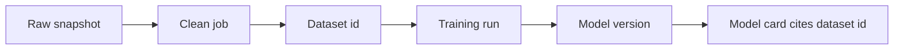

import { ConceptTemplate } from '@/features/kb/components/templates/ConceptTemplate'
import { Callout } from '@/features/kb/components/mdx/Callout'
import { ComparisonTable } from '@/features/kb/components/mdx/ComparisonTable'

export default function Layout({ children }) {
  return (
    <ConceptTemplate title="Dataset Versioning">
      {children}
    </ConceptTemplate>
  )
}

Code has git SHAs. Weights have registry versions. If the **dataset** is “whatever is in the bucket today,” you cannot debug a regression. Dataset versioning is an immutable pointer: this training job used these bytes (or this query at this time).

## 1. Deep Dive and Mechanics

**What you version.** Raw dumps, cleaned tables, split indices, label files, and the SQL/DBT that built them. The split file matters as much as the rows — leakage lives there.

**How.** Content hashes (DVC, lakeFS, Delta time-travel), warehouse table snapshots, or a manifest of object keys plus etags. Git LFS alone is not a data model.

**Lineage.** Dataset v3 was built from raw v12 + label job 88. Store that graph so a bad labeler can be unwound.

**PII.** Versioning does not excuse copying prod dumps to laptops. Same access controls on every snapshot.

<Callout icon="warning" title="Mutable latest">
A dataset named `train_latest` is not a version. Pin `train@2026-03-01` or a hash in the run config.
</Callout>

## 2. Mathematical / Theoretical Foundation

A dataset version is a function from an id to a byte stream (or a relation). Reproducibility is: same code SHA + same data id + same seed ⇒ same artefacts up to allowed nondeterminism. Content-addressable storage makes equality of ids imply equality of bytes.

<ComparisonTable
  headers={['Tool / pattern', 'Unit', 'Fits']}
  rows={[
    ['DVC plus remote', 'File hash', 'Repo-centric teams'],
    ['Delta / Iceberg snapshot', 'Table version', 'Warehouses'],
    ['lakeFS', 'Git-like data repo', 'S3 data lakes'],
    ['Manifest JSON', 'List of URIs plus etag', 'Minimal viable'],
  ]}
/>

## 3. Real-World Implementation

```python
import json, hashlib
from pathlib import Path

def manifest(paths: list[Path]) -> dict:
    rows = []
    for p in paths:
        h = hashlib.sha256(p.read_bytes()).hexdigest()
        rows.append({'path': str(p), 'sha256': h, 'bytes': p.stat().st_size})
    return {'files': rows}

Path('data.manifest.json').write_text(json.dumps(manifest([Path('train.parquet')]), indent=2))
```

Commit the manifest; store blobs in object storage keyed by hash.

## 4. Visualizations



## 5. Interview Prep

**Q: Why not just git commit the CSV?**
**A:** Git hates multi-GB binaries. You version a pointer and put bytes in a content-addressed remote.

**Q: What belongs in the version?**
**A:** Anything that can change labels or rows: filters, joins, human review outcomes, split seeds.

**Q: How do you eval apples-to-apples?**
**A:** Freeze an eval dataset version and never silently append. New eval data is a new version and a new number.

## 6. Production Use Cases

- Regulated model files that must name the training extract.
- LLM eval sets (golden prompts) that must not drift under the same name.
- Feature-store training sets exported as a dated snapshot.

<Callout icon="tip" title="Version negatives too">
Hard-negative lists and sampling weights are data. If they change, the dataset id must change.
</Callout>
