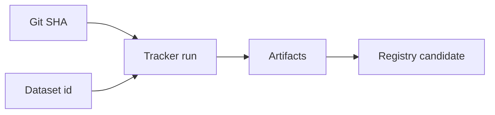

import { ConceptTemplate } from '@/features/kb/components/templates/ConceptTemplate'
import { Callout } from '@/features/kb/components/mdx/Callout'
import { ComparisonTable } from '@/features/kb/components/mdx/ComparisonTable'

export default function Layout({ children }) {
  return (
    <ConceptTemplate title="Experiment Tracking">
      {children}
    </ConceptTemplate>
  )
}

If the best AUC lives in a Slack screenshot, you do not have MLOps. **Experiment tracking** stores each run as a row you can filter, compare, and promote: hyperparameters, metrics over steps, git SHA, dataset version, and links to artifacts.

## 1. Deep Dive and Mechanics

**Run identity.** A UUID plus an experiment name. Nested runs for sweeps. Tags for “baseline” and “prod candidate.”

**What to log.** Config (flattened), metrics (step-indexed), system stats (GPU), artifacts (plots, preds, ONNX). Log the **uncommitted dirty flag** or refuse to start.

**Compare.** Parallel coordinates, metric tables, and “diff these two runs.” Promotion is a click that writes to the **model registry**, not a renamed file on a laptop.

**Auth.** Tracking servers hold IP. SSO and project ACLs matter.

<Callout icon="info" title="Tracking is not a registry">
MLflow/W&B runs are experiments. A registry stage (`Staging`, `Production`) is a governed pointer. Do not deploy off `latest` run in an experiment.
</Callout>

## 2. Mathematical / Theoretical Foundation

A run is a tuple (theta, D_id, seed, metric_curve). Hyperparameter search is optimisation of a noisy function f(theta). Trackers do not solve that; they make f searchable. Reproducibility requires storing enough of the tuple that you can re-invoke the trainer.

<ComparisonTable
  headers={['Product', 'Strength', 'Watch']}
  rows={[
    ['MLflow', 'OSS, registry combo', 'You host it'],
    ['W and B', 'UI, sweeps', 'Vendor lock, cost'],
    ['Neptune / Comet', 'Team features', 'Same as any SaaS'],
    ['TensorBoard only', 'Local curves', 'No governance'],
  ]}
/>

## 3. Real-World Implementation

```python
import mlflow

def train(lr: float, data_id: str):
    mlflow.set_experiment('ranker')
    with mlflow.start_run():
        mlflow.log_params({'lr': lr, 'data_id': data_id})
        acc = 0.81
        mlflow.log_metric('val_acc', acc)
        mlflow.log_artifact('model.pt')
```

Also log `git.sha` and `dvc.lock` hash in params.

## 4. Visualizations



## 5. Interview Prep

**Q: Why not CSV of results?**
**A:** No artifact link, no step curves, no access control, no compare UI, and it will fork.

**Q: What must be in every run?**
**A:** Code id, data id, seed, metric you care about, and the artifact path.

**Q: How do sweeps relate?**
**A:** Parent run plus children. Promote from a child, not from a manually edited checkpoint.

## 6. Production Use Cases

- Daily training grids on recsys and CV.
- LLM fine-tune jobs with token-cost logged as a metric.
- Offline eval jobs that must attach to the same run as the train.

<Callout icon="tip" title="Fail the job if logging fails">
A completed GPU job with no run record is a wasted job. Make the tracker a hard dependency.
</Callout>
