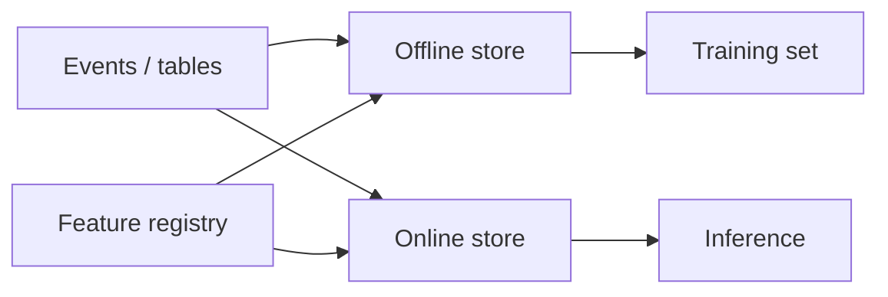

import { ConceptTemplate } from '@/features/kb/components/templates/ConceptTemplate'
import { Callout } from '@/features/kb/components/mdx/Callout'
import { ComparisonTable } from '@/features/kb/components/mdx/ComparisonTable'

export default function Layout({ children }) {
  return (
    <ConceptTemplate title="Feature Stores">
      {children}
    </ConceptTemplate>
  )
}

Most “the model got worse” incidents are **training/serving skew**: pandas in the notebook, a different join in the service. A **feature store** (Feast, Tecton, Vertex, SageMaker FS) is a contract: one definition, two materialisations — historical for train, low-latency for serve.

## 1. Deep Dive and Mechanics

**Offline store.** Warehouse or lake (BigQuery, Snowflake, Iceberg). Point-in-time correct joins so you do not leak the future.

**Online store.** Redis, Dynamo, Bigtable. Values keyed by entity id, updated by streaming or batch push.

**Registry.** Feature names, types, owners, TTL, and transforms. This is the API.

**On-demand transforms.** Some features compute at request time (ratios). Those transforms must be in the same repo the trainer imports.

<Callout icon="warning" title="Point-in-time or leak">
If you join the latest user aggregate onto a label from last month, you trained on the future. Feature stores exist to make that join hard to get wrong.
</Callout>

## 2. Mathematical / Theoretical Foundation

A feature is a function f(entity, t) → value using only data with timestamps &lt; t (for label time t). Point-in-time correctness is that inequality. Online serve approximates f(entity, now). If the streaming job lags, online f is stale — a different skew.

<ComparisonTable
  headers={['Plane', 'Storage', 'Used for']}
  rows={[
    ['Offline', 'Warehouse / lake', 'Train, backfill, batch score'],
    ['Online', 'KV / cache', 'Live inference'],
    ['Streaming', 'Jobs into KV', 'Fresh features'],
    ['On-demand', 'In-process', 'Request-time math'],
  ]}
/>

## 3. Real-World Implementation

```python
# Feast-style retrieve at train time
from datetime import datetime

entity_df = spark.table('labels').select('user_id', 'event_time')
training = store.get_historical_features(
    entity_df=entity_df,
    features=['user:clicks_7d', 'user:country'],
).to_df()
```

The same feature names are fetched in the service via `get_online_features`.

## 4. Visualizations



## 5. Interview Prep

**Q: Why not just Redis?**
**A:** Redis is the online sink. Without a registry and PIT offline path you still have two definitions.

**Q: What is training/serving skew?**
**A:** Different code or clocks producing x_train vs x_serve. The model never saw the serve distribution.

**Q: When is a feature store overkill?**
**A:** One team, five features, one batch pipeline. The *idea* of one definition still applies; the product can wait.

## 6. Production Use Cases

- Recsys and ads with hundreds of shared features.
- Fraud with streaming counters and a warehouse history.
- Multi-model platforms that must not copy SQL.

<Callout icon="tip" title="Test PIT with a known leak">
Write a unit test that a label at t cannot see a feature timestamped t+1. If that test is missing, assume you leak.
</Callout>
