import { ConceptTemplate } from '@/features/kb/components/templates/ConceptTemplate'
import { Callout } from '@/features/kb/components/mdx/Callout'

export default function Layout({ children }) {
  return (
    <ConceptTemplate title="Kubeflow (Kubernetes Native MLOps)">
      {children}
    </ConceptTemplate>
  )
}

Machine Learning at an enterprise scale is mathematically too massive for a single laptop. It requires distributed, horizontal computing. Kubernetes is the undisputed king of distributed computing, but Kubernetes was designed for stateless web servers, not for the highly stateful, hardware-accelerated, mathematically complex workflows required by Neural Networks.

**Kubeflow** acts as the definitive bridging operating system. It mathematically forces Kubernetes to understand the specific architectural needs of Machine Learning, providing a suite of cloud-native tools to orchestrate data pipelines, distribute training across hundreds of GPUs, and serve models at scale.

## 1. Deep Dive & Mechanics

### Kubeflow Pipelines (KFP)
Training a production model is a strict Directed Acyclic Graph (DAG) of mathematical steps.
In Kubeflow Pipelines (KFP), Data Scientists define this DAG entirely in standard Python. 
1. *Step A*: Extract Data from S3.
2. *Step B*: Normalize the tensors.
3. *Step C*: Train the ResNet50 model.

Kubeflow's compiler mathematically converts this Python code into a massive Kubernetes YAML manifest (Argo Workflows). 
When executed, Kubeflow spins up an **independent Docker container for every single step**. 
This is mathematically brilliant for hardware utilization: If Step B (Normalization) requires 128 CPU cores and 1TB of RAM, Kubeflow dynamically provisions a massive CPU node, runs the math, passes the output tensors to Step C, and immediately terminates the CPU node. If Step C requires 8 Nvidia H100 GPUs, Kubeflow instantly provisions a GPU cluster, runs the training, and kills the cluster. You pay for exactly the hardware you need for exactly the seconds you use it.

### Distributed Training Operators
Training a 70-Billion parameter LLM on a single GPU is mathematically impossible (it requires ~140GB of VRAM just for the weights). You must distribute the math.
Kubeflow provides native Operators (like `TFJob` for TensorFlow and `PyTorchJob` for PyTorch) that hook directly into Kubernetes. You tell Kubeflow: *"Train this model using 4 nodes with 8 GPUs each."* Kubeflow automatically orchestrates the complex network topology, mathematically setting up the MPI (Message Passing Interface) rings so the GPUs can synchronize their gradient updates in milliseconds using algorithms like Ring-AllReduce.

## 2. Mathematical / Theoretical Foundation

### Katib (Bayesian Hyperparameter Tuning)
Finding the perfect Learning Rate, Batch Size, and Dropout Rate is a mathematical nightmare. A grid search (trying every combination) takes years.

Kubeflow includes **Katib**, a distributed, mathematically rigorous Hyperparameter tuning engine. 
You provide Katib with a mathematical search space (e.g., $0.0001 < \text{LR} < 0.1$, $16 < \text{Batch Size} < 256$).
Katib does not guess blindly. It uses advanced mathematical algorithms like **Bayesian Optimization** and **Hyperband**. 
1. It mathematically spins up 50 parallel Kubernetes pods to train 50 different configurations simultaneously.
2. It monitors the Validation Loss in real-time.
3. Using the Hyperband algorithm, it aggressively mathematically kills the worst-performing 25 pods halfway through the training, re-allocating those precious GPU resources to the most promising configurations.
4. After thousands of distributed trials, it mathematically returns the absolute optimal Hyperparameter configuration.

### Data Passing via Persistent Volumes
In standard Kubernetes, containers are ephemeral; when a container dies, its local disk dies with it. 
In a Kubeflow DAG, Step 1 must mathematically pass a 50GB normalized tensor to Step 2. Kubeflow manages this by dynamically attaching and detaching **Persistent Volume Claims (PVCs)** or utilizing S3 artifact stores. The mathematical output of Step 1 is serialized to the volume, the container is destroyed, Step 2 is spawned, and the exact same volume is mounted to Step 2, ensuring zero data loss and $O(1)$ data transfer speeds between pipeline nodes.

## 3. Real-World Implementation

Here is a Python script using the Kubeflow Pipelines (KFP) SDK. It demonstrates defining two isolated mathematical steps (Data Prep and Training) and chaining them together into a Kubernetes DAG.

```python
import kfp
from kfp import dsl
from kfp.dsl import component, OutputPath, InputPath

# 1. Define Step A: Data Preparation
# This mathematically compiles into its own Docker container
@component(base_image='python:3.9', packages_to_install=['pandas', 'numpy'])
def prepare_data(data_path: OutputPath('CSV')):
    import pandas as pd
    import numpy as np
    
    # Generate mock mathematical data
    df = pd.DataFrame(np.random.rand(100, 5), columns=['A', 'B', 'C', 'D', 'Target'])
    
    # Save the output to the path dynamically injected by Kubeflow
    df.to_csv(data_path, index=False)
    print("Data preparation mathematically complete.")

# 2. Define Step B: Model Training
# This compiles into a SEPARATE Docker container, potentially on a different physical server
@component(base_image='python:3.9', packages_to_install=['pandas', 'scikit-learn'])
def train_model(data_path: InputPath('CSV'), accuracy_path: OutputPath('Float')):
    import pandas as pd
    from sklearn.linear_model import LogisticRegression
    from sklearn.metrics import accuracy_score
    
    # Load the data passed from Step A
    df = pd.read_csv(data_path)
    X = df.drop('Target', axis=1)
    
    # Binarize the target for logistic regression
    y = (df['Target'] > 0.5).astype(int) 
    
    # Mathematically train the model
    model = LogisticRegression()
    model.fit(X, y)
    
    accuracy = accuracy_score(y, model.predict(X))
    
    # Save the mathematical metric
    with open(accuracy_path, 'w') as f:
        f.write(str(accuracy))
    print(f"Model trained with Accuracy: {accuracy}")

# 3. Define the DAG (The Kubeflow Pipeline)
@dsl.pipeline(
    name='Mathematical LR Pipeline',
    description='A simple pipeline demonstrating KFP components.'
)
def logistic_regression_pipeline():
    # Execute Step A
    prep_task = prepare_data()
    
    # Execute Step B, mathematically passing the output of Step A as the input
    # Kubeflow automatically infers the dependency and ensures Step B waits for Step A
    # We can also dynamically allocate a GPU specifically for this training task
    train_task = train_model(prep_task.output).set_gpu_limit(1)

# 4. Compile the Pipeline to Kubernetes YAML
kfp.compiler.Compiler().compile(logistic_regression_pipeline, 'lr_pipeline.yaml')
```

## 4. Visualizations

```mermaid
graph TD
    subgraph Kubeflow Kubernetes Cluster
        A[Data Scientist] -->|Submits Python DAG| B(KFP Orchestrator)
        
        B -->|Spawns Pod 1| C[Data Prep Node<br/>CPU: 64, RAM: 256GB]
        
        C -.->|Writes Tensor| D[(Shared Persistent Volume)]
        
        C -->|Node Dies, Triggers Next Step| E
        
        B -->|Spawns Pod 2| E[Training Node<br/>8x Nvidia A100 GPUs]
        
        E -.->|Reads Tensor| D
        E -->|Writes Weights| F[(S3 Model Registry)]
        
        E -->|Node Dies| G[Model Serving Node<br/>KServe]
    end
    
    style B fill:#1e1e1e,stroke:#fff,stroke-width:2px
    style C fill:#1e1e1e,stroke:#00a676,stroke-width:2px
    style E fill:#772953,stroke:#fff,stroke-width:2px
```



<Callout icon="warning" title="The Complexity Toll">
  Kubeflow is notorious for being incredibly difficult to install and maintain. It requires a dedicated DevOps team with deep Kubernetes expertise to manage the Istio service meshes, persistent volumes, and RBAC (Role-Based Access Control) security rules. Small data science teams should almost always use managed cloud solutions (like AWS SageMaker or GCP Vertex AI) rather than attempting to maintain bare-metal Kubeflow.
</Callout>

## 5. Interview Prep

**Q: Explain how Kubeflow Pipelines handles data passing between components if they run in completely different Docker containers.**
**Answer:** Because the containers are physically isolated (and often on different physical servers), they cannot share RAM. Kubeflow orchestrates data passing using the underlying storage abstraction. When defining a component, you specify `OutputPath` and `InputPath`. Kubeflow mathematically intercepts these paths. When Component A finishes, Kubeflow captures the file, uploads it to an Artifact Store (like MinIO or S3), and when Component B starts, Kubeflow downloads the file and securely injects the file path into Component B's runtime arguments, making the distributed jump completely invisible to the Python code.

**Q: What is KServe (formerly KFServing)?**
**Answer:** KServe is Kubeflow's highly specialized model deployment sub-system. While you could deploy a model in a standard Kubernetes Deployment, KServe mathematically understands AI traffic. It provides out-of-the-box **Scale-to-Zero** (if no users hit the API, it scales the GPU pods to exactly 0 to save money, spinning them back up on the first request). It also natively supports Canary Rollouts, allowing you to mathematically route 90% of traffic to the `v1.0` model and 10% to the `v2.0` model to safely test accuracy in production.

**Q: Why does Kubeflow use Argo Workflows under the hood?**
**Answer:** Argo Workflows is a Kubernetes-native workflow engine. Kubeflow Pipeline's compiler specifically targets Argo. This is because Argo mathematically defines tasks as a strict DAG of Kubernetes Pods. Argo perfectly handles the low-level mechanics of scheduling Pods, retrying failed Pods, parallelizing independent branches, and passing artifacts between steps, allowing the Kubeflow team to focus exclusively on the Machine Learning abstractions rather than reinventing a distributed execution engine.

## 6. Production Use Cases

- **Spotify (Global ML Orchestration):** Spotify migrated massive swaths of their machine learning infrastructure to Kubeflow. They have thousands of data scientists training recommendation algorithms daily. Kubeflow allows them to define strict, reproducible pipelines. A scientist writes the Python DAG, and Kubeflow provisions the exact GCP Kubernetes resources required to pull the user listening history, train the matrix factorization model, and push it to production, automatically destroying the terabytes of RAM when the pipeline completes.
- **Biotech (AlphaFold Pipelines):** Running deep learning models for protein folding (like AlphaFold) requires massive computational DAGs. Researchers use Kubeflow to automate the process. Step 1 searches the genetic databases (CPU bound). Step 2 performs the Multiple Sequence Alignment (Memory bound). Step 3 mathematically folds the protein using the neural network (GPU bound). Kubeflow ensures the perfect hardware is provisioned for the exact mathematical requirements of each step, maximizing research throughput.