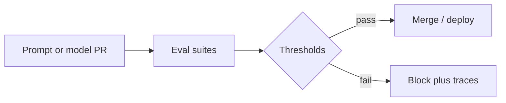

import { ConceptTemplate } from '@/features/kb/components/templates/ConceptTemplate'
import { Callout } from '@/features/kb/components/mdx/Callout'
import { ComparisonTable } from '@/features/kb/components/mdx/ComparisonTable'

export default function Layout({ children }) {
  return (
    <ConceptTemplate title="LLM Evaluation Pipelines">
      {children}
    </ConceptTemplate>
  )
}

LLM quality is not a single accuracy. An **eval pipeline** is a CI job: frozen prompt sets, automatic graders (exact match, rubric LLM-as-judge, code tests), human spot checks, and a go/no-go threshold per suite.

## 1. Deep Dive and Mechanics

**Suites.** Capability (GSM-style), product (your tickets), safety (red-team), and regression (bugs you already fixed). Each has an owner and a floor.

**Graders.** Deterministic first (JSON schema, unit tests for tools). LLM-as-judge second, with a written rubric and a known bias. Humans on a sample.

**Versioning.** Eval set id, prompt version, model id, judge id. Changing the judge is a new experiment.

**Gating.** Block merge if safety suite drops. Warn if a capability suite drops inside noise.

<Callout icon="warning" title="Judge-model incest">
If the same family judges itself, scores inflate. Use a different judge vendor or a human-calibrated slice.
</Callout>

## 2. Mathematical / Theoretical Foundation

Each case i has score s_i in [0,1]. Report mean, bootstrap CI, and pairwise win-rate vs the last shipped prompt. Multiple suites are multiple hypotheses — do not average safety with poetry.

LLM-as-judge agreement with humans is a kappa / correlation you should publish internally. If kappa is 0.3, you are measuring the judge.

<ComparisonTable
  headers={['Grader', 'Cheap?', 'Trust']}
  rows={[
    ['Exact / regex / schema', 'Yes', 'High for structured tasks'],
    ['Unit tests on tools', 'Yes', 'High'],
    ['LLM-as-judge', 'Medium', 'Needs calibration'],
    ['Human raters', 'No', 'Gold, small n'],
  ]}
/>

## 3. Real-World Implementation

```python
def grade_json(output: str, required_keys: list[str]) -> float:
    import json
    try:
        obj = json.loads(output)
    except json.JSONDecodeError:
        return 0.0
    return float(all(k in obj for k in required_keys))
```

Put cases in `evals/product_v4.jsonl`. CI runs `eval run --suite product_v4 --prompt $SHA`.

## 4. Visualizations



## 5. Interview Prep

**Q: Why not only production A/B?**
**A:** A/B is slow and user-visible. Offline suites catch obvious regressions in minutes. You still A/B the ones that pass.

**Q: How big should a suite be?**
**A:** Large enough that a 3-point drop is not noise; small enough to run on every PR. Split: fast smoke + nightly wide.

**Q: Can you eval agents the same way?**
**A:** Yes, but grade trajectories (tool args, termination) not only final text.

## 6. Production Use Cases

- Prompt PRs on a support bot.
- Model-router changes (small vs large).
- RAG: retrieval hit-rate suite plus answer-grounding suite.

<Callout icon="tip" title="Keep the failing traces">
A red suite without stored outputs is not actionable. Save prompt, output, grader rationale.
</Callout>
