import { ConceptTemplate } from '@/features/kb/components/templates/ConceptTemplate'
import { Callout } from '@/features/kb/components/mdx/Callout'

export default function Layout({ children }) {
  return (
    <ConceptTemplate title="LangSmith (LangChain LLMOps)">
      {children}
    </ConceptTemplate>
  )
}

Building a simple LLM wrapper (taking a string and calling the OpenAI API) is easy. Building a complex, multi-agent Retrieval-Augmented Generation (RAG) system using LangChain is a debugging nightmare. 

When a LangChain Agent utilizes tools, memory buffers, and conditional loops (LangGraph), the execution path becomes highly non-deterministic. If the Agent goes into an infinite loop or retrieves the wrong document, standard terminal print statements are mathematically insufficient. 

**LangSmith** is a commercial LLMOps platform built by the creators of LangChain. It provides unprecedented, native introspection into every single component, chain, and tool execution, acting as an X-Ray machine for your AI architecture.

## 1. Deep Dive & Mechanics

### Native LangChain Integration
The primary advantage of LangSmith is its frictionless integration with LangChain.
Because both tools are built by the same company, you do not need to manually decorate or instrument your code. By simply setting two environment variables (`LANGCHAIN_TRACING_V2=true` and `LANGCHAIN_API_KEY`), LangChain automatically begins streaming telemetry to the LangSmith cloud.

If your LangChain pipeline consists of:
`PromptTemplate -> VectorStore -> LLM -> OutputParser`

LangSmith mathematically intercepts the payload between every single arrow. It logs exactly what the PromptTemplate generated, exactly which chunks the VectorStore returned, and exactly how the LLM responded, reconstructing the entire Directed Acyclic Graph (DAG) visually in the dashboard.

### Debugging the ReAct Loop
In autonomous Agent architectures (ReAct), the LLM must mathematically reason, choose a tool, execute it, and observe the result.
LangSmith specifically traces this cognitive loop. If an Agent is given a Python Calculator tool and a Web Search tool, LangSmith logs:
1. The Agent's internal thought ("I need to search the web for the revenue").
2. The exact JSON parameters the Agent generated to invoke the Tool.
3. The raw string output returned by the Tool.
4. The Agent's revised thought based on the new data.
This allows engineers to see exactly *where* the AI's logic broke down.

## 2. Mathematical / Theoretical Foundation

### Datasets and Continuous Evaluation
LangSmith is not just for debugging; it is an incredibly powerful platform for mathematical iteration and CI/CD.
In traditional software, you write Unit Tests. In GenAI, inputs are infinite, so you write **Evaluations**.

If you find a Trace in production where the Agent failed, you can click a button in the LangSmith UI to add that exact input/output pair to a **Testing Dataset**. Over months in production, you curate a massive dataset of complex edge cases.
When an engineer wants to upgrade the underlying model from `gpt-4` to `claude-3-opus`, they mathematically execute the new model against the entire LangSmith Dataset. 

LangSmith uses **LLM-as-a-Judge** to evaluate the results. It mathematically compares the new outputs against the expected outputs, scoring them on metrics like *Helpfulness* and *Accuracy*. If the new model scores worse than the baseline, the CI/CD pipeline is mathematically halted, preventing regressions from hitting production.

### Thread and Memory Tracking
In conversational applications, the prompt sent to the LLM grows mathematically with every interaction because it includes the chat history. LangSmith natively understands LangChain Memory objects. It groups individual Traces into conversational **Threads**, allowing you to see exactly when the context window became too saturated and caused the LLM to start forgetting earlier instructions.

## 3. Real-World Implementation

Here is a Python implementation demonstrating how to trace a LangChain pipeline using LangSmith, and then how to programmatically evaluate a Dataset using the LangSmith SDK.

```python
import os
from langchain_openai import ChatOpenAI
from langchain_core.prompts import ChatPromptTemplate
from langchain_core.output_parsers import StrOutputParser

# 1. Enable LangSmith Tracing via Environment Variables
os.environ["LANGCHAIN_TRACING_V2"] = "true"
os.environ["LANGCHAIN_PROJECT"] = "Customer_Support_Bot"
os.environ["LANGCHAIN_API_KEY"] = "ls__your_api_key"

# 2. Define a standard LangChain (LCEL) pipeline
llm = ChatOpenAI(model="gpt-4-turbo")
prompt = ChatPromptTemplate.from_template("Explain {topic} in one sentence.")
chain = prompt | llm | StrOutputParser()

# 3. Execute. Because the environment variables are set, 
# this execution is silently streamed to the LangSmith dashboard.
response = chain.invoke({"topic": "Quantum Computing"})
print("Response:", response)


# --- ADVANCED: Programmatic Evaluation ---
from langsmith import Client
from langsmith.evaluation import evaluate

client = Client()

# Define a mathematical evaluator function
def exact_match_evaluator(run, example):
    # Compares the LLM's output directly against the expected Ground Truth
    score = 1.0 if run.outputs["output"] == example.outputs["expected"] else 0.0
    return {"key": "exact_match", "score": score}

# Run an evaluation pipeline against a Dataset stored in LangSmith
# This will execute the chain 100 times in parallel against the dataset 
# and log the mathematical results to a specific Experiment UI in LangSmith
results = evaluate(
    chain.invoke,
    data="My_Edge_Case_Dataset", # The name of the dataset in LangSmith
    evaluators=[exact_match_evaluator],
    experiment_prefix="Upgrade_to_GPT4",
    client=client
)
```

## 4. Visualizations

```mermaid
graph TD
    subgraph LangSmith CI/CD Evaluation Loop
        A[Production Trace Fails] -->|Human clicks 'Add'| B[(LangSmith Dataset)]
        
        C[Engineer updates Prompt] --> D{LangSmith Evaluator}
        
        B -->|Injects 500 edge cases| D
        
        D -->|LLM-as-a-Judge| E[Score: 92% Accuracy]
        
        E -->|If Score > Baseline| F[Merge to Main]
        E -->|If Score < Baseline| G[Reject PR]
    end
    
    style B fill:#1e1e1e,stroke:#00a676,stroke-width:2px
    style D fill:#772953,stroke:#fff,stroke-width:2px
    style E fill:#00a676,stroke:#fff,stroke-width:2px
```



<Callout icon="warning" title="LangSmith vs Langfuse">
  A major architectural decision for MLOps teams is choosing between **Langfuse** (Open Source) and **LangSmith** (Proprietary). LangSmith offers the absolute best, most frictionless integration with LangChain and LangGraph. However, because it is a proprietary SaaS product, highly regulated enterprises often reject it due to data privacy concerns (sending sensitive prompt data to third-party servers), opting to self-host Langfuse instead. 
</Callout>

## 5. Interview Prep

**Q: What is the significance of the `LANGCHAIN_TRACING_V2` environment variable?**
**Answer:** It is the global mathematical toggle for observability in the LangChain ecosystem. When set to `true`, the underlying core LangChain classes (like `Runnable` and `BaseLanguageModel`) instantly activate their internal telemetry hooks. They begin serializing their inputs, outputs, latency, and token usage into JSON payloads and spinning up asynchronous background threads to POST that data to the LangSmith API, requiring absolutely zero code instrumentation from the developer.

**Q: How does LangSmith handle high-volume production traffic without crashing the application?**
**Answer:** Tracing adds mathematical overhead. If an application processes 10,000 requests a second, synchronously sending 10,000 HTTP POSTs to LangSmith will crash the server. LangSmith handles this using **Background Threading and Batching**. The telemetry payloads are pushed to an in-memory queue. A separate, non-blocking background thread mathematically pulls batches of traces from the queue and sends them to the cloud over a single persistent connection. Furthermore, you can configure a **Sampling Rate** (e.g., only trace 1% of production traffic) to drastically reduce overhead.

**Q: Can you use LangSmith without using LangChain?**
**Answer:** Yes. While natively integrated with LangChain, LangSmith provides a standalone Python SDK (`@traceable` decorator). You can wrap standard OpenAI SDK calls, custom Python functions, or even pipelines built with competing frameworks like LlamaIndex. LangSmith will mathematically construct the Execution Graph exactly the same way.

## 6. Production Use Cases

- **Continuous Integration for Prompts:** A tech company uses LangSmith to enforce strict CI/CD on their AI agents. When a developer modifies the Agent's system prompt in a GitHub branch, a GitHub Action automatically triggers. The action uses the LangSmith SDK to pull a dataset of 1,000 historical user queries, runs the new Agent against them, and mathematically calculates the hallucination rate. If the new prompt increases hallucinations by more than 2%, the Pull Request is automatically blocked.
- **Latency Optimization in RAG:** An enterprise search tool is running too slowly (averaging 8 seconds). The engineers open the LangSmith UI and inspect the mathematical Trace of the pipeline. They visually realize that the `Embed_Query` node takes 0.5s, the `Vector_Search` node takes 0.5s, but the `Generate_Summary` node takes 7 seconds because it is processing 15,000 tokens of context. Armed with this exact bottleneck data, they implement a strict `Context_Truncation` node to reduce the context to 5,000 tokens, mathematically dropping latency to 3 seconds.