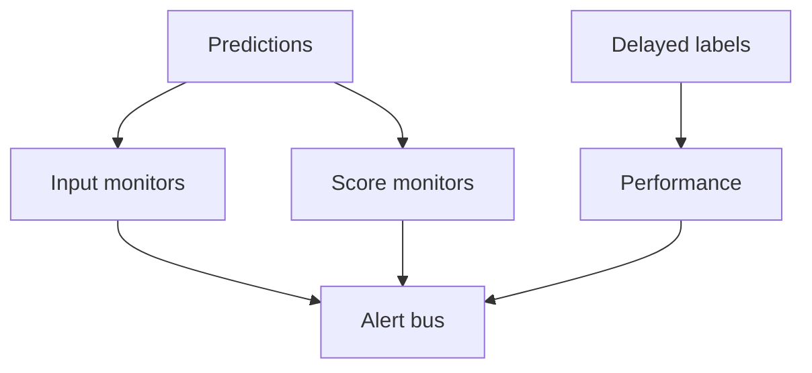

import { ConceptTemplate } from '@/features/kb/components/templates/ConceptTemplate'
import { Callout } from '@/features/kb/components/mdx/Callout'
import { ComparisonTable } from '@/features/kb/components/mdx/ComparisonTable'

export default function Layout({ children }) {
  return (
    <ConceptTemplate title="Model Monitoring">
      {children}
    </ConceptTemplate>
  )
}

Shipping is the start. **Model monitoring** watches the live system: feature and score distributions, delayed accuracy, fairness slices, and the usual red/golden signals (latency, errors). It is SRE for a stochastic function.

## 1. Deep Dive and Mechanics

**Four layers.** (1) Infra: QPS, p99, 5xx. (2) Input: PSI, null rates, schema. (3) Output: score histogram, calibration, empty/toxic rates. (4) Outcome: labels when they arrive.

**Slices.** Overall AUC can hide a country or a device class dying. Monitor key segments you promised in the model card.

**Alerting.** Burn-rate on SLOs, not a page per PSI wiggle. Ticket vs page by severity.

**Ownership.** An on-call rotation that includes the model owner, not only the platform team.

<Callout icon="info" title="No labels, still monitor">
Most teams lack same-day y. You still watch x and p-hat. Outcome metrics join later as a slower loop.
</Callout>

## 2. Mathematical / Theoretical Foundation

You estimate live risk R_t = E[loss(y, f(x))] with a delayed or proxy estimator. Distribution monitors test P_t(x) vs P_0(x) or P_t(f(x)) vs P_0. Multiple tests need false-discovery control or you will live in alert hell.

<ComparisonTable
  headers={['Layer', 'Example', 'Cadence']}
  rows={[
    ['Infra', 'p99, OOM', 'Seconds'],
    ['Input', 'null rate, PSI', 'Minutes to daily'],
    ['Output', 'score KS', 'Minutes to daily'],
    ['Outcome', 'AUC, calibration', 'Hours to weeks'],
  ]}
/>

## 3. Real-World Implementation

```python
def monitor_batch(scores, null_rate, p99_ms, limits) -> list[str]:
    alerts = []
    if null_rate > limits['max_null']:
        alerts.append('feature_nulls')
    if abs(scores.mean() - limits['score_mean']) > limits['score_slack']:
        alerts.append('score_shift')
    if p99_ms > limits['p99']:
        alerts.append('latency')
    return alerts
```

Wire this to a windowed job (5 min) and a daily notebook that humans actually read.

## 4. Visualizations



## 5. Interview Prep

**Q: What do you monitor without labels?**
**A:** Schema, nulls, PSI, score distribution, latency/errors, and policy rates (block rate).

**Q: Who gets paged?**
**A:** Infra symptoms → platform. Score/PSI → model owner. Write that in the runbook before launch.

**Q: Monitoring vs observability for LLMs?**
**A:** Overlap. LLM observability adds traces, tokens, and prompt versions. Classic model monitoring adds drift and delayed quality.

## 6. Production Use Cases

- Credit and fraud models with monthly labels.
- Rankers with implicit feedback as a proxy.
- LLM apps with toxicity and groundedness proxies.

<Callout icon="tip" title="Shadow the last model">
Keep v_n-1 scoring a sample. A sudden gap vs v_n-1 is a stronger page than an absolute PSI number.
</Callout>
