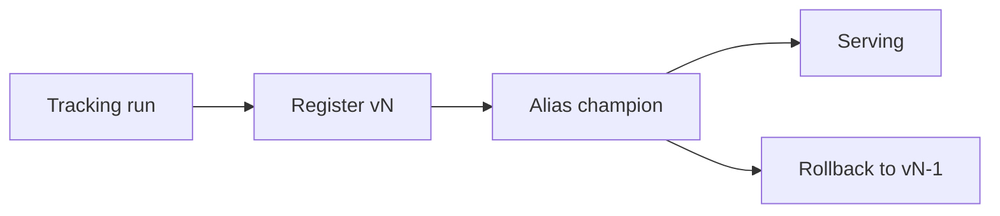

import { ConceptTemplate } from '@/features/kb/components/templates/ConceptTemplate'
import { Callout } from '@/features/kb/components/mdx/Callout'
import { ComparisonTable } from '@/features/kb/components/mdx/ComparisonTable'

export default function Layout({ children }) {
  return (
    <ConceptTemplate title="Model Registries">
      {children}
    </ConceptTemplate>
  )
}

A folder of `.pt` files is not a platform. A **model registry** (MLflow Model Registry, SageMaker, Vertex, W&B registry) stores an immutable version, metadata, aliases (`champion`, `challenger`), and who approved the stage change.

## 1. Deep Dive and Mechanics

**Version.** Increment on every registered artifact. Immutable bytes plus a pointer (`models:/ranker/12`).

**Stages / aliases.** `Archived`, `Staging`, `Production` or floating aliases. Serving reads an alias, not a raw path, so rollback is a pointer flip.

**Lineage.** Link to the training run, dataset id, and eval report. Auditors will ask.

**Webhooks.** Stage transition triggers a deploy pipeline. Humans click; robots roll.

<Callout icon="warning" title="Alias is a footgun">
If two services pin `Production` and you flip it, both move. Pin a numeric version in high-risk systems and flip aliases only in the deploy job.
</Callout>

## 2. Mathematical / Theoretical Foundation

The registry is a map from (name, version) → artifact + metadata, and a map from alias → version. Consistency is just pointer atomicity (compare-and-swap the alias). Governance is RBAC on the transition function, not ML math.

<ComparisonTable
  headers={['Object', 'Mutable?', 'Example']}
  rows={[
    ['Version artifact', 'No', 'ranker v12 bytes'],
    ['Alias', 'Yes', 'champion -> 12'],
    ['Stage', 'Yes', 'Staging'],
    ['Card / tags', 'Mostly append', 'metrics, owner'],
  ]}
/>

## 3. Real-World Implementation

```python
import mlflow

client = mlflow.tracking.MlflowClient()
mv = client.create_model_version(name='ranker', source='runs:/abc/model')
client.set_registered_model_alias('ranker', 'challenger', mv.version)
# after canary:
client.set_registered_model_alias('ranker', 'champion', mv.version)
```

Serving loads `models:/ranker@champion`.

## 4. Visualizations



## 5. Interview Prep

**Q: Registry vs artifact bucket?**
**A:** The bucket holds bytes. The registry holds identity, aliases, and approval. You need both.

**Q: How do you rollback?**
**A:** Point `champion` at the previous version and restart or hot-reload. Keep vN-1 warm if rollback must be instant.

**Q: Who can promote?**
**A:** A small set of humans or a pipeline that already passed eval gates. Not every data scientist’s laptop.

## 6. Production Use Cases

- Multi-service companies with many models.
- Regulated promotion with a two-person rule.
- LLM prompt+weights bundles registered as one unit.

<Callout icon="tip" title="Register the preprocess">
A model without its tokenizer / feature graph is an incomplete artifact. Version them together.
</Callout>
