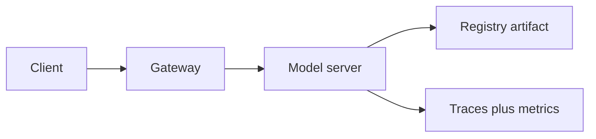

import { ConceptTemplate } from '@/features/kb/components/templates/ConceptTemplate'
import { Callout } from '@/features/kb/components/mdx/Callout'
import { ComparisonTable } from '@/features/kb/components/mdx/ComparisonTable'

export default function Layout({ children }) {
  return (
    <ConceptTemplate title="Model Serving">
      {children}
    </ConceptTemplate>
  )
}

**Serving** is the production loop: load artifact, validate input schema, run the graph, emit prediction plus traces. Notebooks do not serve. Pick a server (Triton, TF-Serving, TorchServe, Bento, a custom FastAPI) and treat it like any other stateful service.

## 1. Deep Dive and Mechanics

**Online.** Sync RPC/HTTP, tight p99, batching inside the server (Triton dynamic batch).

**Batch.** Nightly score the warehouse. Throughput over latency. Same artifact as online if you can — otherwise you reintroduced skew.

**Streaming.** Flink/Kafka consume features, produce scores. Watermarks and late data are the hard part.

**Contract.** Protobuf/JSON schema, model name, version header. Reject unknown fields or you will silently drop a feature.

<Callout icon="info" title="The server is not the model">
Autoscaling, auth, and canaries are platform. The artifact is the model. Do not bake routing logic into the forward pass.
</Callout>

## 2. Mathematical / Theoretical Foundation

Batching trades latency for throughput: wait w ms to fill a batch of size b, compute cost ≈ c(b). Optimal w depends on arrival process (see Triton queueing). GPUs want large b; SLOs want small w.

<ComparisonTable
  headers={['Mode', 'SLA', 'Typical stack']}
  rows={[
    ['Online', 'p99 tens of ms', 'Triton, TF-Serving, k8s'],
    ['Batch', 'Hours', 'Spark / Beam plus artifact'],
    ['Streaming', 'Seconds', 'Flink plus online model'],
    ['Edge', 'Offline-capable', 'TFLite, ONNX Runtime, Core ML'],
  ]}
/>

## 3. Real-World Implementation

```python
from fastapi import FastAPI
from pydantic import BaseModel

app = FastAPI()
model = load_champion()

class Req(BaseModel):
    user_id: str
    features: list[float]

@app.post('/predict')
def predict(req: Req):
    score = float(model(req.features))
    return {'score': score, 'model': 'ranker@champion'}
```

Add auth, timeouts, and a `/ready` that fails if the artifact did not load.

## 4. Visualizations



## 5. Interview Prep

**Q: Why not pickle a notebook function?**
**A:** No schema, no version, no GPU batching, no safe rollout. It will work until it does not.

**Q: Sync vs async serving?**
**A:** Sync for user-facing rank. Async/batch when the user can wait or when you precompute.

**Q: How do you multi-model?**
**A:** One process, many versions (Triton model repository) or many Deployments. Isolation vs density is the trade.

## 6. Production Use Cases

- Recsys rank on the request path.
- Nightly churn scores into a CRM.
- On-device keyword spotting.

<Callout icon="tip" title="Ready vs live">
`/live` is the process. `/ready` is “artifact loaded and warmup done.” Kubernetes should use both.
</Callout>
