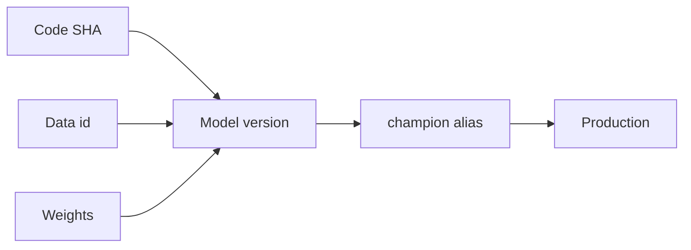

import { ConceptTemplate } from '@/features/kb/components/templates/ConceptTemplate'
import { Callout } from '@/features/kb/components/mdx/Callout'
import { ComparisonTable } from '@/features/kb/components/mdx/ComparisonTable'

export default function Layout({ children }) {
  return (
    <ConceptTemplate title="Model Versioning">
      {children}
    </ConceptTemplate>
  )
}

**Model versioning** is more than `model_v2_final_really.pt`. A version is an id that resolves to bytes, a trainer SHA, a dataset id, metrics, and a card. Without that, you cannot say what production is running.

## 1. Deep Dive and Mechanics

**Immutability.** v12 never changes. A bugfix is v13. Overwriting S3 keys named `prod` is how outages become un-debuggable.

**Compatibility.** Semver-ish: major if the input schema changes, minor if only weights. Serving must reject a major mismatch.

**Lineage.** version → run → data → code. Store it in the registry, not in a wiki.

**Promotion.** Versions move through aliases. The number stays; the alias moves.

<Callout icon="warning" title="Fine-tune is a new version">
Continued training from v12 is not v12. New data or new steps ⇒ new id, even if you only changed 1% of weights.
</Callout>

## 2. Mathematical / Theoretical Foundation

Think of a model as a function f_id: X → Y. Versioning is a bijection from id to the pair (parameters, preprocess). Schema evolution is a map between X_old and X_new; if you cannot write that map, it is a breaking major.

<ComparisonTable
  headers={['Id style', 'Example', 'Use']}
  rows={[
    ['Monotonic int', 'ranker/14', 'Registry default'],
    ['Content hash', 'sha256:abc', 'Bit-exact cache'],
    ['Git describe', 'train@a1b2', 'Research only'],
    ['Alias', 'champion', 'Serving pointer'],
  ]}
/>

## 3. Real-World Implementation

```python
def version_tuple(git_sha: str, data_id: str, config_hash: str) -> str:
    return f'{git_sha[:12]}-{data_id}-{config_hash[:8]}'
```

Log that string in traces for every prediction. Support will need it.

## 4. Visualizations



## 5. Interview Prep

**Q: File name vs registry version?**
**A:** File names collide and get overwritten. Registry versions are unique and permissioned.

**Q: When is a schema change a new major?**
**A:** When old clients cannot produce the new x, or the new model cannot read the old x, without an adapter you have tested.

**Q: Can two versions share weights?**
**A:** Distillation or a copied init, yes — still two versions if anything in the function changed.

## 6. Production Use Cases

- Every registered checkpoint before canary.
- On-device models (the binary name is the version).
- Legal hold: reproduce last year’s scorer.

<Callout icon="tip" title="Echo the version">
Every predict response should include the version id. Logs without it are not evidence.
</Callout>
