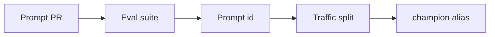

import { ConceptTemplate } from '@/features/kb/components/templates/ConceptTemplate'
import { Callout } from '@/features/kb/components/mdx/Callout'
import { ComparisonTable } from '@/features/kb/components/mdx/ComparisonTable'

export default function Layout({ children }) {
  return (
    <ConceptTemplate title="Prompt Versioning">
      {children}
    </ConceptTemplate>
  )
}

For LLM apps the prompt *is* the program. **Prompt versioning** puts that program in git (or a prompt registry): id, changelog, eval suite, and who shipped it. Hot-editing production text without a version is an unreviewed deploy.

## 1. Deep Dive and Mechanics

**What to version.** System prompt, developer messages, tool JSON schemas, few-shot packs, and router rules. Templates with variables (`user_name`) belong in the same file.

**Store.** Monorepo files + SHA, or LangSmith/Langfuse prompt hubs with versions. Serving loads `prompt://support/47` not “whatever is in the console.”

**Eval on change.** A one-line tweak can tank grounding. CI runs the suite on the new id.

**Canary.** Hash users onto prompt A vs B like any other experiment.

<Callout icon="warning" title="Hidden UI edits">
If someone can change the live prompt in a SaaS console, you no longer have git history. Disable console-prod edits or mirror them back to git in CI.
</Callout>

## 2. Mathematical / Theoretical Foundation

A prompt version is a function from variables → token sequence. Combined with a model id it defines a stochastic policy. Changing either is a new policy; evals estimate a quality functional J(prompt, model). You cannot A/B only the model if the prompt also moved.

<ComparisonTable
  headers={['Store', 'Pros', 'Cons']}
  rows={[
    ['Git files', 'Diff, PR, review', 'Hotfix slower'],
    ['Prompt hub', 'Instant rollback UI', 'Drift from git'],
    ['Config service', 'Per-env', 'Easy to forget eval'],
    ['Baked in image', 'Immutable', 'Slow ship'],
  ]}
/>

## 3. Real-World Implementation

```python
from pathlib import Path

def load_prompt(name: str, version: int) -> str:
    path = Path('prompts') / name / f'v{version}.txt'
    return path.read_text(encoding='utf-8')
```

Record `name` and `version` on every LLM trace.

## 4. Visualizations



## 5. Interview Prep

**Q: Why version prompts separately from model weights?**
**A:** They change on different clocks. You need to know which pair produced a bad answer.

**Q: Is a few-shot example a prompt version?**
**A:** Yes if it is in the request. Changing shots is a behaviour change.

**Q: How do you rollback?**
**A:** Point the alias at the last green prompt id. Do not “remember what it used to say.”

## 6. Production Use Cases

- Support and sales bots with weekly copy tweaks.
- Multi-tenant prompts (per customer addenda) with a base version plus overlay id.
- Agent tool schemas that must ship with the prompt that describes them.

<Callout icon="tip" title="Diff like code">
Reviewers should see a unified diff of the prompt, not a screenshot. Whitespace and quotes change model behaviour.
</Callout>
