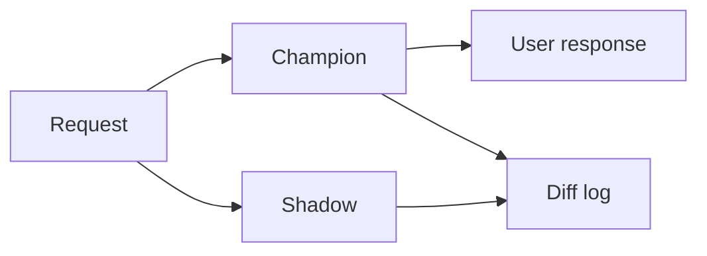

import { ConceptTemplate } from '@/features/kb/components/templates/ConceptTemplate'
import { Callout } from '@/features/kb/components/mdx/Callout'
import { ComparisonTable } from '@/features/kb/components/mdx/ComparisonTable'

export default function Layout({ children }) {
  return (
    <ConceptTemplate title="Shadow Deployment">
      {children}
    </ConceptTemplate>
  )
}

**Shadow** (dark launch) forks a copy of production requests to a new model. Users still get the champion’s answer. You log both predictions, diffs, and cost. It is the safest first look at serve-path reality.

## 1. Deep Dive and Mechanics

**Tee.** Gateway or sidecar clones the request. Shadow failures must not fail the user path (timeouts, circuit breaker).

**Compare.** Score deltas, rank overlap (Kendall), disagreement rate, latency of the shadow replica. For LLMs, log both texts but do not show B.

**Load.** Shadow doubles model compute if you tee 100%. Sample (1–10%) unless you have spare GPUs.

**Limits.** You do not see user behaviour on B (no clicks on B’s ranking). Shadow cannot replace A/B for product metrics.

<Callout icon="warning" title="PII and logs">
You just doubled the places user data lands. Same retention and access rules as prod, or do not shadow.
</Callout>

## 2. Mathematical / Theoretical Foundation

You estimate d = f_B(x) - f_A(x) under P_serve(x). That diagnoses skew and numerical drift. It does **not** estimate incremental reward of showing B. Causal product impact needs assignment of *what the user saw*.

<ComparisonTable
  headers={['Mode', 'User sees', 'Learns']}
  rows={[
    ['Shadow', 'A only', 'Score/latency diffs'],
    ['Canary', 'A or B', 'Some product signal'],
    ['A/B', 'A or B by design', 'Causal lift'],
    ['Interleave', 'Mixed list', 'Preference'],
  ]}
/>

## 3. Real-World Implementation

```python
import asyncio

async def predict_with_shadow(x, champion, shadow, log):
    y_a = await champion(x)
    async def run_b():
        try:
            y_b = await asyncio.wait_for(shadow(x), timeout=0.05)
            log(y_a, y_b)
        except Exception:
            log(y_a, None)
    asyncio.create_task(run_b())
    return y_a
```

Never `await` shadow on the user path without a tight timeout.

## 4. Visualizations



## 5. Interview Prep

**Q: Why shadow before canary?**
**A:** Catch serve crashes, schema bugs, and wild score shifts with zero user impact.

**Q: Why is shadow not enough to ship?**
**A:** Users did not experience B. Ranking quality and LLM helpfulness need exposure.

**Q: How much traffic?**
**A:** Enough for a stable disagreement histogram, not enough to melt the bill. Start at 1%.

## 6. Production Use Cases

- New ranker ONNX vs old.
- Preprocess rewrite (must match scores on a sample).
- LLM provider migration (latency and refusal rate).

<Callout icon="tip" title="Diff the features first">
If x_A ≠ x_B, score diffs are uninterpretable. Shadow the whole graph or log both feature vectors.
</Callout>
